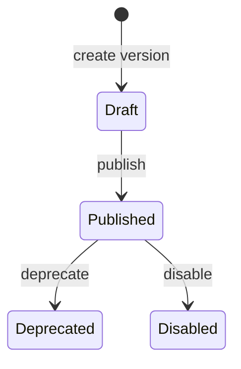

# AI policy — HTTP API and lifecycle

Router: `APIRouter(prefix="/core/v1", dependencies=[get_auth_context])` — `src/domain/ai_policy/controllers/ai_controller.py`.

Some handlers call **`_ensure_scope(auth, Scope.*)`**; others delegate to the service without an explicit scope check in the controller — read the implementation when hardening authz.

## AI execution policies and versions

| Method | Path | Notes |
|--------|------|--------|
| POST | `/core/v1/ai-execution-policies` | Create policy root |
| GET | `/core/v1/ai-execution-policy-versions` | List versions; optional `ai_execution_policy_id`, `status_filter`, `limit` |
| POST | `/core/v1/ai-execution-policy-versions` | Create version |
| POST | `/core/v1/ai-execution-policies/{ai_execution_policy_id}/versions/{ai_execution_policy_version_id}:validate` | Validate |
| POST | `/core/v1/ai-execution-policies/{ai_execution_policy_id}/versions/{ai_execution_policy_version_id}:publish` | Publish — **`ChangeRequest`** body |
| POST | `/core/v1/ai-execution-policies/{ai_execution_policy_id}/versions/{ai_execution_policy_version_id}:deprecate` | Deprecate — **`ChangeRequest`** |
| POST | `/core/v1/ai-execution-policies/{ai_execution_policy_id}/versions/{ai_execution_policy_version_id}:disable` | Disable — **`ChangeRequest`** |

Policy and version ids are typed as **strings** in the path parameters (see controller signatures).

## Models

| Method | Path | Scope |
|--------|------|--------|
| GET | `/core/v1/models` | — |
| POST | `/core/v1/models` | **`Scope.ModelsCreate`** |

## Node ↔ policy version bindings

| Method | Path | Scope |
|--------|------|--------|
| POST | `/core/v1/node-ai-execution-policy-bindings` | **`Scope.NodeAIExecutionPolicyBindingsCreate`** |
| GET | `/core/v1/node-ai-execution-policy-bindings` | **`Scope.NodeAIExecutionPolicyBindingsList`** — optional `node_id`, `ai_execution_policy_version_id`, `limit` |
| DELETE | `/core/v1/node-ai-execution-policy-bindings/{binding_id}` | **`Scope.NodeAIExecutionPolicyBindingsDelete`** — 204 |

## Lifecycle diagram

Exact state names and transitions are enforced in `AIService` + repository; use OpenAPI/ORM models as source of truth for status strings.

## Related

- [AI policy overview](index.md)
- [Governance scopes](../Governance/http-api-and-scopes.md) — `Scope` enum in `src/domain/governance/schemas/scopes.py`
