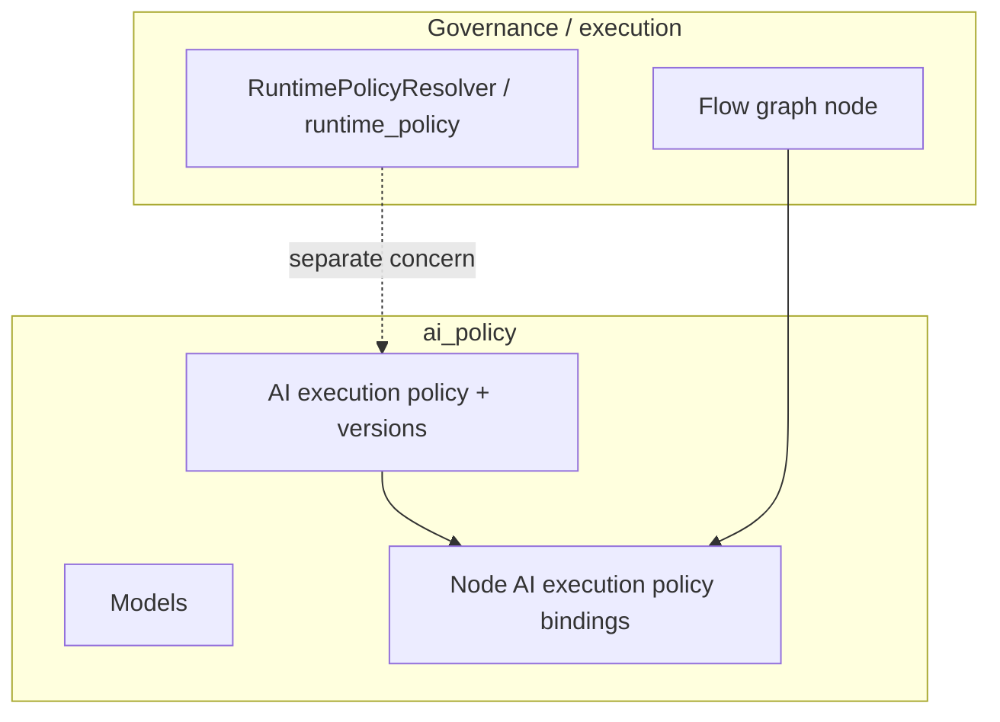

# AI policy — guide

The **`ai_policy`** bounded context manages **AI execution policies** (per-tenant policy roots and versioned definitions), **`Model`** catalog rows, and **bindings** from **flow graph nodes** to a specific **AI execution policy version**. It complements the broader [Governance](../Governance/index.md) runtime bundle: [Runtime policy resolver](../Execution/runtime-policy-resolver.md) resolves `runtime_policy`, while this domain focuses on **node-level AI execution** rules and the **policy version lifecycle** (validate, publish, deprecate, disable).

## Package map

| Area | Path |
|------|------|
| Service | `src/domain/ai_policy/services/ai_service.py` |
| Repository | `src/domain/ai_policy/repositories/ai_repository.py` |
| Controller | `src/domain/ai_policy/controllers/ai_controller.py` |
| Schemas | `src/domain/ai_policy/schemas/ai.py` |

## Conceptual placement

## Persistence

Tables such as `ai_execution_policy`, `ai_execution_policy_version`, `node_ai_execution_policy_binding`, and model tables — see [Persistence tables](../Glossary/persistence-tables.md).

## Reading order

1. [HTTP API and lifecycle](http-api-and-lifecycle.md)
2. [Governance — policy model](../Governance/policy-model-and-versioning.md) for contrast with `runtime_policy`
3. [Graph runtime nodes](../Execution/graph-runtime/nodes/index.md)
