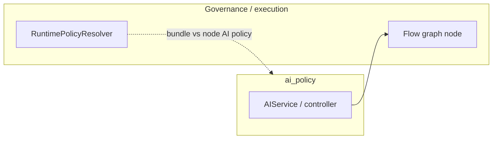

# AI policy — integration and runtime

**AI policy** defines **node-level** AI execution rules and bindings. The broader **runtime policy** bundle (`runtime_policy`) is resolved elsewhere — see [Runtime policy resolver](../Execution/runtime-policy-resolver.md) and [Governance — runtime resolution](../Governance/runtime-resolution.md).

## Boundaries

- HTTP routes validate and persist policy versions and **node ↔ policy version** bindings.
- At execution, graph nodes consult the bound policy version alongside governance limits.

## Related

- [HTTP API and lifecycle](http-api-and-lifecycle.md)
- [Graph runtime nodes](../Execution/graph-runtime/nodes/index.md)
