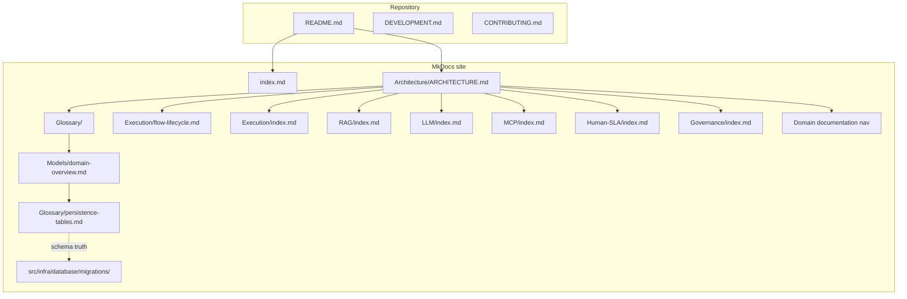

# Documentation map (for humans and AI)

Use this page as a **spider-web hub**: start from your goal, follow links to domain docs, then open `src/domain/<context>/` in the repository.

## Repository map (high level)

**Note:** `README.md`, `DEVELOPMENT.md`, and `CONTRIBUTING.md` live at the **repository root** and are not duplicated inside MkDocs; open them in the IDE when bootstrap or contribution rules matter.

## Reading order by task

### Domain documentation (all bounded contexts)

Use the MkDocs sidebar **Domain documentation** for the full tree (same order as below). Each domain follows a common skeleton where applicable: **overview** → **persistence and data** → **integration and runtime** → **HTTP API** (or equivalent).

| Domain | Start | Code |
|--------|-------|------|
| Execution | [Execution overview](../Execution/index.md) | `src/domain/execution/` |
| RAG | [RAG overview](../RAG/index.md) | `src/domain/rag/` |
| LLM | [LLM overview](../LLM/index.md) | `src/domain/llm/` |
| MCP | [MCP overview](../MCP/index.md) | `src/domain/mcp_registry/` |
| Human SLA | [Human SLA overview](../Human-SLA/index.md) | `src/domain/human_sla/` |
| Governance | [Governance overview](../Governance/index.md) | `src/domain/governance/` |
| Agents | [Agents overview](../Agents/index.md) | `src/domain/agents/` |
| AI policy | [AI policy overview](../AI-Policy/index.md) | `src/domain/ai_policy/` |
| Auth | [Auth overview](../Auth/index.md) | `src/domain/auth/` |
| Context | [Context overview](../Context/index.md) | `src/domain/context/` |
| Conversation | [Conversation overview](../Conversation/index.md), [User input and media](../Conversation/user-input-and-media.md) | `src/domain/conversation/`, `src/domain/user_input/` |
| Flows | [Flows overview](../Flows/index.md) | `src/domain/flows/` |
| Onboarding | [Onboarding overview](../Onboarding/index.md) | `src/domain/onboarding/` |
| Prompts (node) | [Prompts overview](../Prompts/index.md) | `src/domain/prompts/` |
| Tenants | [Tenants overview](../Tenants/index.md) | `src/domain/tenants/` |
| Tools | [Tools overview](../Tools/index.md) | `src/domain/tools/` |
| User prompts | [User prompts overview](../User-Prompts/index.md) | `src/domain/user_prompts/` |

### By task

| Task | Read first | Then | Code |
|------|------------|------|------|
| Configure a tenant end-to-end | [Full tenant configuration](../Get-Started/full-tenant-configuration.md) | [Governance overview](../Governance/index.md), domain HTTP docs per phase (Tenants, Auth, Flows, …) | `src/domain/*` per bounded context |
| Change graph execution | [Execution overview](../Execution/index.md), [Flow lifecycle](../Execution/flow-lifecycle.md), [Runtime vs authoring](../Architecture/runtime-vs-authoring.md) | [Graph runtime](../Execution/graph-runtime/index.md), [Runtime executor](../Execution/graph-runtime/runtime-executor.md), [Glossary: flow run](../Glossary/terms/flow-run.md) | `src/domain/execution/services/graph_runtime/` |
| Change graph runtime / node executors | [Execution overview](../Execution/index.md) | [Graph runtime](../Execution/graph-runtime/index.md), [Node registry](../Execution/graph-runtime/node-registry.md), [Nodes overview](../Execution/graph-runtime/nodes/index.md) | `src/domain/execution/services/graph_runtime/` |
| Flows authoring / graph compile | [Flows overview](../Flows/index.md) | [HTTP API overview](../Flows/http-api-overview.md), [Graph and compiler](../Flows/graph-and-compiler.md) | `src/domain/flows/` |
| Tools / tool configs / bindings | [Tools overview](../Tools/index.md) | [HTTP API](../Tools/http-api.md), [Runtime execution](../Tools/runtime-execution.md) | `src/domain/tools/` |
| Conversation SSE / read APIs | [Conversation overview](../Conversation/index.md) | [SSE and runtime](../Conversation/sse-and-runtime.md), [Read API](../Conversation/read-api.md) | `src/domain/conversation/` |
| Tenants / auth tokens | [Tenants](../Tenants/index.md), [Auth](../Auth/index.md) | [HTTP API](../Tenants/http-api.md), [Auth HTTP API](../Auth/http-api.md) | `src/domain/tenants/`, `src/domain/auth/` |
| Layered context (memory / RAG) | [Context](../Context/index.md) | [LLM context builder](../LLM/context-builder.md), [RAG runtime](../RAG/runtime-and-integration.md) | `src/domain/context/` |
| Change RAG retrieval / ingest | [RAG overview](../RAG/index.md) | [Chunking strategies](../RAG/chunking-strategies.md), [Runtime and integration](../RAG/runtime-and-integration.md) (e.g. [ingest from media](../RAG/runtime-and-integration.md#ingest-from-media), [batch text ingest](../RAG/runtime-and-integration.md#batch-text-ingest)), [Embedding orchestration](../RAG/embedding-orchestration.md), [Vector store](../Glossary/terms/vector-store.md) | `src/domain/rag/` |
| Change LLM inference / providers | [LLM overview](../LLM/index.md) | [Layered inference](../LLM/layered-inference.md), [LLM executor](../LLM/llm-executor.md), [Providers and selection](../LLM/providers-and-selection.md) | `src/domain/llm/` |
| MCP exposure / tenant tool bridge | [MCP overview](../MCP/index.md) | [Gateway and runtime](../MCP/gateway-and-runtime.md), [Registry and API](../MCP/registry-and-api.md) | `src/domain/mcp_registry/`, `src/adapters/mcp/` |
| Human SLA / handoff cases | [Human SLA overview](../Human-SLA/index.md) | [Cases and service](../Human-SLA/cases-and-service.md), [Policies and matching](../Human-SLA/policies-and-matching.md) | `src/domain/human_sla/` |
| Graph nodes / demo seed | [Node templates](../Execution/node-templates.md) | [Demo seed graph](../Execution/demo-seed-graph.md), [Flow lifecycle](../Execution/flow-lifecycle.md) | `resources/scripts/seeds/demo/` |
| Add / change DB table | [Persistence tables](../Glossary/persistence-tables.md) | Alembic versions under `src/infra/database/migrations/versions/` | `src/infra/database/models/` |
| Policies / limits | [Governance overview](../Governance/index.md), [Governance policy versioning](../Glossary/terms/governance-policy-versioning.md) | [HTTP API and scopes](../Governance/http-api-and-scopes.md), [Enforcement and limits](../Governance/enforcement-and-limits.md), [Domain overview](../Models/domain-overview.md) | `src/domain/governance/` |
| LLM cost / context | [Token cost and context strategy](../Develop/token-cost-and-context-strategy.md) | [LLM domain services](../LLM/index.md), [Tracing and cost](../Develop/tracing-and-cost.md), [Execution event](../Glossary/terms/execution-event.md) | `src/domain/llm/`, `src/domain/context/`, `src/domain/rag/`, `src/domain/governance/` |
| Events (runtime / audit / SSE) | [System events reference](../Develop/system-events-reference.md) | [Execution event](../Glossary/terms/execution-event.md), [Authoring event](../Glossary/terms/authoring-event.md), [Flow lifecycle](../Execution/flow-lifecycle.md) | `src/domain/execution/schemas/events.py`, `src/domain/governance/schemas/authoring_events.py`, `src/domain/conversation/schemas/conversation.py` |
| Tracing / cost | [Tracing and cost](../Develop/tracing-and-cost.md) | [Token cost and context strategy](../Develop/token-cost-and-context-strategy.md), [Execution event](../Glossary/terms/execution-event.md) | `src/adapters/observability/` |

## Rules for safe navigation

1. Prefer **glossary** definitions before renaming entities in code or SQL.
2. Cross-check **persistence** names with Alembic; do not invent table names in docs without a migration.
3. Distinguish **authoring** tables from **runtime** tables (see [Persistence tables](../Glossary/persistence-tables.md)).
4. When in doubt, locate the **port** (`src/domain/*/ports/`) then the **service** implementation.

## Related

- [Glossary index](../Glossary/index.md)
- [Domain model overview](../Models/domain-overview.md)
- [Architecture](../Architecture/ARCHITECTURE.md)
- [Contributing (documentation)](../Contributing/README.md) — MkDocs conventions and `mkdocs build`
- Repository root `SECURITY.md` — disclosure policy (not built into this site)
