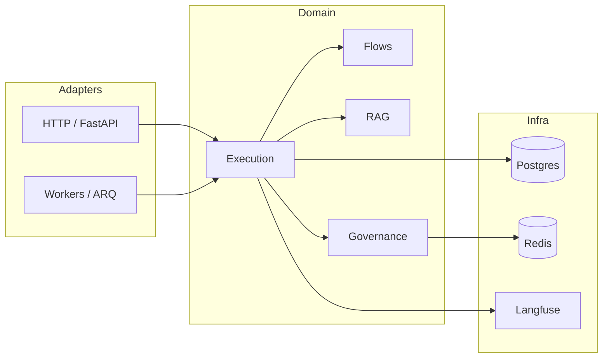

# Architecture (site entry)

**agent-orchestration-core** is a multi-tenant **cognitive orchestration** service: natural language and events in, **deterministic graph execution** and **governance** out. This page summarizes how the system is shaped; the deeper bounded-context breakdown lives in [Architecture/ARCHITECTURE.md](Architecture/ARCHITECTURE.md).

## System context

## Hexagonal summary

- **Domain** (`src/domain/**`): business rules, services, repositories; contracts as protocols or ABCs where appropriate.
- **Adapters** (`src/adapters/**`): observability, LLM/RAG integrations, MCP, messaging.
- **Application** (`src/application/**`): composes domain use cases where needed.
- **Infrastructure** (`src/infra/**`): persistence, HTTP helpers, DB session wiring.

Dependencies point **inward** toward domain ports; adapters implement those ports at the edges.

## Where to read next

| Topic | Document |
|-------|----------|
| Bounded contexts + tables | [Domain model overview](Models/domain-overview.md), [Glossary](Glossary/index.md) |
| Authoring vs runtime | [Runtime vs authoring](Architecture/runtime-vs-authoring.md) |
| SQL table index | [Persistence tables](Glossary/persistence-tables.md) |
| AI / human navigation hub | [Documentation map (AI)](AI/documentation-map.md) |
| Full architecture detail | [Architecture/ARCHITECTURE.md](Architecture/ARCHITECTURE.md) |

## Repository root docs

These are **not** part of the MkDocs build but are essential for contributors: `README.md`, `DEVELOPMENT.md`, `CONTRIBUTING.md`, and `SECURITY.md` (responsible disclosure). For documentation-only PR rules and running MkDocs locally, see [Contributing (documentation)](Contributing/README.md).
