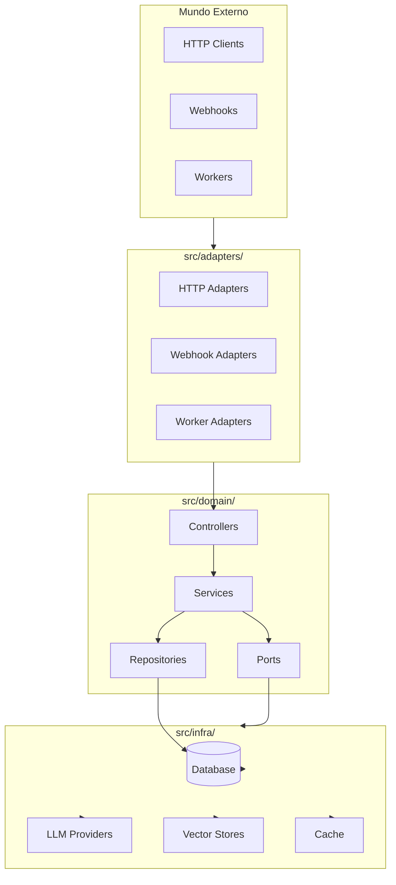
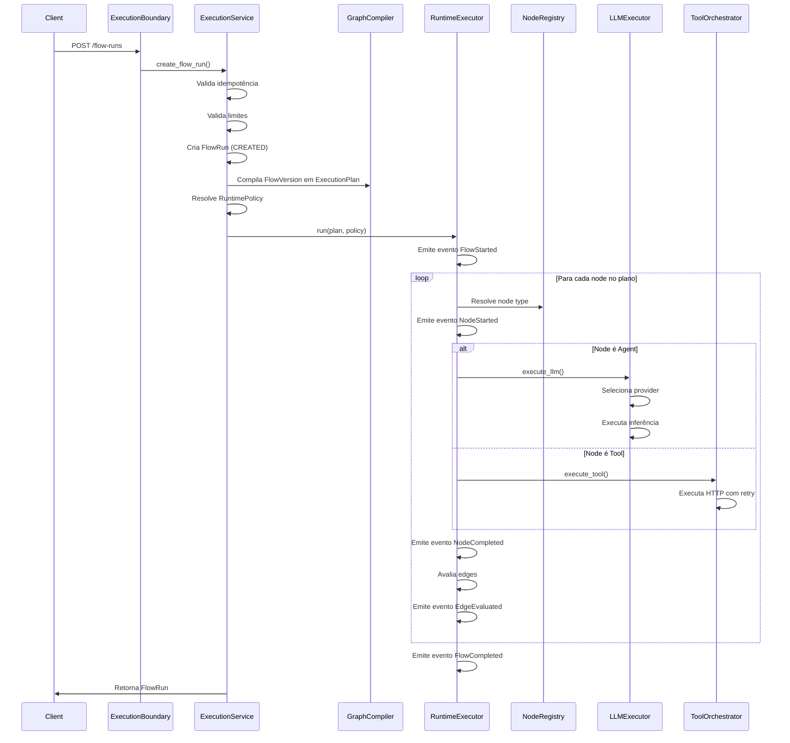
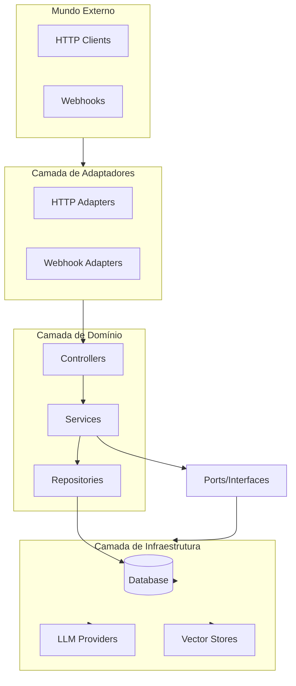

# Arquitetura do agent-orchestration-core

## Visão Geral da Arquitetura

O **agent-orchestration-core** é uma plataforma de orquestração cognitiva multi-tenant construída sobre princípios de **Arquitetura Hexagonal (Ports & Adapters)** e **Domain-Driven Design (DDD)**. O sistema foi projetado para ser determinístico, auditável e isolado por tenant desde sua fundação.

### Princípios Arquiteturais Fundamentais

#### 1. Arquitetura Hexagonal (Ports & Adapters)

O sistema segue a Arquitetura Hexagonal, separando claramente a lógica de negócio (domínio) das preocupações técnicas (infraestrutura e adaptadores):

- **Ports**: Interfaces que definem contratos de comunicação (ex: `LLMProviderPort`, `RuntimeTracerPort`, `ExecutionServicePort`)
- **Adapters**: Implementações concretas que conectam o domínio ao mundo externo (ex: `OpenAIProviderAdapter`, `LangfuseRuntimeTracer`, `HttpToolExecutor`)
- **Domain**: Lógica de negócio isolada, independente de frameworks e infraestrutura

Esta separação permite:
- Testabilidade: domínio pode ser testado sem dependências externas
- Flexibilidade: troca de implementações sem afetar lógica de negócio
- Manutenibilidade: mudanças em infraestrutura não impactam domínio

#### 2. Domain-Driven Design (DDD)

O código é organizado por **domínios de negócio**, não por camadas técnicas. Cada domínio encapsula:

- **Entidades**: Objetos de negócio com identidade (ex: `Flow`, `Agent`, `Tool`)
- **Value Objects**: Objetos imutáveis sem identidade (ex: `VersionStatus`, `ExecutionEventType`)
- **Services**: Lógica de negócio que não pertence a uma entidade específica
- **Repositories**: Abstrações para persistência
- **Ports**: Contratos de comunicação com outros domínios ou infraestrutura

#### 3. Separação Authoring vs Runtime

O sistema mantém uma separação estrita entre **authoring** (design-time) e **runtime** (execution-time):

**Authoring (Design-Time)**:
- Definição e versionamento de artefatos (Flows, Agents, Tools, Policies)
- Estados: `DRAFT`, `PUBLISHED`, `DEPRECATED`, `DISABLED`
- Imutabilidade: versões publicadas não podem ser alteradas
- Governança: eventos de authoring para auditoria de mudanças

**Runtime (Execution-Time)**:
- Execução de artefatos versionados (FlowRun, AgentRun, ToolRun)
- Estados de execução (CREATED, RUNNING, COMPLETED, FAILED)
- Append-only: execução nunca altera definições
- Rastreabilidade: eventos de execução para observabilidade e auditoria

Esta separação garante:
- Reprodutibilidade: execuções sempre referenciam versões explícitas
- Segurança: runtime não pode alterar definições
- Auditoria: histórico completo de mudanças e execuções

#### 4. Multi-Tenant Estrutural

O isolamento por tenant é **estrutural**, não opcional:

- Todo dado relevante pertence a um `tenant_id`
- Tenant vem do contexto de segurança (JWT), nunca de parâmetros de API
- Isolamento em todos os níveis: dados, execução, políticas, limites
- Validação obrigatória: ausência de tenant bloqueia operações

### Camadas e Responsabilidades

O sistema é organizado em camadas claras com responsabilidades bem definidas:



#### `src/adapters/` - Entradas e Saídas do Sistema

**Responsabilidade**: Adaptar protocolos externos (HTTP, webhooks, workers) para o core.

**Regras**:
- Adaptam payload para o core (nunca contêm lógica de negócio)
- Não acessam diretamente outros adapters
- Chamam controllers, nunca services diretamente
- São substituíveis sem afetar domínio

**Exemplos**:
- `adapters.http.*` - Handlers HTTP
- `adapters.observability.*` - Integrações de observabilidade
- `adapters.secrets.*` - Resolução de secrets
- `adapters.cache.*` - Adaptadores de cache

#### `src/infra/` - Implementações Técnicas Substituíveis

**Responsabilidade**: Implementações técnicas que podem ser trocadas sem afetar domínio.

**Regras**:
- Nunca importa código de domínio
- Implementa apenas interfaces definidas em `ports/`
- Pode ser trocado sem afetar domínio
- Detalhes técnicos isolados

**Exemplos**:
- `infra.database.*` - ORM, migrations, conexões
- `infra.http_tool_executor.*` - Executor HTTP para tools
- Implementações de providers LLM (quando aplicável)

#### `src/domain/` - Domínios de Negócio

**Responsabilidade**: Lógica de negócio organizada por contexto/domínio.

**Estrutura Interna de Cada Domínio**:

```
src/domain/<context>/
├── controllers/      # Orquestra requests, valida input, chama services
├── services/         # Regras de negócio e invariantes
├── repositories/     # Abstrações para persistência
├── schemas/          # DTOs e validação estrutural (Pydantic)
├── ports/            # Contratos de dependências externas
└── exceptions/       # Erros semânticos do domínio
```

**Regras de Dependência (Bloqueantes)**:
- Domínio nunca depende de infra
- Infra nunca depende de domínio
- Services não conhecem controllers
- Controllers não contêm regra de negócio
- Repositories acessam apenas infra via DatabaseConnection

### Domínios Implementados

O sistema é composto pelos seguintes domínios:

#### Execution (Runtime)

**Responsabilidade**: Execução real dos fluxos, rastreamento de estado e observabilidade.

**Componentes Principais**:
- `ExecutionService`: Orquestra criação e execução de FlowRuns
- `RuntimeExecutor`: Executa planos de execução determinísticos
- `GraphCompiler`: Compila definições de flow em planos executáveis
- `RunLifecycleStateMachine`: Gerencia transições de estado
- `ExecutionRepository`: Persistência de execuções e eventos

**Artefatos**:
- `FlowRun`: Execução de uma versão de flow
- `NodeRun`: Execução de um node
- `AgentRun`: Execução de um agente
- `ToolRun`: Execução de uma tool
- `ExecutionEvent`: Eventos de execução (append-only)
- `GraphState`: Estado consolidado da execução

#### Flows (Authoring)

**Responsabilidade**: Definição lógica de processos, versionamento e composição de nodes.

**Componentes Principais**:
- `FlowsService`: Gerencia criação e versionamento de flows
- `FlowGraphCompiler`: Compila definições em grafos executáveis
- `FlowGraphValidator`: Valida integridade de grafos
- `ConditionEvaluator`: Avalia expressões de condição
- `FlowsRepository`: Persistência de flows e versões

**Artefatos**:
- `Flow`: Definição lógica de processo
- `FlowVersion`: Versão imutável de um flow
- `Node`: Unidade executável dentro de um flow
- `Router`: Mecanismo de decisão de caminho
- `RoutingRule`: Regra de roteamento
- `ConditionExpression`: Expressão reutilizável de decisão

#### Agents

**Responsabilidade**: Definição de agentes cognitivos, especialização por tarefa e associação com nodes.

**Componentes Principais**:
- `AgentsService`: Gerencia criação e versionamento de agents
- `AgentsRepository`: Persistência de agents e versões

**Artefatos**:
- `Agent`: Definição lógica de agente cognitivo
- `AgentVersion`: Versão imutável de um agent
- `NodeAgentBinding`: Associação entre node e agent version

#### Tools

**Responsabilidade**: Contratos de integração externa, configuração por tenant e autorização de uso.

**Componentes Principais**:
- `ToolsService`: Gerencia importação e configuração de tools
- `ToolOrchestrator`: Orquestra execução de tools com retry/timeout
- `OpenAPIParser`: Parse de especificações OpenAPI
- `ToolsRepository`: Persistência de tools e configurações

**Artefatos**:
- `Tool`: Contrato abstrato de integração externa
- `ToolConfig`: Configuração concreta de uma tool para um tenant
- `AgentVersionToolBinding`: Associação entre agent version e tool config

#### AI Policy

**Responsabilidade**: Controle de execução de IA, escolha de modelo, parâmetros, limites e custo.

**Componentes Principais**:
- `AIService`: Gerencia políticas de execução de IA
- `AIRepository`: Persistência de políticas e versões

**Artefatos**:
- `AIExecutionPolicy`: Política de execução de IA
- `AIExecutionPolicyVersion`: Versão imutável de política
- `AITask`: Tipo de tarefa cognitiva com flags estruturais de contexto:
  - `allow_rag_tenant`
  - `allow_user_memory`
  - `allow_session_context`
  - `allow_memory_write`
- `Model`: Modelo de LLM disponível

#### RAG

**Responsabilidade**: Recuperação de contexto relevante e enriquecimento de entrada para IA.

**Componentes Principais**:
- `RagService`: Gerencia configurações RAG por tenant
- `RagRepository`: Persistência de configurações RAG

**Artefatos**:
- `RagConfig`: Configuração RAG por tenant (versionada)
- `VectorStore`: Armazenamento vetorial

**Restrições**:
- Ativação de contexto é estrutural por `AITask`:
  - Tenant Knowledge: `allow_rag_tenant=true`
  - User Memory: `allow_user_memory=true`
  - Session Context (exposição ao LLM): `allow_session_context=true`
  - Memory write boundary: `allow_memory_write=true`
- Sem flag explícita, o comportamento é `false` (default seguro).
- Ativação dinâmica de RAG é decidida por precedência objetiva:
  - gate estrutural (`AITask`)
  - `RagPolicyVersion` ativa por tenant
  - `ToolConfig.config.rag_activation` (override explícito por escopo)
  - `RagConfig` válida/publicada
  - presença obrigatória de `user_id` para escopo `USER_MEMORY_VECTOR`
  - heurística leve de input (`empty`, `short`, `structured`)
- Decisões de ativação de RAG são observáveis via evento `domain.rag.activation.decision` com `reason`, `input_len` e `input_kind`, sem logging de conteúdo bruto.
- Persistência de memória inferida exige `MemoryPolicy` ativa por tenant.
- `MemoryPolicyVersion` governa retention TTL, consentimento, allowed sources, allowed schemas e write targets por schema.
- Persistência de memória executa via `MemoryWriteService`, com eventos canônicos `MemoryUpdated` e `MemoryEmbedded` em tracing e execution events.
- Atualização de preferências em `MemoryWriteService` segue política determinística:
  - extração de key via `fixed_key` ou `allowed_keys`
  - sobrescrita apenas por prioridade de source
  - atualização ignorada quando valor não muda ou source tem prioridade menor
- Extração pós-execução de memória é acionada no `on_flow_complete` via hook wrapper:
  - classifica output final em preferência estruturada, patch de perfil e memória vetorial
  - converte para `UserMemoryItem` com `source=INFERRED_LLM`
  - persiste exclusivamente via `MemoryWriteService` para manter governança por `MemoryPolicy`
  - observabilidade expõe apenas chaves/contagens, sem payload bruto do output do flow
- Pipeline de embedding para `USER_MEMORY_VECTOR` é assíncrono:
  - produtor (post-flow) valida política, prepara documento e enfileira job (`Redis + Arq`)
  - worker executa geração de embeddings e persistência de chunks
  - semântica de entrega: at-least-once com idempotência por hash de documento e conflito `(document_id, chunk_index)`
  - ciclo de vida do documento: `PENDING -> PROCESSING -> COMPLETED|FAILED`
  - eventos canônicos adicionais: `MemoryEmbeddingQueued`, `MemoryEmbeddingStarted`, `MemoryEmbeddingCompleted`, `MemoryEmbeddingFailed`
- Recuperação de memória é centralizada em `MemoryRetrievalService`:
  - separa responsabilidades entre Tenant RAG, User Memory e Session Context
  - enforce de User Memory vector por `(tenant_id, user_id)` e TTL via `doc_metadata.expires_at > now`
  - suporta reranking temporal opcional por decaimento multiplicativo (`score * exp(-age/half_life)`)
  - observabilidade usa apenas ids/contagens e flags de decisão (sem conteúdo bruto)
- Enriquecimento de contexto em modo híbrido:
  - runtime pode semear `state.user_context_enrichment` de forma implícita via `runtime_policy.user_context_enrichment`
  - `UserContextEnrichmentNode` publica explicitamente quais camadas podem ser usadas por etapas LLM subsequentes
  - com `gating=true`, `ContextBuilder` bloqueia tenant/user memory até publicação explícita do handle
  - retrieval real continua on-demand por `MemoryRetrievalService` (sem persistir conteúdo de memória no `graph_state`)

#### Onboarding

**Responsabilidade**: Coleta estruturada de informações e validação progressiva de dados.

**Componentes Principais**:
- `OnboardingService`: Gerencia onboardings e execuções
- `OnboardingRepository`: Persistência de onboardings e runs

**Artefatos**:
- `Onboarding`: Definição de processo de onboarding
- `OnboardingVersion`: Versão imutável de onboarding
- `OnboardingRun`: Execução de um onboarding
- `StepRun`: Execução de um step dentro de um onboarding run

#### Tenants

**Responsabilidade**: Gerenciamento de tenants e configurações por tenant.

**Componentes Principais**:
- `TenantsService`: Gerencia informações e configurações de tenants
- `TenantsRepository`: Persistência de dados de tenants

**Artefatos**:
- `Tenant`: Entidade tenant com configurações (settings JSONB)

#### Governance

**Responsabilidade**: Isolamento e governança multi-tenant, resolução de identidade, escopo e permissões.

**Componentes Principais**:
- `AccessPolicyService`: Autorização baseada em políticas
- `ExecutionLimitService`: Limites de execução por tenant
- `RateLimitService`: Rate limiting por tenant/principal/action
- `LLMAdminService`: Administração de providers e modelos LLM

**Artefatos**:
- `AccessPolicy` / `AccessPolicyVersion`: Políticas de acesso
- `ExecutionLimitPolicy` / `ExecutionLimitPolicyVersion`: Limites de execução
- `RateLimitPolicy` / `RateLimitPolicyVersion`: Rate limiting
- `MemoryPolicy` / `MemoryPolicyVersion`: Governança de persistência de memória
- `ActiveMemoryPolicyVersion`: Versão ativa de política de memória por tenant
- `RagPolicy` / `RagPolicyVersion`: Governança de ativação dinâmica de RAG
- `ActiveRagPolicyVersion`: Versão ativa de política de RAG por tenant
- `AuthoringEvent`: Eventos de governança (publish/activate/rollback)

#### Prompts

**Responsabilidade**: Gerenciamento de prompts dinâmicos para nodes.

**Componentes Principais**:
- `PromptService`: Gerencia prompts e associações com nodes
- `PromptRepository`: Persistência de prompts

**Artefatos**:
- `NodePrompt`: Prompt associado a um tipo de node

### Padrões de Design

#### Protocol vs ABC para Interfaces

O sistema usa dois padrões para definir interfaces, cada um com propósito específico:

**Protocol (Structural Typing)**:
- Usado para integrações externas e flexibilidade máxima
- Verificação estrutural: qualquer classe com métodos necessários é compatível
- Não requer herança explícita
- Exemplos: `LLMProviderPort`, `RuntimeTracerPort`, `LLMExecutorPort`

**ABC (Abstract Base Class)**:
- Usado para contratos internos do domínio
- Requer herança explícita
- Validação em runtime
- Exemplos: `ExecutionServicePort`, `FlowsServicePort`, `AgentsServicePort`

#### Dependency Injection

O sistema usa `dependency-injector` para gerenciar dependências:

- **Containers**: Organizados por domínio (ex: `FlowsContainer`, `AgentsContainer`)
- **Core Container**: Compartilhado entre domínios (database, cache, etc.)
- **Factory Providers**: Criação de instâncias com dependências resolvidas
- **Singleton Providers**: Instâncias compartilhadas (ex: database connection)

Arquivo principal: `src/containers.py`

#### Versionamento Semântico

Todos os artefatos versionados seguem **semantic versioning** (major.minor.patch):

- **Lógica Híbrida**: Suporta `source_version_id` para derivar de versão existente ou auto-incremento de patch
- **Estados**: `DRAFT`, `PUBLISHED`, `DEPRECATED`, `DISABLED`
- **Imutabilidade**: Versões publicadas não podem ser alteradas
- **Unicidade**: Constraint de unicidade por grupo + semver

Artefatos versionados:
- `FlowVersion`, `AgentVersion`, `OnboardingVersion`
- `AIExecutionPolicyVersion`, `RagConfig`
- `ToolConfig` (com schema_version e config_hash)

#### Observability Hooks

Sistema de hooks para eventos de execução:

- **ExecutionEventHook** (ABC): Interface abstrata para hooks
- **DbExecutionEventHook**: Implementação que persiste eventos no banco
- **Integração**: Hooks são injetados no `RuntimeExecutor` e `ExecutionService`
- **Eventos**: `on_flow_start`, `on_node_start`, `on_node_complete`, `on_edge_evaluated`, `on_flow_complete`, `on_flow_failed`

#### Provider Selection (LLM)

Sistema flexível de seleção de providers LLM:

- **LLMProviderSelector**: Seleciona provider baseado em tenant, provider e model_alias
- **LLMProviderFactory**: Cria instâncias de providers (OpenAI, Anthropic, etc.)
- **FakeLLMProvider**: Apenas para testes (não usado em produção)
- **Validação**: `LLMExecutor` valida que há provider disponível antes de executar

### Fluxo de Execução

O fluxo de execução de um FlowRun segue os seguintes passos:



#### Estados e Transições

**FlowRun States**:
- `CREATED` → `RUNNING` → `COMPLETED` / `FAILED` / `ESCALATED`
- `WAITING` (com reason, correlation_id, deadline)

**NodeRun States**:
- `PENDING` → `RUNNING` → `COMPLETED` / `FAILED` / `SKIPPED`

**AgentRun States**:
- `CREATED` → `RUNNING` → `COMPLETED` / `FAILED`

**ToolRun States**:
- `CREATED` → `EXECUTING` → `SUCCESS` / `ERROR` / `TIMEOUT`

Transições são gerenciadas pelo `RunLifecycleStateMachine` e geram `ExecutionEvent` para auditoria.

### Diagramas Arquiteturais

#### Diagrama de Camadas



#### Diagrama de Domínios e Relações

```mermaid
flowchart LR
    subgraph Authoring["Authoring Domains"]
        Flows[Flows]
        Agents[Agents]
        Tools[Tools]
        AIPolicy[AI Policy]
        RAG[RAG]
        Onboarding[Onboarding]
    end

    subgraph Runtime["Runtime Domain"]
        Execution[Execution]
    end

    subgraph Governance["Governance Domains"]
        Tenants[Tenants]
        Governance[Governance]
    end

    Flows -->|FlowVersion| Execution
    Agents -->|AgentVersion| Execution
    Tools -->|ToolConfig| Execution
    AIPolicy -->|PolicyVersion| Execution
    RAG -->|RagConfig| Execution
    Onboarding -->|OnboardingVersion| Execution
    Tenants -->|tenant_id| Execution
    Governance -->|Policies| Execution
```

## Referências

- [README.md](../README.md) - Visão geral e specs de planning
- [COMMUNICATION.md](./COMMUNICATION.md) - Padrões de comunicação
- [RAG.md](./RAG.md) - Sistema RAG
- [UNIMPLEMENTED_COMPONENTS.md](../UNIMPLEMENTED_COMPONENTS.md) - Componentes pendentes
