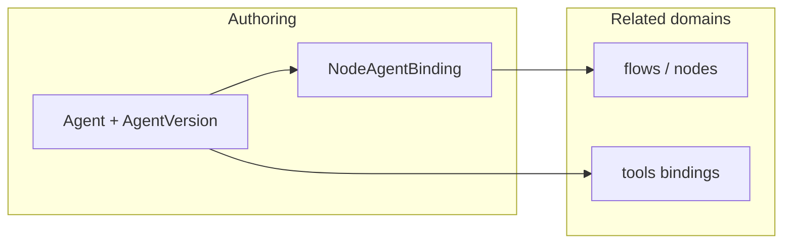

# Agents — guide

The **agents** bounded context stores **tenant-scoped agent definitions** and **versioned agent configurations**, links them to **graph nodes** via bindings, and exposes lifecycle operations (validate, publish, activate, rollback) with audit via `ChangeRequest` where applicable.

## Role in the platform

- **Agent** — logical product (`agent` table).
- **Agent version** — immutable-ish snapshot with persona, system prompt, tool compatibility hashes (`agent_version`).
- **Node–agent binding** — attaches an **agent version** to a **flow graph node** (`node_agent_binding`).

Tool bindings for an agent version are managed under [Tools](../Tools/index.md) (`/agent-version-tool-bindings`).

## Package map

| Area | Path |
|------|------|
| Service | `src/domain/agents/services/agents_service.py` |
| Repository | `src/domain/agents/repositories/agents_repository.py` |
| Controller | `src/domain/agents/controllers/agents_controller.py` |
| Schemas | `src/domain/agents/schemas/agents.py` |
| Port | `src/domain/agents/ports/service.py` |

HTTP prefix: **`/core/v1`** (see [HTTP API](http-api.md)).

## Persistence

See [Persistence tables](../Glossary/persistence-tables.md) (`agent`, `agent_version`, `node_agent_binding`, …) and [Agent version](../Glossary/terms/agent-version.md).

## Reading order

1. [Persistence and data](persistence-and-data.md)
2. [Integration and runtime](integration-and-runtime.md)
3. [HTTP API](http-api.md)
4. [Tools — HTTP API](../Tools/http-api.md) for `agent-version-tool-bindings`
5. [Execution graph runtime](../Execution/graph-runtime/index.md) for how nodes run at runtime

## Related

- [Flows](../Flows/index.md)
- [Documentation map](../AI/documentation-map.md)
