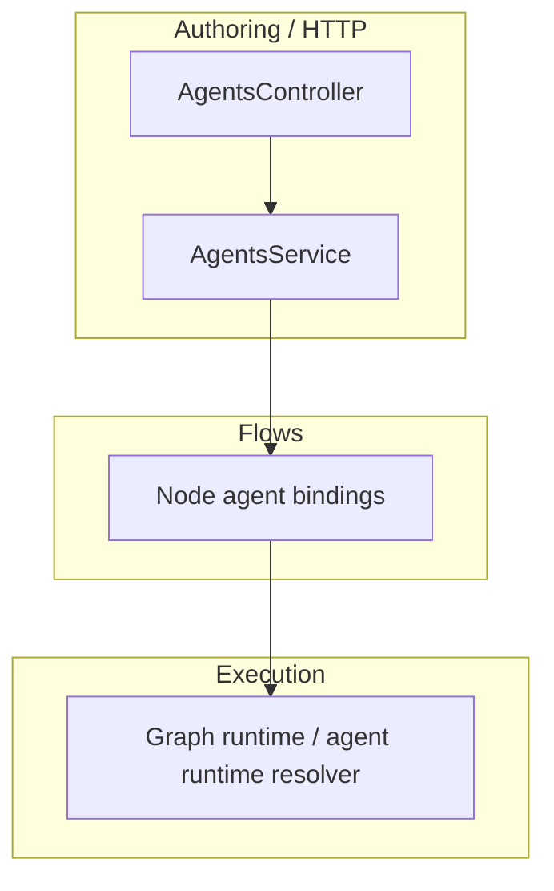

# Agents — integration and runtime

The **agents** package is consumed at **authoring time** (CRUD, publish, bindings) and at **runtime** when the graph resolves which agent version runs on a node.

## Call graph (simplified)

- **Flows** attach **agent versions** to **nodes** via `node_agent_binding`.
- **Execution** [graph runtime](../Execution/graph-runtime/index.md) resolves the active agent for a node run; tool compatibility uses [Tools — runtime execution](../Tools/runtime-execution.md).

## Related

- [HTTP API](http-api.md)
- [Tools](../Tools/index.md)
