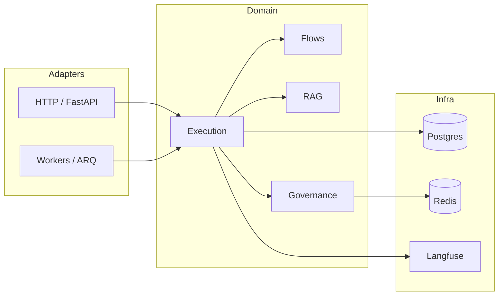

# Architecture

This document is the canonical overview of **agent-orchestration-core**: bounded contexts, hexagonal boundaries, and how authoring relates to runtime.

## System context

## Hexagonal view

- **Domain** (`src/domain/**`): business rules, services, repositories (ports expressed as protocols / abstract collaborators where used).
- **Adapters** (`src/adapters/**`): Langfuse tracer, LLM/RAG adapters, MCP gateways, messaging.
- **Application** (`src/application/**`): orchestration of domain use cases where needed.
- **Infrastructure** (`src/infra/**`): database models, HTTP helpers, persistence wiring.

Runtime code depends **inward** on domain contracts; infrastructure and adapters implement those contracts at the edges.

## Authoring vs runtime

- **Authoring**: draft and publish versioned artefacts (flows, tools, policies, prompts). Published versions are immutable.
- **Runtime**: executes published versions only (`FlowRun`, node runs, tool runs). Execution is append-only with respect to definitions.

See also [flow lifecycle](../Execution/flow-lifecycle.md).

## Bounded contexts (short)

Contexts map **one-to-one** to `src/domain/<package>/` except **`mcp_registry`** (folder name) for MCP. Shared helpers that are not a product boundary live under `src/domain/common/`.

### Core runtime and inference

| Context | Responsibility | Docs |
|--------|----------------|------|
| [Execution](../Execution/index.md) | Graph execution, state machines, node runtime, hooks | `src/domain/execution/` |
| [Flows](../Flows/index.md) | Graph definition, compilation, validation, HTTP authoring | `src/domain/flows/` |
| [RAG](../RAG/index.md) | Retrieval, embeddings, vector stores, RAG HTTP surface | `src/domain/rag/` |
| [LLM](../LLM/index.md) | Layered inference, executor, providers, semantic cache, moderation | `src/domain/llm/` |
| [MCP](../MCP/index.md) | Tenant MCP registry, gateway, HTTP tool bridge | `src/domain/mcp_registry/` |

### Human-in-the-loop and policy

| Context | Responsibility | Docs |
|--------|----------------|------|
| [Human SLA](../Human-SLA/index.md) | Handoff policies, cases, service API | `src/domain/human_sla/` |
| [Governance](../Governance/index.md) | Policies, rate limits, scopes, enforcement, authoring audit | `src/domain/governance/` |
| [AI policy](../AI-Policy/index.md) | Tenant AI configuration and lifecycle | `src/domain/ai_policy/` |

### Definitions, identity, and conversation

| Context | Responsibility | Docs |
|--------|----------------|------|
| [Agents](../Agents/index.md) | Agent definitions and bindings | `src/domain/agents/` |
| [Auth](../Auth/index.md) | Service keys and auth HTTP surface | `src/domain/auth/` |
| [Context](../Context/index.md) | Layered memory, RAG activation, context ports | `src/domain/context/` |
| [Conversation](../Conversation/index.md) | Streaming and read APIs for runs | `src/domain/conversation/` |
| [Onboarding](../Onboarding/index.md) | Structured onboarding flows | `src/domain/onboarding/` |
| [Prompts](../Prompts/index.md) | Versioned node prompts | `src/domain/prompts/` |
| [Tenants](../Tenants/index.md) | Tenant lifecycle and settings | `src/domain/tenants/` |
| [Tools](../Tools/index.md) | Tool contracts, OpenAPI ingestion, execution | `src/domain/tools/` |
| [User prompts](../User-Prompts/index.md) | End-user prompt artefacts and API | `src/domain/user_prompts/` |

## Related material

- [Get Started: installation](../Get-Started/installation.md)
- [Site architecture entry](../ARCHITECTURE.md) (short overview + links)
- [Runtime vs authoring](runtime-vs-authoring.md)
- [Domain model overview](../Models/domain-overview.md)
- [Glossary](../Glossary/index.md)
- [Documentation map (AI)](../AI/documentation-map.md)
- [Execution: flow lifecycle](../Execution/flow-lifecycle.md)
- [Develop: tracing and cost](../Develop/tracing-and-cost.md)
- [Deployment](../Deployment/docker.md)
