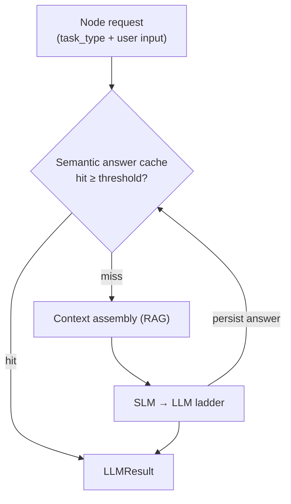
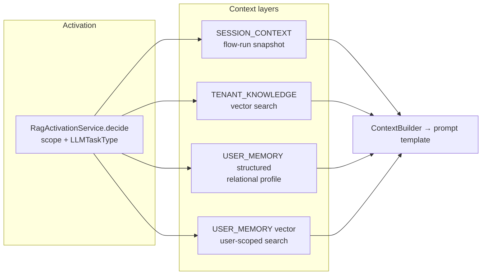
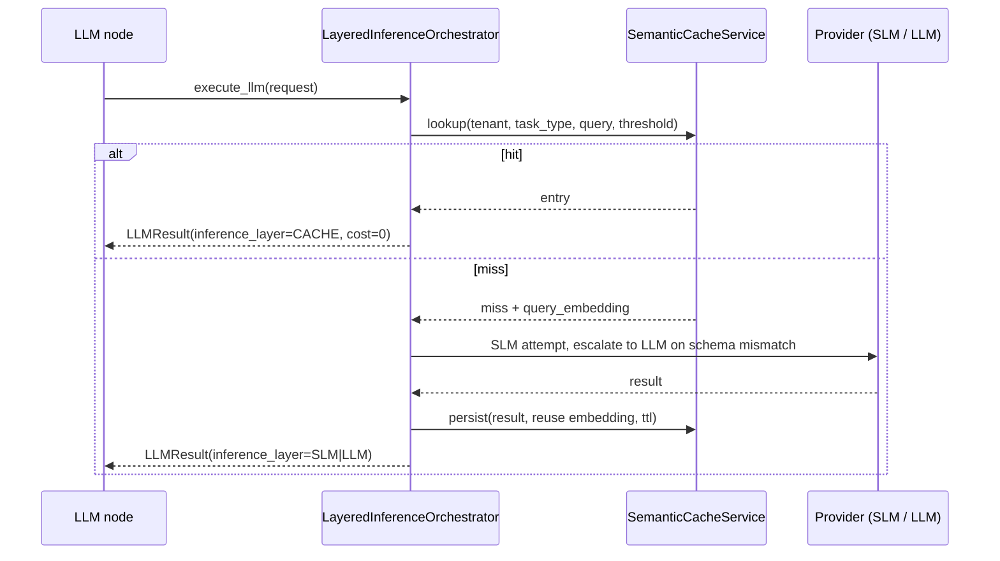

# Context and cache strategy — RAG and CAG

Two families of technique feed and short-circuit inference in this service:

- **RAG (retrieval-augmented generation)** — assemble the prompt from retrieved, governed context
  instead of from an ever-growing conversation transcript.
- **CAG (cache-augmented generation)** — answer or accelerate a request from previously computed
  material: cached answers, cached query embeddings, and cached definitions.

They are complementary: RAG decides *what enters the prompt*, CAG decides *what can be skipped*.
This page is the map; each layer links to its canonical reference.

## RAG — what enters the prompt

Retrieval is **governed**, not automatic. `RagActivationService.decide` gates every retrieval against
structural flags on the node, the published `rag_config`, minimum input length, and tool allowlists;
`MemoryRetrievalService.get_layered_context` then assembles the layers the decision allowed.

| Technique | Where | Reference |
|-----------|-------|-----------|
| Chunking strategies (`SEMANTIC`, `TOKEN_WINDOW`, `PER_PAGE`) driven by `rag_chunking_rule` | ingest | [Chunking strategies](../RAG/chunking-strategies.md) |
| Embedding contract pinned per vector store (provider, model, dimension, metric, version) | ingest + query | [Embedding orchestration](../RAG/embedding-orchestration.md) |
| Metadata-filtered similarity search (`scope`, `user_id`, `source`, `doc_type`, `category`, `expires_after`) | query | [Runtime and integration](../RAG/runtime-and-integration.md) |
| Layered context (session / tenant knowledge / user memory) | query | [Context services and ports](../Context/services-and-ports.md) |
| Specialized corpora: intent examples, tool catalog | query | [Runtime and integration](../RAG/runtime-and-integration.md) |
| Temporal re-ranking of user-memory hits | query | `MemoryRetrievalConfig.temporal_scoring` |
| Activation gate and no-context behaviour | query | [Runtime resolution](../Governance/runtime-resolution.md) |

Retrieved context is bounded before it reaches the model: `top_k`, `similarity_threshold`, and the
output ceiling computed by `CompletionBudgetPolicy`
(see [Structured output and budget](../LLM/structured-output-and-budget.md) and
[Token cost and context strategy](../Develop/token-cost-and-context-strategy.md)).

## CAG — what can be skipped

### 1. Semantic answer cache (answer-level CAG)

`SemanticCacheService` + `LayeredInferenceOrchestrator`, table `semantic_answer_cache`.

- Lookup embeds the query (`text-embedding-3-small`) and searches stored answers for the same
  `tenant_id` and `task_type` above `cache_similarity_threshold` (default **0.92**).
- A hit returns immediately as `InferenceLayer.CACHE` with `cost_usd = 0.0` and `latency_ms = 0`;
  no provider call is made.
- A miss reuses the embedding computed during lookup when persisting, so the answer costs one
  embedding, not two.
- Entries expire by `cache_ttl_seconds` (default **3600**) and track `hit_count`.
- Per-tenant control lives in the runtime LLM policy under `inference_layers` (`cache_enabled`,
  `cache_similarity_threshold`, `cache_ttl_seconds`); an absent or invalid block falls back to the
  orchestrator defaults — see [Layered inference](../LLM/layered-inference.md).

### 2. Query-embedding cache (retrieval-level CAG)

`RagRuntimeService.get_context`, table `rag_query_cache`.

The embedding of a retrieval query is cached per
`(tenant_id, vector_store_id, vector_store_version, contract_hash, query_hash)`. A repeated query
reuses the stored vector and only pays for the similarity search; usage counters are updated on hit.
Entries are invalidated when the embedding contract changes
(`invalidate_query_cache_contract`) or when the vector store is re-indexed
(`invalidate_query_cache_vector_store`), which keeps cached vectors from outliving the model that
produced them. This cache stores **vectors, not answers** — it never bypasses retrieval or governance.

### 3. Definition caches (control-plane CAG)

Published definitions are immutable, which makes them safe to cache aggressively:

| Cache | Backing | TTL | Purpose |
|-------|---------|-----|---------|
| Agent version by node | Redis | 3600 s | Runtime resolution of the agent bound to a node |
| Published tool config batch | Redis | 90 s | Tool resolution and execution |
| RAG config / vector store rows | Redis | 60 s | Retrieval setup |
| LLM pricing rows | Redis | 60 s | Cost engine |
| Node prompts | In-process, invalidated on write | 3600 s | `PromptService` template lookup |
| Built MCP ASGI apps | In-process LRU (64) keyed by spec hash | — | MCP gateway |
| Idempotency keys | Redis | `IDEMPOTENCY_TTL_SECONDS` (default 3600 s) | Deduplicate execution POSTs |

Redis failures are absorbed when `CACHE_SILENT_MODE=true` (default): the request falls through to
Postgres rather than failing. Set it to `false` to surface cache errors.

## Correctness boundaries

- Caches never become a second source of truth. Published versions in Postgres remain authoritative;
  every cached value is derived from an immutable version or carries an explicit TTL.
- Answer caching is keyed by tenant **and** task type, so a cached classification cannot leak across
  tenants or be reused for a different decision.
- Query-embedding entries are keyed by the embedding contract hash, so a model or dimension change
  invalidates them instead of silently mixing vector spaces.
- Cache hits are observable: `inference_layer` on `LLMResult`, OpenTelemetry spans, and execution events
  distinguish `CACHE`, `SLM`, and `LLM` outcomes — see [Tracing and cost](../Develop/tracing-and-cost.md).

## Related

- [RAG overview](../RAG/index.md)
- [LLM overview](../LLM/index.md) · [Semantic cache](../LLM/semantic-cache.md) · [Layered inference](../LLM/layered-inference.md)
- [Context overview](../Context/index.md)
- [Token cost and context strategy](../Develop/token-cost-and-context-strategy.md)
