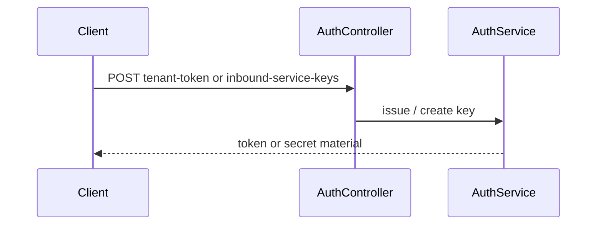

# Auth — guide

The **auth** bounded context issues **tenant-scoped tokens** for machine-to-machine use and manages **inbound service keys** (create/revoke) for tenants. It is intentionally small: most authorization rules live in [Governance enforcement](../Governance/enforcement-and-limits.md) and JWT **scopes** elsewhere.

## Package map

| Area | Path |
|------|------|
| Service | `src/domain/auth/services/auth_service.py` |
| Controller | `src/domain/auth/controllers/auth_controller.py` |
| Repository | `src/domain/auth/repositories/inbound_service_key_repository.py` |
| Schemas | `src/domain/auth/schemas/auth.py` |

## Request flow (simplified)

## Related

- [HTTP API](http-api.md)
- [Governance — scopes](../Governance/http-api-and-scopes.md)
- [Tenants](../Tenants/index.md)
