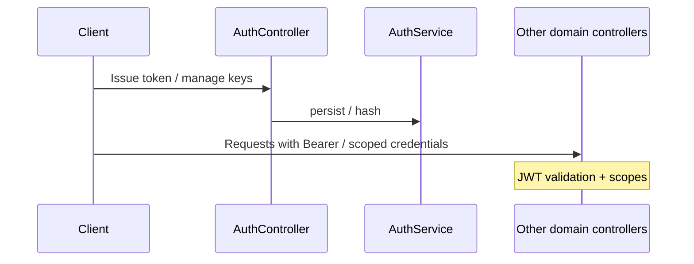

# Auth — integration and runtime

**Auth** issues **tenant-scoped tokens** and manages **inbound service keys**. Downstream controllers depend on **`get_auth_context`** (and related dependencies) rather than calling `AuthService` on every request path.

## Flow

## Related

- [HTTP API](http-api.md)
- [Governance — HTTP API and scopes](../Governance/http-api-and-scopes.md)
