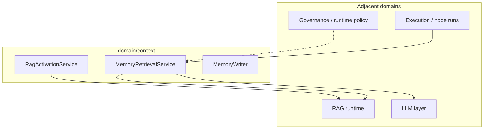

# Context — integration and runtime

**Context** has **no public REST surface**; it connects **execution**, **LLM inference**, **RAG retrieval**, and **policy** through services and ports (see [Services and ports](services-and-ports.md)).

## Runtime placement

- **[RAG](../RAG/index.md)** supplies tenant knowledge when activation and scope allow.
- **[LLM](../LLM/index.md)** consumes layered context built for prompts.
- **[Execution](../Execution/index.md)** provides run and node context for retrieval and tracing.

## Related

- [RAG — runtime and integration](../RAG/runtime-and-integration.md)
- [LLM — context builder](../LLM/context-builder.md)
