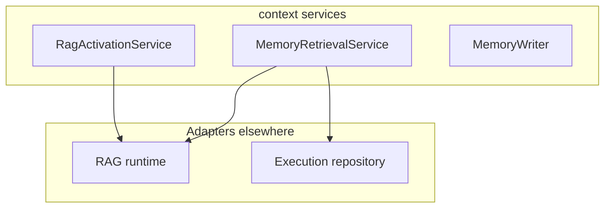

# Context — services and ports

## Ports (`domain/context/ports/service.py`)

| Port | Responsibility |
|------|------------------|
| `TenantKnowledgeRetrieverPort` | Retrieve **tenant knowledge** chunks for a `TenantKnowledgeQuery` |
| `UserMemoryReaderPort` | Read **user memory** context/preferences/profile |
| `MemoryWriteServicePort` | Persist memory writes with optional event context |
| `SessionContextPort` | Load/persist **`SessionContextSnapshot`** for a `flow_run_id` |
| `MemoryRetrievalServicePort` | Higher-level **layered** context for LLM (`get_layered_context`) |

Adapters implementing these protocols live outside this folder (e.g. RAG and execution integrations).

## Key services

- **`MemoryRetrievalService`** — orchestrates tenant + user memory + session layers using the ports above; depends on `RuntimeTracerPort` and `ExecutionContext` for node runs (see `memory_retrieval.py`).
- **`RagActivationService`** — decides whether RAG should run for a task (see `rag_activation_service.py`).
- **`MemoryWriter`** / **`MemoryExtractionProcessor`** — write path and extraction post-processing.

## Diagram

## Related

- [Context overview](index.md)
