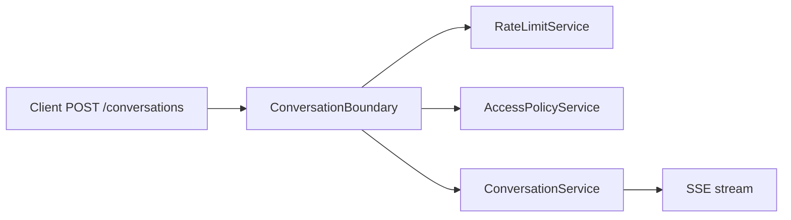

# Conversation — guide

The **conversation** bounded context exposes **streaming conversation turns** over **Server-Sent Events (SSE)** and **read APIs** for operators (interactions, sessions, end users). Runtime enforcement (rate limit + access policy) is applied in **`ConversationBoundary`** before `ConversationService`.

## Package map

| Area | Path |
|------|------|
| Streaming | `conversation_controller.py` → `ConversationBoundary` → `conversation_service.py` |
| Read API | `conversation_read_controller.py` → `conversation_read_service.py` |
| SSE helpers | `sse_writer.py`, `stream_bridge.py` |

## High-level runtime path

## Reading order

1. [SSE and runtime](sse-and-runtime.md)
2. [User input and media](user-input-and-media.md) (optional `input_parts`, normalization to `user_input`)
3. [Read API](read-api.md)
4. [Governance — enforcement](../Governance/enforcement-and-limits.md)
5. [System events](../Develop/system-events-reference.md) for SSE event shapes
