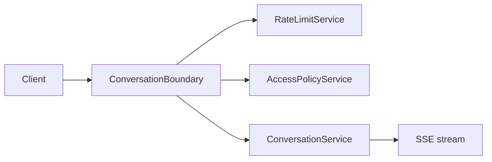

# Conversation — integration and runtime

Streaming and read paths run behind **`ConversationBoundary`**, which applies **rate limits** and **access policy** before **`ConversationService`**.

## Runtime path

- Enforcement details: [Governance — enforcement and limits](../Governance/enforcement-and-limits.md).
- Event shapes: [System events reference](../Develop/system-events-reference.md).

## Related

- [SSE and runtime](sse-and-runtime.md)
