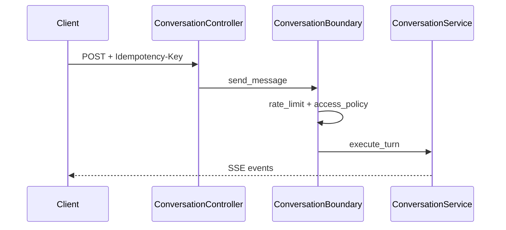

# Conversation — SSE and runtime

## Streaming endpoint

| Method | Path | Response |
|--------|------|----------|
| POST | `/core/v1/conversations` | **`EventSourceResponse`** (SSE) |

Controller: `src/domain/conversation/controllers/conversation_controller.py`  
Router: `prefix="/core/v1"`, `dependencies=[get_auth_context]`.

### Headers

- **`Idempotency-Key`** — **required**; missing → `RouterValidationException` (`missing_idempotency_key`).
- **`Last-Event-ID`** — optional; must parse to non-negative int or validation error.
- **`X-Trace-Id`** — optional UUID for tracing (see controller).

### Boundary behaviour

`ConversationBoundary.send_message` (see `src/services/conversation_boundary.py`):

1. **`RateLimitService.enforce`** with `action=Scope.ExecutionFlowRunCreate`.
2. **`AccessPolicyService.authorize`** with the same action string and `auth.scopes`.
3. Delegates to **`ConversationService.execute_turn`**.

## Sequence

## Related

- [Conversation overview](index.md)
- [Read API](read-api.md)
