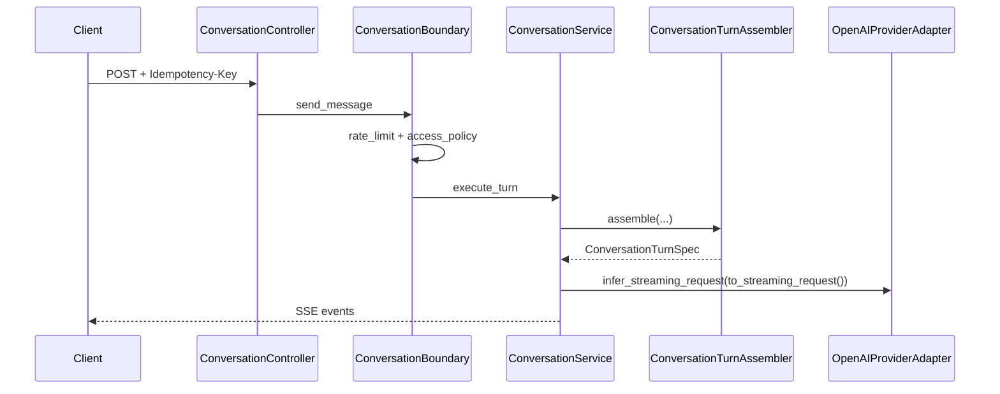

# Conversation — SSE and runtime

## Streaming endpoint

| Method | Path | Response |
|--------|------|----------|
| POST | `/core/v1/conversations` | **`EventSourceResponse`** (SSE) |

Controller: `src/domain/conversation/controllers/conversation_controller.py`
Router: `prefix="/core/v1"`, `dependencies=[get_auth_context_or_api_key]`.

### Headers

- **`Idempotency-Key`** — **required**; missing → `RouterValidationException` (`missing_idempotency_key`).
- **`Last-Event-ID`** — optional; must parse to non-negative int or validation error.
- **`X-Trace-Id`** — optional UUID for tracing (see controller).
- **`Authorization`** — tenant or end-user bearer depending on principal type.
- **`X-End-User-Authorization`** — optional; when the caller is a **machine** principal (BFF / service token on `Authorization`), carries the end-user bearer for MCP tool calls. Must not be sent in request `metadata`.

### Request body

The conversation contract uses `agent_id` as selector and keeps `user_input` / `input_parts` for user text and multimodal input.

### Boundary behaviour

`ConversationBoundary.send_message` (see `src/services/conversation_boundary.py`):

1. **`RateLimitService.enforce`** with `action=Scope.ExecutionFlowRunCreate`.
2. **`AccessPolicyService.authorize`** with the same action string and `auth.scopes`.
3. Resolves trusted end-user bearer: **`Authorization`** for human principals; **`X-End-User-Authorization`** for machine principals (BFF path).
4. Binds sessions to **`ConversationRequest.user_id`** (end-user), not the machine `principal_id`.
5. Delegates to **`ConversationService.execute_turn`**.

Request `metadata` must not include `end_user_authorization` or other forbidden authority keys — use inbound headers instead.

### Runtime path

The endpoint runs in direct low-friction mode:

- `ConversationService` creates minimal interaction audit.
- **`ConversationTurnAssembler.assemble`** resolves the agent's active version and builds a typed
  **`ConversationTurnSpec`** — ordered prompt parts, each carrying a **trust level** — see
  [Turn assembly](turn-assembly.md).
- `turn_spec.to_streaming_request()` produces an **`OpenAIStreamingRequest`**.
- **`OpenAIProviderAdapter.infer_streaming_request`** performs `responses.create(stream=True)`.
- OpenAI events are mapped to internal SSE events.

### SSE event contract

`SSEEventType` has six members; there is no node- or edge-level event on this stream.

| Event | Terminal | Payload |
|-------|----------|---------|
| `connected` | no | `session_id`, `correlation_id`, `interaction_id` |
| `content_delta` | no | `delta`, `source_event_type` |
| `tool_progress` | no | provider-side tool call started / completed |
| `ping` | no | keep-alive |
| `done` | **yes** | `final_text` |
| `error` | **yes** | `error_code`, `correlation_id`, `trace_id` |

Errors arrive **inside** the stream with HTTP 200 — read events until `done` or `error` rather than
trusting the status line.

## Sequence

## Related

- [Conversation overview](index.md)
- [Turn assembly](turn-assembly.md) — prompt parts, trust levels, history modes
- [Read API](read-api.md)
