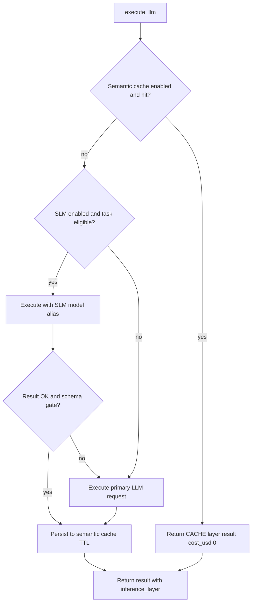

# Token cost and context strategy

This page is the **canonical** description of how **agent-orchestration-core** controls **LLM token usage and USD cost**, **sizes context** (RAG + memory), and applies **caching** and **layered inference**. It maps directly to code under `src/domain/llm/`, `src/domain/rag/`, `src/domain/context/`, and `src/domain/governance/`.

## Goals

The runtime balances:

- **Cost** — Minimize unnecessary LLM calls and bound completion size; attribute USD using `llm_pricing`.
- **Latency** — SLM path, caches, and caps (`max_latency_ms`) where configured.
- **Quality / safety** — Escalation from SLM to full LLM when structured output does not validate; policy enforcement after calls.

Observability uses **Langfuse** (see [Tracing and cost](tracing-and-cost.md)) so operators can **inspect** token usage and estimated cost on traces.

## Layered inference (decision order)

`LayeredInferenceOrchestrator` (`src/domain/llm/services/layered_inference_orchestrator.py`) wraps the core `LLMExecutor` (`src/domain/llm/services/llm_executor.py`) and decides:

1. **Semantic cache (answer cache)** — If `InferenceLayerPolicy.cache_enabled`, a similarity search runs via `SemanticCacheService` (`src/domain/llm/services/semantic_cache_service.py`). On **hit**, the orchestrator returns immediately with `InferenceLayer.CACHE`, **no paid LLM completion** (`token_usage` may be empty; `cost_usd` set to `0` in code path).
2. **SLM path** — For tasks listed in `slm_eligible_tasks` (defaults include `intent_selection`, `tool_selection`), the request is retried with `slm_model_alias` / `slm_provider` from `InferenceLayerPolicy` (`src/domain/llm/schemas/inference_cache.py`).
3. **Escalation** — If `escalation_on_schema_mismatch` is true and the SLM result fails `_passes_confidence_gate` (required keys from `output_schema`), execution falls back to the **primary** LLM.
4. **Primary LLM** — Default path when cache misses and SLM is not used or fails.
5. **Persist** — Successful responses can be written back to the semantic cache with `cache_ttl_seconds`.

Policy can be overridden per call via `policy_llm["inference_layers"]` (validated into `InferenceLayerPolicy`).

## Output token budget (structured outputs)

`CompletionBudgetPolicy` (`src/domain/llm/services/completion_budget_policy.py`) computes `max_tokens` for structured outputs using **tiktoken** (`cl100k_base`) on the serialized **JSON schema**, then applies:

- `schema_factor` (default `1.2`), `safety_margin` (default `16`), `floor` (default `32`)
- Hard cap `policy_max` when provided

This avoids requesting the model maximum when only a small JSON payload is expected.

## Hard caps on `LLMRequest`

`LLMRequest` (`src/domain/llm/schemas/llm.py`) includes `max_tokens`, `max_cost_usd`, `max_latency_ms`, and optional `prompt_cache_key`. After each completion, `LLMExecutor._enforce_policy` (`src/domain/llm/services/llm_executor.py`) validates usage vs `max_tokens` and `max_cost_usd` (latency enforcement is present but may be relaxed in code paths — verify the current branch when auditing).

## Accounting (USD)

`CostEngine.compute_cost` (`src/domain/llm/services/cost_engine.py`) loads active rows from **`llm_pricing`** (input/output **per 1k tokens**) and combines them with provider-reported `token_usage`. `LLMProviderSelector` (`src/domain/llm/services/provider_selector.py`) resolves tenant **model alias** → **provider_model** and pricing before execution.

## Context growth and shrinkage

| Mechanism | Role | Code |
|-----------|------|------|
| **RAG activation** | Skips retrieval/embed work when RAG should not run for the task | `src/domain/context/services/rag_activation_service.py` |
| **Layered memory context** | Composes session, tenant, and user memory; optional temporal rerank on RAG items | `src/domain/context/services/memory_retrieval.py` |
| **Chunking / ingest** | Token windows, overlap, max chunks, truncation flags on ingest | `src/domain/rag/services/rag_runtime_service.py` |

Chunking parameters come from `rag_chunking_rule` / `rag_config` (see [RAG overview](../RAG/index.md) and [Persistence tables](../Glossary/persistence-tables.md)).

## Caches (what each saves)

| Cache | What is reused | Saves |
|-------|----------------|--------|
| **Semantic answer cache** | Prior **LLM JSON answers** for similar queries (embedding similarity) | Full LLM completion cost for repeat intents |
| **RAG query cache** | Query embedding + retrieval contract | Re-embedding and/or duplicate vector search for same query fingerprint |

These are **not** interchangeable: one is **answer-level**, the other **retrieval-level**.

## How to consult costs

### 1. Langfuse (primary runtime view)

1. Configure environment variables in `settings` (see `src/settings.py`):
   - `LANGFUSE_PUBLIC_KEY`, `LANGFUSE_SECRET_KEY`, `LANGFUSE_HOST` (default `https://cloud.langfuse.com`)
   - `TRACING_ENABLED`, `TRACING_LEVEL`
2. Ensure the Langfuse project receives traces from `LangfuseRuntimeTracer` (`src/adapters/observability/langfuse_runtime_tracer.py`).
3. In the **Langfuse UI**, open **Traces** / **Generations** for your project and filter by session, time, or metadata. Generations created from `llm_executor` include **usage** and **cost** metadata where the provider returns token counts and `CostEngine` has computed USD.

This is the main place to **see per-call token usage and estimated cost** in production-like setups.

### 2. Tariffs in Postgres (`llm_pricing`)

To **inspect or change rates** (USD per 1k input/output tokens) for a provider model, use the `llm_pricing` table and related governance repositories — **not** for historical spend totals. `CostEngine` reads active pricing at calculation time.

### 3. Configurable limits (where to tune)

Runtime policy templates include LLM caps (example defaults in `execution_service` — `src/domain/execution/services/execution_service.py`, `runtime_policy` / `llm` block):

- `max_cost_usd`, `max_cost_usd_per_flow_run`, `max_cost_usd_per_tenant_window`
- `max_llm_calls_per_flow_run`, `max_llm_calls_per_tenant_window`
- `max_tokens`, `max_latency_ms`, etc.

Adjust these in **policy configuration** (and persisted policy tables), not only in code, when operating multi-tenant.

### 4. Structured logs (debugging)

`structlog` (`src/adapters/observability/logging.py`) context often includes identifiers such as `flow_run_id` / correlation IDs. Use logs alongside Langfuse to **correlate** a failing request with a trace. See repository **`DEVELOPMENT.md`** for local run and log level.

### 5. What this repo does *not* ship

There is **no** single built-in “cost dashboard” web UI inside this repository. Aggregated billing analytics typically require **Langfuse export**, a **data warehouse**, or downstream finance tools. Any such pipeline is **outside** this service unless explicitly integrated.

## Product limitations

- **SLM local** provider may be incomplete or stubbed in some environments (`SLMLocalProvider`, `src/domain/llm/adapters/slm_local_provider.py`); cost savings depend on deployment.
- **Latency** enforcement in `_enforce_policy` may be disabled in parts of the codebase — confirm before relying on it for SLOs.

## Related

- [LLM domain services](../LLM/index.md) — executor, layered inference, semantic cache, provider selection (code-grounded detail)
- [Tracing and cost](tracing-and-cost.md)
- [Glossary: execution event](../Glossary/terms/execution-event.md)
- [Documentation map (AI)](../AI/documentation-map.md)
