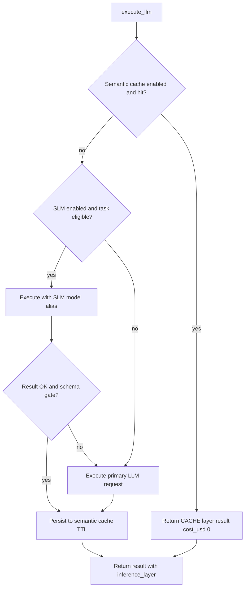
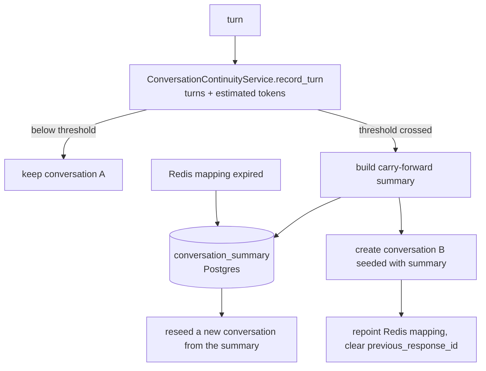

# Token cost and context strategy

This page is the **canonical** description of how **agent-orchestration-core** controls **LLM token usage and USD cost**, **sizes context** (RAG + memory), and applies **caching** and **layered inference**. It maps directly to code under `src/domain/llm/`, `src/domain/rag/`, `src/domain/context/`, and `src/domain/governance/`.

## Goals

The runtime balances:

- **Cost** — Minimize unnecessary LLM calls and bound completion size; attribute USD using `llm_pricing`.
- **Latency** — SLM path, caches, and caps (`max_latency_ms`) where configured.
- **Quality / safety** — Escalation from SLM to full LLM when structured output does not validate; policy enforcement after calls.

Observability uses **OpenTelemetry** (see [Tracing and cost](tracing-and-cost.md)) so operators can **inspect** token usage and estimated cost on traces and in Grafana.

## Layered inference (decision order)

`LayeredInferenceOrchestrator` (`src/domain/llm/services/layered_inference_orchestrator.py`) wraps the core `LLMExecutor` (`src/domain/llm/services/llm_executor.py`) and decides:

1. **Semantic cache (answer cache)** — If `InferenceLayerPolicy.cache_enabled`, a similarity search runs via `SemanticCacheService` (`src/domain/llm/services/semantic_cache_service.py`). On **hit**, the orchestrator returns immediately with `InferenceLayer.CACHE`, **no paid LLM completion** (`token_usage` may be empty; `cost_usd` set to `0` in code path).
2. **SLM path** — For tasks listed in `slm_eligible_tasks` (defaults include `intent_selection`, `tool_selection`), the request is retried with `slm_model_alias` / `slm_provider` from `InferenceLayerPolicy` (`src/domain/llm/schemas/inference_cache.py`).
3. **Escalation** — If `escalation_on_schema_mismatch` is true and the SLM result fails `_passes_confidence_gate` (required keys from `output_schema`), execution falls back to the **primary** LLM.
4. **Primary LLM** — Default path when cache misses and SLM is not used or fails.
5. **Persist** — Successful responses can be written back to the semantic cache with `cache_ttl_seconds`.

Policy can be overridden per call via `policy_llm["inference_layers"]` (validated into `InferenceLayerPolicy`).

## Output token budget (structured outputs)

`CompletionBudgetPolicy` (`src/domain/llm/services/completion_budget_policy.py`) computes `max_tokens` for structured outputs using **tiktoken** (`cl100k_base`) on the serialized **JSON schema**, then applies:

- `schema_factor` (default `1.2`), `safety_margin` (default `16`), `floor` (default `32`)
- Hard cap `policy_max` when provided

This avoids requesting the model maximum when only a small JSON payload is expected.

## Hard caps on `LLMRequest`

`LLMRequest` (`src/domain/llm/schemas/llm.py`) includes `max_tokens`, `max_cost_usd`, `max_latency_ms`, and optional `prompt_cache_key`. After each completion, `LLMExecutor._enforce_policy` (`src/domain/llm/services/llm_executor.py`) validates usage against all three, raising `llm_policy_max_tokens_exceeded`, `llm_policy_cost_exceeded`, or `llm_policy_latency_exceeded`.

## Accounting (USD)

`CostEngine.compute_cost` (`src/domain/llm/services/cost_engine.py`) loads active rows from **`llm_pricing`** (input/output **per 1k tokens**) and combines them with provider-reported `token_usage`. `LLMProviderSelector` (`src/domain/llm/services/provider_selector.py`) resolves tenant **model alias** → **provider_model** and pricing before execution.

## Context growth and shrinkage

| Mechanism | Role | Code |
|-----------|------|------|
| **RAG activation** | Skips retrieval/embed work when RAG should not run for the task | `src/domain/context/services/rag_activation_service.py` |
| **Layered memory context** | Composes session, tenant, and user memory; optional temporal rerank on RAG items | `src/domain/context/services/memory_retrieval.py` |
| **Chunking / ingest** | Token windows, overlap, max chunks, truncation flags on ingest | `src/domain/rag/services/rag_runtime_service.py` |
| **`ContextSummarizer` node** | Compacts a named node's output in **graph state** once it exceeds a byte threshold | `src/domain/execution/services/graph_runtime/nodes/context_summarizer.py` |

Chunking parameters come from `rag_chunking_rule` / `rag_config` (see [Chunking strategies](../RAG/chunking-strategies.md), [RAG overview](../RAG/index.md), and [Persistence tables](../Glossary/persistence-tables.md)).

### What is and is not bounded

`ContextSummarizer` bounds payloads travelling **in graph state** between nodes. It is size-gated
(`min_payload_bytes_to_run`) so it costs nothing below the threshold, and reports how much it
saved. Configuration: [Non-LLM nodes → ContextSummarizer](../Execution/graph-runtime/nodes/llm-nodes.md#contextsummarizer).

Two growth surfaces it does **not** bound, and one that is now bounded elsewhere:

1. **Retrieved memory and knowledge.** There is no context or token budget on the system context;
   retrieved items are concatenated unbounded. *(Open.)*
2. **Structured-memory retention.** `retention_ttl` is advisory metadata — there is no eviction
   or purge job, so structured memory never expires. *(Open.)*
3. **Provider-side conversation history** — now bounded by conversation rollover, below.

## Provider-side conversation rollover

With the OpenAI provider, history lives in the Conversations API keyed by `conversation_key` with
`previous_response_id` chaining. `ContextSummarizer` cannot reach it: the transcript is not in graph
state, it is with the provider. Two things were therefore true at once — the conversation grew
without limit, and when the 24h Redis mapping expired the whole thread vanished silently.

The chosen strategy is to **roll the provider conversation**, not to own history locally. That keeps
provider-side caching and the `previous_response_id` chain, at the cost of bounding by an
**estimate** rather than the provider's authoritative token count.

| Piece | Where |
|-------|-------|
| Growth counters (turns, estimated tokens) | Redis, 30-day TTL, reset on rollover |
| Token estimate | tiktoken `cl100k_base`, falling back to `len/4` |
| Durable carry-forward | `conversation_summary` table — Postgres, because Redis is allowed to fail silently |
| Thresholds | `ConversationContinuityPolicy`: `max_turns` (40), `max_estimated_tokens` (60k), `summary_max_chars` (4k) |
| Boundary | `ConversationContinuityPort` lives in `domain/llm/ports/` so the provider adapter never imports `domain/conversation` — an architectural rule with a test enforcing it |

Two behaviours worth stating plainly:

- **A mapping miss no longer loses history.** If `conversation_summary` has a row, the replacement
  conversation is seeded with it. Only a conversation that has never rolled over starts empty.
- **Failures never break a turn.** If counters are unreadable the decision is "do not roll over"
  (rather than rolling on every turn), and a failed rollover is logged, not raised.

The bound is an estimate maintained on our side. That is the honest limitation of keeping the
transcript with the provider; owning history locally would make it exact and is the alternative that
was weighed and not taken.

## Caches (what each saves)

| Cache | What is reused | Saves |
|-------|----------------|--------|
| **Semantic answer cache** | Prior **LLM JSON answers** for similar queries (embedding similarity) | Full LLM completion cost for repeat intents |
| **RAG query cache** | Query embedding + retrieval contract | Re-embedding and/or duplicate vector search for same query fingerprint |

These are **not** interchangeable: one is **answer-level**, the other **retrieval-level**.

## How to consult costs

### 1. Grafana (primary runtime view)

1. Configure environment variables in `settings` (see `src/settings.py`):
   - `OTEL_EXPORTER_OTLP_ENDPOINT` (default `http://localhost:4318`), `OTEL_SERVICE_NAME`
   - `TRACING_ENABLED`, `METRICS_ENABLED`
2. Start the stack: `docker compose up -d`.
3. Open **D3 LLM Cost and Tokens** on `http://localhost:3000`. Spend and tokens come from
   `llm_usage_ledger` in Postgres; live call rate and latency come from spans via the Collector's
   spanmetrics connector.
4. To inspect a single call, open **D2 Graph Execution**, find the run, and follow the `trace_id`
   link into Tempo. Generation spans carry `gen_ai.usage.input_tokens`, `gen_ai.usage.output_tokens`
   and `aoc.gen_ai.cost.usd` as typed numbers wherever the provider returned token counts and
   `CostEngine` computed USD.

> **Every currency figure is currently 1000x too high** (gap G-02): `CostEngine` divides by 1000
> against per-1M prices. Relative rankings are correct; absolute USD is not. Token counts are
> unaffected and are the trustworthy quantity until that is fixed.

### 2. Tariffs in Postgres (`llm_pricing`)

To **inspect or change rates** (USD per 1k input/output tokens) for a provider model, use the `llm_pricing` table and related governance repositories — **not** for historical spend totals. `CostEngine` reads active pricing at calculation time.

### 3. Configurable limits (where to tune)

Runtime policy templates include LLM caps (example defaults in `execution_service` — `src/domain/execution/services/execution_service.py`, `runtime_policy` / `llm` block):

- `max_cost_usd`, `max_cost_usd_per_flow_run`, `max_cost_usd_per_tenant_window`
- `max_llm_calls_per_flow_run`, `max_llm_calls_per_tenant_window`
- `max_tokens`, `max_latency_ms`, etc.

Adjust these in **policy configuration** (and persisted policy tables), not only in code, when operating multi-tenant.

### 4. Structured logs (debugging)

`structlog` (`src/adapters/observability/logging.py`) context often includes identifiers such as `flow_run_id` / correlation IDs. Every log record now carries `trace_id` and `span_id`, so Loki and Tempo cross-link in both directions. See repository **`DEVELOPMENT.md`** for local run and log level.

### 5. What this repo does *not* ship

The provisioned Grafana dashboards cover operational cost inspection. Long-horizon billing analytics (multi-month rollups, invoicing, chargeback) still require a **data warehouse** or downstream finance tooling; `llm_usage_ledger` is the export surface. Any such pipeline is **outside** this service unless explicitly integrated.

## Product limitations

- **SLM local** provider may be incomplete or stubbed in some environments (`SLMLocalProvider`, `src/domain/llm/adapters/slm_local_provider.py`); cost savings depend on deployment.
- **Retrieved memory and knowledge** carry no token budget of their own — see [What is and is not bounded](#what-is-and-is-not-bounded).

## Related

- [LLM domain services](../LLM/index.md) — executor, layered inference, semantic cache, provider selection (code-grounded detail)
- [Tracing and cost](tracing-and-cost.md)
- [Glossary: execution event](../Glossary/terms/execution-event.md)
- [Documentation map (AI)](../AI/documentation-map.md)
