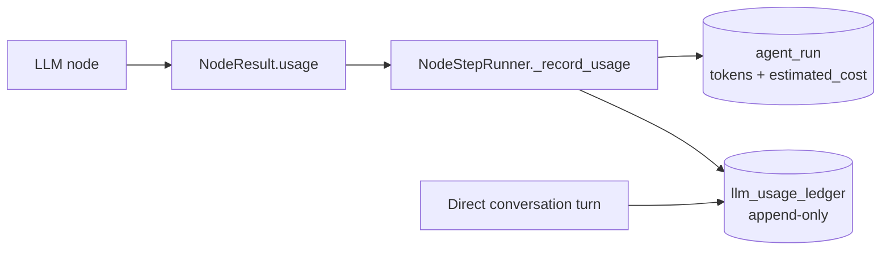

# Tracing and cost

This page is the **entry point for observability**: how traces and metrics are emitted, and where to
look in Grafana. For **how the runtime controls token spend, context size, caches, and layered
inference**, use the canonical guide **[Token cost and context strategy](token-cost-and-context-strategy.md)**.

## OpenTelemetry

Runtime tracing is implemented by `src/adapters/observability/otel_runtime_tracer.py`, behind
`RuntimeTracerPort`. Domain code depends on the port, never on OpenTelemetry SDK types — a unit test
(`tests/unit/execution/test_vendor_tracer_confinement.py`) enforces that the SDK is imported only
under `src/adapters/observability/`.

Spans cover flow and conversation roots, graph nodes, LLM generations, retrieval, tool execution and
guardrail decisions.

### Two paths, one join key

Observability is deliberately split, because neither store can serve both jobs.

| Path | Serves | Why |
|------|--------|-----|
| **A — OTLP → Collector → Tempo / Prometheus** | HTTP RED, node/tool/LLM latency, span error taxonomy | Postgres has no timing for these; `flow_run.started_at`, `node_run.started_at` and `tool_run.started_at`/`finished_at` are unwritten |
| **B — Grafana → Postgres** | cost, SLA, events, governance audit, RAG, version A/B | exact, durable, tenant-scoped and already indexed |

They join on **`flow_run.trace_id`**, which is 87/87 populated and never equals `flow_run_id`. A
32-character hex UUID *is* a valid W3C 128-bit trace id, so a Grafana table on Postgres deep-links
straight into a Tempo trace with **no schema change**. Dashboard D2 ships that link.

The agent plane has no equivalent: `agent_run`, `agent_run_event`, `agent_run_message` and `tool_run`
carry no `trace_id`, so an agent-plane panel is a terminal artefact.

### Attribute contract

Token and cost values are exported as **typed numbers**, not JSON strings:

| Attribute | Type |
|-----------|------|
| `gen_ai.usage.input_tokens` / `output_tokens` / `total_tokens` | int |
| `aoc.gen_ai.cost.usd` | double |
| `gen_ai.request.model`, `gen_ai.response.model`, `gen_ai.provider.name`, `gen_ai.operation.name` | string |
| `aoc.observation.type` | string — the `as_type` of the observation |

This is what lets the Collector's **spanmetrics** connector and Grafana aggregate cost and tokens
directly, with no OTTL `ParseJSON` transform in the pipeline.

Successful spans end `StatusCode.OK` and failures end `ERROR` with `exception.type` /
`exception.message`, so a span-metrics split on status is meaningful.

### Propagation and privacy

- The global propagator is pinned to **TraceContext only**. W3C `baggage` is deliberately **not**
  enabled: it would inject `tenant_id`, `user_id`, `flow_id` and `correlation_id` into *outbound*
  requests, including tenant-configured third-party tool endpoints reached through
  `infra/http_tool_executor.py`.
- **`OTEL_CAPTURE_CONTENT` defaults to `false`**, so prompts and completions are not exported.
- Log records are exported over OTLP to the Collector and on to Loki (`LOGS_ENABLED`, default true).
  Every record carries `trace_id` and `span_id`, so Tempo and Loki cross-link in both directions.
- Only an allowlist of structlog context variables reaches spans (`correlation_id`, `request_id`,
  `trace_id`, `tenant_id`, `request.method`, `request.url.path`). `request.url`,
  `request.query_params`, `request.headers`, `request.user_agent` and `request.referer` are dropped —
  a query string can carry an `api_key`. The Collector repeats the deletion as a backstop.

### Sampling and volume

- Spans whose name contains `repository.` are thinned by `OTEL_SAMPLE_RATIO_REPOSITORY` (default
  `0.1`). 176 of 300 instrumentation sites are plain SQL access in `repositories/`.
- `as_type="event"` observations become span **events** on the current span, and the Collector drops
  event-bookkeeping spans outright — they duplicate the `execution_event` table and run at roughly
  19 spans per flow run.

### Running the stack

```bash
docker compose up -d
```

Grafana is on `http://localhost:3000`. Four dashboards are provisioned from
`resources/observability/grafana/dashboards/`:

| Dashboard | Contents |
|-----------|----------|
| D1 Service Health | HTTP RED, span error taxonomy, Collector health, cost-loss log alerts |
| D2 Graph Execution | node latency, funnel, edge decisions, loops, version A/B, trace deep-link |
| D3 LLM Cost and Tokens | spend and tokens by model/task/layer, pricing gaps, attribution completeness |
| D4 Human SLA and Governance | handoff and containment, backlog, authoring audit, policy blind spots |

### What is still not measurable

Panels for these are shipped as labelled placeholders rather than as charts that would read zero
forever:

| Gap | Why |
|-----|-----|
| G-02 | Every currency figure is **1000x too high** — `cost_engine` divides by 1000 against per-1M prices. Token counts are unaffected and are the trustworthy quantity |
| G-08 | **Cost per execution** — `llm_usage_ledger.flow_run_id` and `node_run_id` are 0/23 |
| G-07b | **SLA breach / assignment / resolution** — no policy rows exist, no evaluator runs, no case leaves OPEN |
| G-10 | **Guardrail enforcement** — `RuntimePolicyLlmSchema` has no cost field, so Pydantic silently drops every cost limit |
| G-21 | **Time to first token** — `completion_start_time` is stamped before the provider call, so it would report ~0. The adapter accepts and drops it rather than record a false number |
| — | **In-flight runs** — `RunStatus.RUNNING` is never written on the in-process path |

## Cost

LLM and embedding usage flows through domain services that apply **governance and pricing** hooks (`llm_pricing`, provider config). Exact call sites vary by feature; start from `src/domain/llm/` and `src/domain/rag/` when auditing cost paths. **Narrative and operator steps:** [Token cost and context strategy](token-cost-and-context-strategy.md).

## Spend ledger — `llm_usage_ledger`

Traces are a **telemetry sink**, not a system of record: they are sampled, retained for a limited
window, and the Collector can be unreachable. Every provider interaction therefore also appends a row to
**`llm_usage_ledger`** in Postgres, so *"what did tenant X spend last month"* has an answer from the
product's own database.



| Column | Meaning |
|--------|---------|
| `tenant_id`, `session_id`, `flow_run_id`, `node_run_id`, `agent_run_id` | attribution; indexed on `(tenant_id, occurred_at)` |
| `provider`, `provider_model`, `task_type` | what was called |
| `inference_layer` | `LLM`, `SLM` or `CACHE` — a semantic-cache hit is recorded at cost `0` and must not be read as spend |
| `input_tokens`, `output_tokens`, `cost_usd`, `latency_ms` | the measurement |

```sql
SELECT sum(cost_usd)
FROM llm_usage_ledger
WHERE tenant_id = :tenant_id AND occurred_at >= :since;
```

`ExecutionRepository.sum_llm_cost_for_tenant` wraps that query.

**`agent_run` is populated too.** `input_tokens`, `output_tokens` and `estimated_cost` used to be
dead columns: `create_agent_run` was reachable only from an HTTP endpoint, never from node
execution. The step runner now creates the `AgentRun` when an agent version governs the node,
which also makes the `assert_can_create_agent_run` governance gate reachable.

Accounting is **best-effort by design**: a ledger failure is logged and swallowed rather than
failing a node that already produced its result. Budget *enforcement* is the opposite — see below.

## Budget enforcement

`GuardrailEngine` reserves before the call and records after it. Two properties matter:

- **Atomic.** Counters use `INCRBYFLOAT`, so concurrent calls accumulate. The previous
  read-then-write pair lost spend whenever two calls overlapped.
- **Fail-closed.** If a counter cannot be read or written, the engine raises
  `GuardrailUnavailableException` (503) rather than treating the budget as zero. `CACHE_SILENT_MODE`
  still absorbs ordinary cache failures elsewhere, but it must not absorb the thing that stops
  runaway spend.

Latency policy is enforced again: `max_latency_ms` raises `llm_policy_latency_exceeded`. It had been
disabled behind a debug `print` with the raise commented out.

## Related

- [Token cost and context strategy](token-cost-and-context-strategy.md) — layered inference, budgets, RAG/context, and how to consult costs
- [Documentation map (AI)](../AI/documentation-map.md)
- Repository `DEVELOPMENT.md` for local runbook commands
