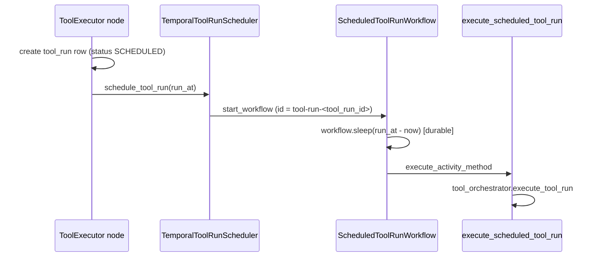
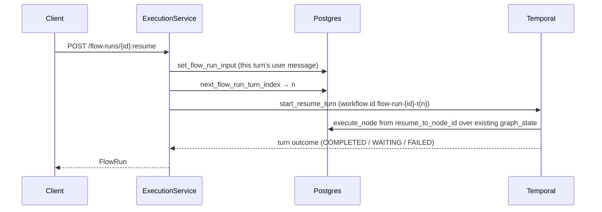

# Durable execution (Temporal)

Flow runs and scheduled tool runs can execute as **Temporal workflows** instead of inline in the
HTTP request. This page covers what runs where, how to operate it locally, and — importantly —
which parts of the durable path are **not yet complete**.

Source: `src/adapters/temporal/`.

## Two workflows, two task queues

| Workflow | Task queue setting | Default | Purpose |
|----------|--------------------|---------|---------|
| `FlowRunWorkflow` | `TEMPORAL_TASK_QUEUE` | `flow-runs` | Executes a whole flow run as a durable graph traversal. |
| `ScheduledToolRunWorkflow` | `TEMPORAL_TOOL_RUN_TASK_QUEUE` | `tool-runs` | Waits on a durable timer, then executes one deferred tool run. |

They are deliberately on **separate queues** so a backlog of scheduled tool runs cannot starve
live flow-run activity slots. `src/adapters/temporal/worker.py` runs both `Worker` instances
concurrently in a single process.

### `FlowRunWorkflow` activities

| Activity | Role |
|----------|------|
| `prepare_flow_run` | Loads the flow version, compiles the plan, creates the `FlowRun` row. |
| `execute_node` | Executes exactly one node and evaluates its outgoing edges. |
| `finalize_flow_run` | Writes the terminal state. |

The graph loop lives in the **workflow**; each node is one activity. That is what makes a node
failure retryable without replaying the LLM calls of earlier nodes.

### `ScheduledToolRunWorkflow`



The wait is a **server-side timer**, not a process-local sleep: restarting the worker does not
lose the schedule. The workflow id is derived from the tool run id and started with
`WorkflowIDReusePolicy.REJECT_DUPLICATE`, so a duplicate schedule request for the same tool run
is refused rather than double-booked. `MAX_SCHEDULE_HORIZON` caps the wait at 365 days.

State is exposed as a query (`get_state`): `WAITING → EXECUTING → COMPLETED` / `FAILED`.

## Configuration

| Variable | Default | Meaning |
|----------|---------|---------|
| `TEMPORAL_ENABLED` | `false` | Master switch. When false, flow runs stay inline in the HTTP request. |
| `TEMPORAL_HOST` | `localhost:7233` | Frontend address. |
| `TEMPORAL_NAMESPACE` | `default` | Namespace. |
| `TEMPORAL_TASK_QUEUE` | `flow-runs` | Flow-run queue. |
| `TEMPORAL_TOOL_RUN_TASK_QUEUE` | `tool-runs` | Scheduled tool-run queue. |
| `TEMPORAL_TLS` | `false` | Enable TLS to the frontend. |
| `TEMPORAL_API_KEY` | `""` | API key for Temporal Cloud. |
| `TEMPORAL_FAIRNESS_ENABLED` | `false` | Sets `Priority(fairness_key=tenant_id)` so one noisy tenant cannot monopolise the queue. |
| `TEMPORAL_WORKER_MAX_CONCURRENT_ACTIVITIES` | `20` | Per-worker activity slots. |
| `TEMPORAL_WORKER_MAX_CONCURRENT_WORKFLOW_TASKS` | `50` | Per-worker workflow task slots. |
| `TEMPORAL_NODE_START_TO_CLOSE_TIMEOUT_MS` | `30000` | Per-node activity timeout. |
| `TEMPORAL_WORKFLOW_RUN_TIMEOUT_MS` | `120000` | Whole flow-run timeout. |
| `TEMPORAL_TURN_WAIT_TIMEOUT_MS` | `125000` | How long the caller waits for a turn. Keep above the workflow run timeout. |
| `TEMPORAL_TOOL_RUN_MAX_ATTEMPTS` | `3` | Retry attempts for the scheduled tool-run activity. |

## Running it locally

```bash
make temporal-up     # docker compose up -d temporal
make worker          # PYTHONPATH=src TEMPORAL_ENABLED=true python -m adapters.temporal.worker
make temporal-ui     # prints the Web UI URL
```

The Web UI is at <http://localhost:8233>. To route flow runs through Temporal, the **API process**
also needs `TEMPORAL_ENABLED=true` — the worker flag alone is not enough.

Verify the scheduled path end to end without any tenant data:

```bash
PYTHONPATH=src uv run python examples/scheduled_tool_run.py
```

It starts a real workflow, asserts the side effect has **not** happened while the timer is
pending, and asserts it fires afterwards.

## Determinism

Workflow code must be replay-safe. The sandbox runner is built by
`src/adapters/temporal/sandbox.py`, and DTOs cross the boundary through
`pydantic_data_converter`. Inside workflow code:

- use `workflow.now()`, never `datetime.now()`
- use `workflow.sleep()`, never `asyncio.sleep()`
- keep all I/O in activities

Replay tests run against recorded histories in `tests/unit/temporal/histories/`:

```bash
make test-temporal   # 47 tests
```

## Resuming a WAITING run

`FlowRunWorkflow` is **turn-scoped**: it returns when the run reaches `COMPLETED`, `FAILED` or
`WAITING`. There is therefore no live workflow to signal when a WAITING run resumes — the previous
turn's workflow has already returned. A resume is a **new workflow for the next turn**, not a signal
into the old one.

That works because graph state lives in Postgres, not in workflow history: `execute_node` reloads
`graph_state` on every step, and `prepare_flow_run` seeds state only when it is absent. The new turn
starts at `resume_to_node_id` over the state the previous turn left behind.



| Piece | Where |
|-------|-------|
| Workflow id per turn | `workflow_id_for(flow_run_id, turn_index)` → `flow-run-{id}-t{n}`; turn 0 keeps the original id, so `REJECT_DUPLICATE` still guards double-dispatch of the *same* turn |
| Turn counter | `flow_run.turn_index`, incremented atomically by `next_flow_run_turn_index` |
| This turn's input | `set_flow_run_input` before dispatch — `execute_node` builds its context from `flow_run.input`, so the resume message must be persisted, not passed transiently. Per-turn history stays in `interaction`. |
| Engine entry point | `WorkflowEnginePort.start_resume_turn` (replaces the raising `signal_resume`) |

`resume_flow_run` branches on `TEMPORAL_ENABLED` exactly as `create_flow_run` does, so a conversation
is durable for every turn or for none — never only its first.

## Reconciling stranded runs

A crash between `prepare_flow_run` and `finalize_flow_run` used to leave the row QUEUED or RUNNING
forever. `FlowRunReconciler` (`src/domain/execution/services/flow_run_reconciler.py`) runs as a third
coroutine in the worker process and sweeps rows whose `updated_at` has not moved inside the stale
window, backed by the `ix_flow_run_status_updated_at` index.

For each candidate it asks the engine whether the workflow is still alive:

| Engine answer | Action |
|---------------|--------|
| Running, or WAITING | leave it |
| Workflow not found (`RPCStatusCode.NOT_FOUND`) | fail the run |
| Completed / failed / terminated / timed out | fail the run |
| Engine unreachable (exception) | leave it — an unreachable Temporal is not evidence that the run is dead |
| `TEMPORAL_ENABLED=false`, no engine | fail past the stale window |

Failing writes `FlowFailureReason.STRUCTURAL_ERROR` with `message: flow_run_abandoned` and emits a
`FlowFailed` execution event, so an abandoned run is distinguishable from one that failed on its own.

| Setting | Default |
|---------|---------|
| `FLOW_RUN_RECONCILER_ENABLED` | `true` |
| `FLOW_RUN_RECONCILER_INTERVAL_SECONDS` | `60` |
| `FLOW_RUN_RECONCILER_STALE_AFTER_SECONDS` | `900` |
| `FLOW_RUN_RECONCILER_BATCH_SIZE` | `50` |

## Known gaps

These are real limitations of the current implementation, not future ideas. Limitations that
change how you would deploy the service are collected in
[Known limitations](../Develop/limitations.md).

- **Activity retries re-execute the whole node**, duplicating tool side effects and LLM spend.
  The selective-retry fix in `ToolExecutor` addresses the in-graph loop, not this.
- **No workflow versioning strategy.** Replay coverage exists but nothing requires a new recorded
  history when the workflow changes. The turn-scoped resume design limits the blast radius — a
  workflow only has to survive replay for the duration of one turn, not a whole conversation — but
  it does not remove the need for a policy.
- **Async mode caches a `QUEUED` response** under the idempotency key, so `wait=false` retries return
  a stale result.

The worker now declares a `healthcheck` in `docker-compose.yml`, and `/health` reports a `temporal`
component whenever `TEMPORAL_ENABLED` is true.

## Related

- [Flow lifecycle](flow-lifecycle.md)
- [Execution service](execution-service.md)
- [Non-LLM nodes → ToolExecutor](graph-runtime/nodes/non-llm-nodes.md#toolexecutor) — `SCHEDULED` config
- [Known limitations](../Develop/limitations.md)
