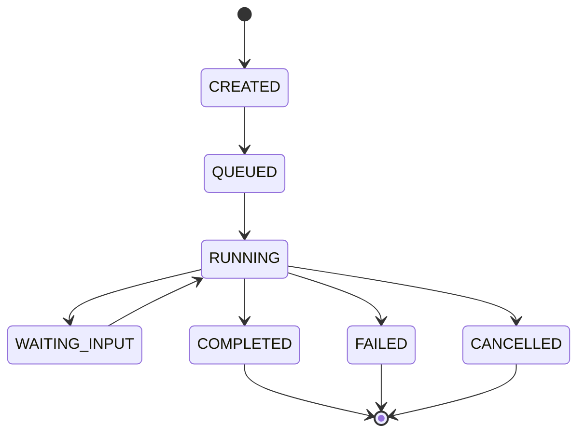
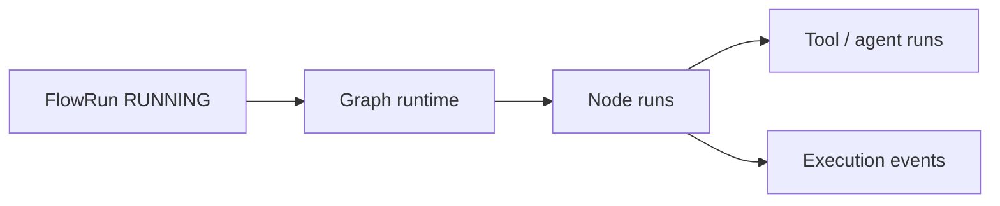

# Flow run lifecycle

High-level lifecycle for a published flow execution.

Runtime transitions are enforced by `ExecutionStateMachine` and related services under `domain/execution/`. Authoring-time flow versions remain immutable; runs reference explicit version identifiers.

## Interaction with graph runtime

After a [flow run](../Glossary/terms/flow-run.md) reaches `RUNNING`, the **graph runtime** (`src/domain/execution/services/graph_runtime/`) drives node execution:

- **Compiler / planner output** is consumed as a structured graph snapshot (see [Flow graph snapshot](../Glossary/terms/flow-graph-snapshot.md)).
- **Nodes** execute in an order determined by edges and conditions (`domain/flows/` compilation, `condition_expression` at persistence layer).
- **Hooks** (memory, tracing, tools) are orchestrated through execution services—not by mutating authoring rows.

Behavioural specs also live under `tests/bdd/graph_runtime/` (compiler, registry, nodes).

For graph compilation and edge conditions, see `domain/flows/services/` and `domain/execution/services/graph_runtime/`.

## Related

- [Execution domain overview](index.md), [Graph runtime](graph-runtime/index.md)
- [Node templates](node-templates.md), [Demo seed graph](demo-seed-graph.md)
- [RAG overview](../RAG/index.md)
- [System events reference](../Develop/system-events-reference.md) — runtime `ExecutionEventType` and SSE shapes
- [Runtime vs authoring](../Architecture/runtime-vs-authoring.md)
- [Documentation map (AI)](../AI/documentation-map.md)
