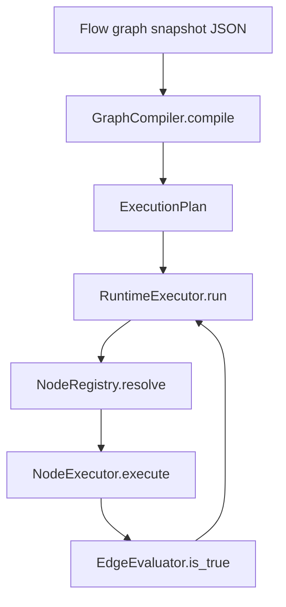

# Graph runtime overview

The **graph runtime** under `src/domain/execution/services/graph_runtime/` turns a persisted **flow graph snapshot** into a deterministic **`ExecutionPlan`**, then **`RuntimeExecutor`** walks nodes, persists **node runs** and **graph state**, evaluates **outgoing edges** with **`EdgeEvaluator`**, and dispatches **`NodeExecutor`** implementations from **`NodeRegistry`**.

## Folder map

| Module | Role |
|--------|------|
| `execution_plan.py` | `CompiledEdge`, `ExecutionPlan` models |
| `graph_compiler.py` | Snapshot → plan; structural validation |
| `executor.py` | `RuntimeExecutor` main loop |
| `edge_evaluator.py` | Condition compile/evaluate |
| `registry.py` | `NodeRegistry` |
| `agent_runtime_resolver.py` | Per-node system prompt from agent version |
| `types.py` | `ExecutionContext`, `NodeResult`, `NodeExecutor` protocol |
| `nodes/` | Concrete node implementations |

## Related

- [Execution service](../execution-service.md)
- [Execution plan](execution-plan.md), [Graph compiler](graph-compiler.md), [Runtime executor](runtime-executor.md), [Edge evaluator](edge-evaluator.md), [Node registry](node-registry.md)
