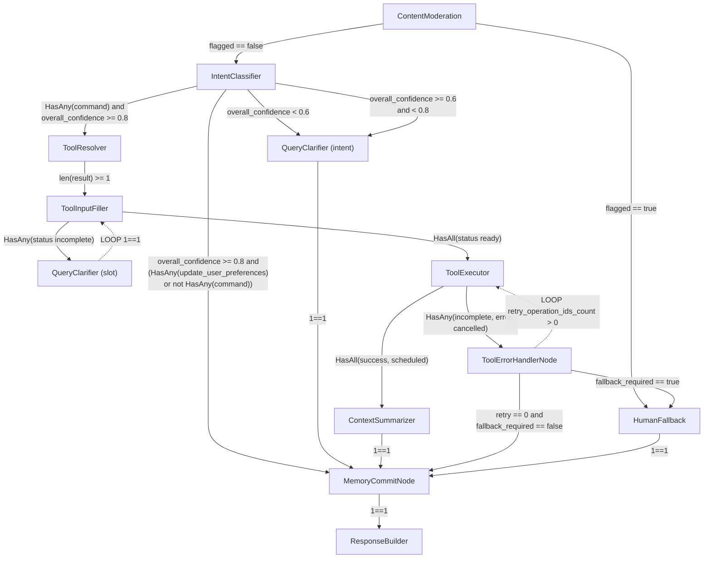

# Node templates catalog

All node descriptions below are **templates**: copy and adapt for your flows.

## Context structure

Context is built dynamically from the prompts available for the run. Not every prompt slot is required every time. Example message list:

```json
[
  {"role": "system", "content": "system_prompt"},
  {"role": "system", "content": "node_prompt"},
  {"role": "system", "content": "tool_input_context.prompt"},
  {"role": "system", "content": "tool_output_context.prompt"},
  {"role": "system", "content": "tenant_profile.prompt"},
  {"role": "system", "content": "user_profile.prompt"},
  {"role": "user", "content": "user.input_message"}
]
```

### Prompt slots

- **system_prompt:** Persona, rules, and guardrails for the agent.
- **node_prompt:** Task-specific node prompt (SLM/LLM).
- **tool_input_context.prompt:** Context for tool input (e.g. OpenAPI).
- **tool_output_context.prompt:** Context for tool output.
- **tenant_profile.prompt:** Tenant-scoped knowledge from RAG (e.g. knowledge base).
- **user_profile.prompt:** User-scoped RAG or summarized memory.
- **user.input_message:** End-user message.

---

## TenantProfile (LLM-less)

Collects and enriches tenant-level information.

---

## UserProfileReader (LLM-less)

Reads **user** information only.

- Reads from **user RAG** when configured.
- If the RAG context is too large, run **ContextSummarizer** before downstream nodes.

**Minimum context:**

```json
[
  {"role": "system", "content": "node_prompt"},
  {"role": "user", "content": "user.input_message"}
]
```

---

## UserProfileWriter (LLM)

Creates or updates **user memory**.

- Writes or updates user-corpus RAG documents.
- If document count exceeds a limit (e.g. 500), use an LLM **summarization** step to shrink volume before persist.

**Code mapping:** The explicit writer vertex is **`MemoryCommitNode`** (one per flow). Optionally place **`MemoryPayloadSummarizeNode`** before commit on the memory branch to compress payload (no persistence); commit uses **`data_merge`** from `IntentDetectionNode`, `ParamExtractionNode`, and the summarizer when present. There is **no** `UserContextEnrichmentNode` in the graph; USER_MEMORY read gating comes from the executor and **`runtime_policy.user_context_enrichment`** (see [RAG runtime and integration](../RAG/runtime-and-integration.md)).

**Context:**

```json
[
  {"role": "system", "content": "node_prompt"},
  {"role": "system", "content": "user_profile.prompt"},
  {"role": "user", "content": "user.input_message"}
]
```

---

## ContentModeration (SLM → LLM)

Moderates content and flags policy violations.

```json
[
  {"role": "system", "content": "node_prompt"},
  {"role": "user", "content": "user.input_message"}
]
```

---

## HumanFallback (Hybrid)

Opens human SLA / fallback paths.

```json
[
  {"role": "system", "content": "node_prompt"},
  {"role": "system", "content": "tenant_profile.prompt"},
  {"role": "user", "content": "user.input_message"}
]
```

---

## IntentClassifier (Hybrid)

Classifies user intent (e.g. conversation, small_talk, execution, query).

```json
[
  {"role": "system", "content": "node_prompt"},
  {"role": "user", "content": "user.input_message"}
]
```

---

## ToolResolver (RAG-focused)

Selects tools using semantic catalog retrieval without loading full unstructured context.

```json
[
  {"role": "system", "content": "node_prompt"},
  {"role": "system", "content": "tenant_profile.prompt"},
  {"role": "user", "content": "user.input_message"}
]
```

---

## DataCategorizer (Hybrid)

Categorizes data using patterns in storage (e.g. categorize transactions from user text).

```json
[
  {"role": "system", "content": "node_prompt"},
  {"role": "system", "content": "tenant_profile.prompt"},
  {"role": "user", "content": "user.input_message"}
]
```

---

## ToolExecutor (LLM-less)

Loads the selected tool/API specification for execution.

---

## ToolInputFiller (LLM)

Validates required fields against the tool **input_schema** / **output_schema** and structures `input_schema` when needed.

```json
[
  {"role": "system", "content": "node_prompt"},
  {"role": "system", "content": "tool_schema_context.prompt"},
  {"role": "user", "content": "user.input_message"}
]
```

---

## QueryClarifier (LLM)

Runs when intent or required slots are missing.

**Maximum context:**

```json
[
  {"role": "system", "content": "system_prompt"},
  {"role": "system", "content": "node_prompt"},
  {"role": "system", "content": "tenant_profile.prompt"},
  {"role": "user", "content": "user.input_message"}
]
```

**Minimum context:**

```json
[
  {"role": "system", "content": "system_prompt"},
  {"role": "system", "content": "node_prompt"},
  {"role": "user", "content": "user.input_message"}
]
```

---

## ResponseBuilder (LLM)

Builds the final user-facing response.

**Maximum:**

```json
[
  {"role": "system", "content": "system_prompt"},
  {"role": "system", "content": "node_prompt"},
  {"role": "system", "content": "tenant_profile.prompt"},
  {"role": "system", "content": "user_profile.prompt"},
  {"role": "user", "content": "user.input_message"}
]
```

**Medium:**

```json
[
  {"role": "system", "content": "system_prompt"},
  {"role": "system", "content": "node_prompt"},
  {"role": "system", "content": "user_profile.prompt"},
  {"role": "user", "content": "user.input_message"}
]
```

**Minimum:**

```json
[
  {"role": "system", "content": "system_prompt"},
  {"role": "system", "content": "node_prompt"},
  {"role": "user", "content": "user.input_message"}
]
```

---

## ContextSummarizer (LLM)

Summarizes when context is too large.

```json
[
  {"role": "system", "content": "node_prompt"},
  {"role": "user", "content": "user.input_message"}
]
```

---

## Example DEMO flow (alternative shape)

The production demo seed uses a different entry (see [Demo seed graph](demo-seed-graph.md)). The diagram below shows an **alternative** demo layout with `IntentClassifier` for illustration.



## Related

- [Flow lifecycle](flow-lifecycle.md)
- [Demo seed graph](demo-seed-graph.md)
- [RAG runtime and integration](../RAG/runtime-and-integration.md)
