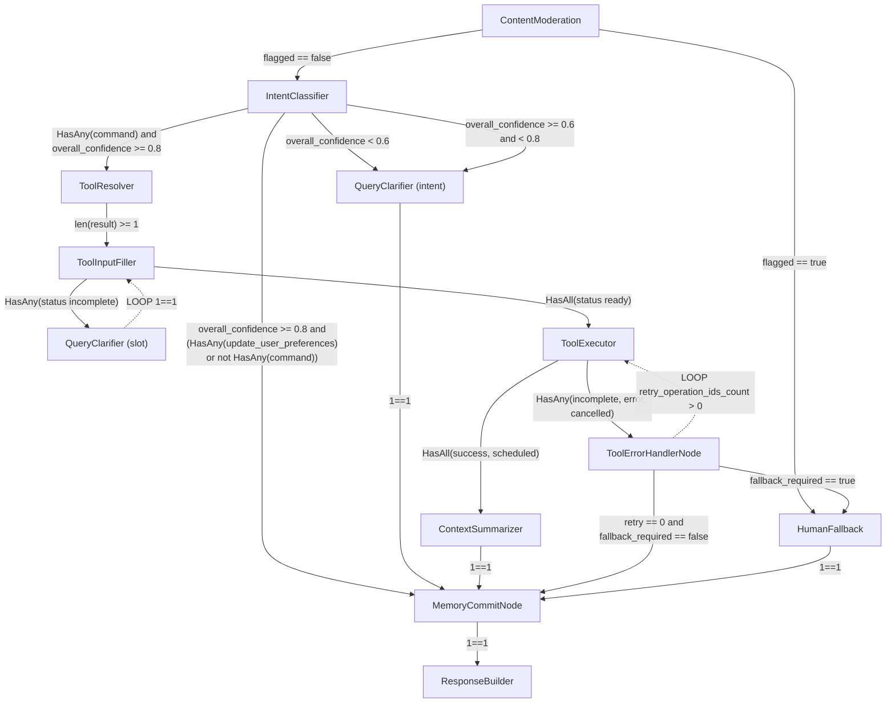

# Node templates catalog

The **node type** is a closed set. `NodeRegistry` maps exactly **eleven** strings to executors; a
graph naming anything else compiles but fails at runtime with
**`FlowFailureReason.UNKNOWN_NODE_TYPE`** on the step that reaches it, and `POST
/core/v1/nodes/{node_type}/prompt` rejects it outright (`node_type must be one of …`).

Source of truth: `NodeType` (`src/domain/prompts/schemas/prompt.py`) and `NodeRegistry._registry`
(`src/domain/execution/services/graph_runtime/registry.py`). At runtime, query
`GET /core/v1/flows/node-templates:system` for the templates your deployment actually seeded.

The context blocks on this page are **prompt-shape templates** — copy and adapt them. The node
**types** are not adaptable.

## The eleven node types

| Node type | Calls an LLM? | Purpose |
|-----------|---------------|---------|
| [`ContentModeration`](#contentmoderation) | moderation provider | Flag policy violations on user input. |
| [`IntentClassifier`](#intentclassifier) | yes | Classify user intent. |
| [`ToolResolver`](#toolresolver) | yes | Select tools via semantic catalog retrieval. |
| [`ToolInputFiller`](#toolinputfiller) | yes | Fill tool parameters against the tool's `request_schema`. |
| [`QueryClarifier`](#queryclarifier) | yes | Ask the user for a missing intent or slot. |
| [`ToolExecutor`](#toolexecutor) | no | Execute selected tools (immediate or scheduled). |
| [`ToolErrorHandlerNode`](#toolerrorhandlernode) | no | Retry bookkeeping; sets `fallback_required`. |
| [`ContextSummarizer`](#contextsummarizer) | yes, size-gated | Compact a named node's output in graph state. |
| [`MemoryCommitNode`](#memorycommitnode) | no | Persist durable user memory. |
| [`ResponseBuilder`](#responsebuilder) | yes | Build the final user-facing response. **Terminal.** |
| [`HumanFallback`](#humanfallback) | yes | Open an SLA case and answer with a fallback message. **Terminal.** |

`ResponseBuilder` and `HumanFallback` are the **terminal** types — `GraphCompiler` rejects a graph
containing neither (`no_terminal_nodes`).

## Context structure

Context is built dynamically from the prompts available for the run. Not every prompt slot is
required every time. Example message list:

```json
[
  {"role": "system", "content": "system_prompt"},
  {"role": "system", "content": "node_prompt"},
  {"role": "system", "content": "tool_input_context.prompt"},
  {"role": "system", "content": "tool_output_context.prompt"},
  {"role": "system", "content": "tenant_profile.prompt"},
  {"role": "system", "content": "user_profile.prompt"},
  {"role": "user", "content": "user.input_message"}
]
```

### Prompt slots

- **system_prompt:** Persona, rules, and guardrails for the agent.
- **node_prompt:** Task-specific node prompt (SLM/LLM).
- **tool_input_context.prompt:** Context for tool input (e.g. OpenAPI).
- **tool_output_context.prompt:** Context for tool output.
- **tenant_profile.prompt:** Tenant-scoped knowledge from RAG (e.g. knowledge base).
- **user_profile.prompt:** User-scoped RAG or summarized memory.
- **user.input_message:** End-user message.

---

## ContentModeration

Moderates content and flags policy violations. Calls `ModerationProviderPort`, not chat completion;
returns `flagged` and `categories`.

```json
[
  {"role": "system", "content": "node_prompt"},
  {"role": "user", "content": "user.input_message"}
]
```

---

## IntentClassifier

Classifies user intent (e.g. conversation, small_talk, execution, query).

```json
[
  {"role": "system", "content": "node_prompt"},
  {"role": "user", "content": "user.input_message"}
]
```

---

## ToolResolver

Selects tools using semantic catalog retrieval without loading full unstructured context.

```json
[
  {"role": "system", "content": "node_prompt"},
  {"role": "system", "content": "tenant_profile.prompt"},
  {"role": "user", "content": "user.input_message"}
]
```

---

## ToolInputFiller

Validates required fields against the tool **input_schema** / **output_schema** and structures
`input_schema` when needed.

```json
[
  {"role": "system", "content": "node_prompt"},
  {"role": "system", "content": "tool_schema_context.prompt"},
  {"role": "user", "content": "user.input_message"}
]
```

---

## QueryClarifier

Runs when intent or required slots are missing.

**Maximum context:**

```json
[
  {"role": "system", "content": "system_prompt"},
  {"role": "system", "content": "node_prompt"},
  {"role": "system", "content": "tenant_profile.prompt"},
  {"role": "user", "content": "user.input_message"}
]
```

**Minimum context:**

```json
[
  {"role": "system", "content": "system_prompt"},
  {"role": "system", "content": "node_prompt"},
  {"role": "user", "content": "user.input_message"}
]
```

---

## ToolExecutor

Loads the selected tool/API specification and executes it. No LLM call. Supports `IMMEDIATE` and
`SCHEDULED` execution modes and selective retry — see
[Non-LLM nodes](graph-runtime/nodes/non-llm-nodes.md#toolexecutor).

---

## ToolErrorHandlerNode

No LLM call and no injected dependencies. Reads `ToolExecutor` output, applies retry bookkeeping,
publishes `retry_operation_ids` and `finalized_results` into `next_state`, and sets
`fallback_required` when retries are exhausted — which is the signal an edge uses to route into
`HumanFallback`.

---

## ContextSummarizer

Summarizes when context is too large. The node is **size-gated**: it reads the output of
`source_node_id` from the graph-state snapshot and calls the LLM only when the serialized payload
reaches `min_payload_bytes_to_run`.

```json
[
  {"role": "system", "content": "node_prompt"},
  {"role": "user", "content": "user.input_message"}
]
```

Node config:

```json
{
  "source_node_id": "<uuid of the node whose output to compact>",
  "min_payload_bytes_to_run": 4096,
  "replace_source_output": false
}
```

Full contract, reason codes and the `compaction` metrics block:
[LLM-backed nodes → ContextSummarizer](graph-runtime/nodes/llm-nodes.md#contextsummarizer).

---

## MemoryCommitNode

The explicit durable-memory writer, one per flow. Builds its payload with **`data_merge`** rules
against the outputs of named upstream nodes — in the demo graph, `ToolInputFiller` slots plus the
optional `ContextSummarizer` output — then calls `MemoryWriteServicePort`.

Optionally place a **`ContextSummarizer`** before it on the memory branch to compress the payload;
that node does **not** persist anything itself.

Reports `persisted` and a `reason_code` rather than assuming success — a `SUCCESS` status with
`persisted: false` is a real and expected state. See
[Non-LLM nodes](graph-runtime/nodes/non-llm-nodes.md#memorycommitnode).

```json
[
  {"role": "system", "content": "node_prompt"},
  {"role": "system", "content": "user_profile.prompt"},
  {"role": "user", "content": "user.input_message"}
]
```

---

## ResponseBuilder

Builds the final user-facing response. **Terminal.**

**Maximum:**

```json
[
  {"role": "system", "content": "system_prompt"},
  {"role": "system", "content": "node_prompt"},
  {"role": "system", "content": "tenant_profile.prompt"},
  {"role": "system", "content": "user_profile.prompt"},
  {"role": "user", "content": "user.input_message"}
]
```

**Medium:**

```json
[
  {"role": "system", "content": "system_prompt"},
  {"role": "system", "content": "node_prompt"},
  {"role": "system", "content": "user_profile.prompt"},
  {"role": "user", "content": "user.input_message"}
]
```

**Minimum:**

```json
[
  {"role": "system", "content": "system_prompt"},
  {"role": "system", "content": "node_prompt"},
  {"role": "user", "content": "user.input_message"}
]
```

---

## HumanFallback

Opens human SLA / fallback paths, then answers with a fallback message. **Terminal.**

```json
[
  {"role": "system", "content": "node_prompt"},
  {"role": "system", "content": "tenant_profile.prompt"},
  {"role": "user", "content": "user.input_message"}
]
```

---

## Capabilities that are not node types

Several behaviours read like nodes but are **not** in the registry. Do not put these strings in a
graph.

| Capability | How it is actually done |
|------------|-------------------------|
| Tenant profile / knowledge | Retrieval layer, not a node: `allow_rag_tenant` on the node plus `agent_version.rag_config_id`, assembled by `MemoryRetrievalService` and `ContextBuilder`. |
| Reading user memory | Layer flags `allow_user_memory_structured` / `allow_user_memory_vector`, gated by `runtime_policy.user_context_enrichment`. There is **no** `UserContextEnrichmentNode` — `FlowGraphValidator` rejects that string as a deprecated type. |
| Writing user memory | The `MemoryCommitNode` above. |
| Categorizing data | A tool, invoked through `ToolResolver` → `ToolInputFiller` → `ToolExecutor`. |

Earlier revisions of this page listed `TenantProfile`, `UserProfileReader`, `UserProfileWriter` and
`DataCategorizer` as node templates, and referred to `IntentDetectionNode`,
`ParamExtractionNode` and `MemoryPayloadSummarizeNode`. **None of those exist**; the last three were
earlier names for `IntentClassifier`, `ToolInputFiller` and `ContextSummarizer`.

---

## Example DEMO flow (alternative shape)

The production demo seed uses a different entry (see [Demo seed graph](demo-seed-graph.md)). The
diagram below shows an **alternative** demo layout with `IntentClassifier` for illustration.



## Related

- [Nodes overview](graph-runtime/nodes/index.md) — implementation classes and dependencies
- [Node registry](graph-runtime/node-registry.md) — how a type string becomes an executor
- [Flow lifecycle](flow-lifecycle.md)
- [Demo seed graph](demo-seed-graph.md)
- [RAG runtime and integration](../RAG/runtime-and-integration.md)
