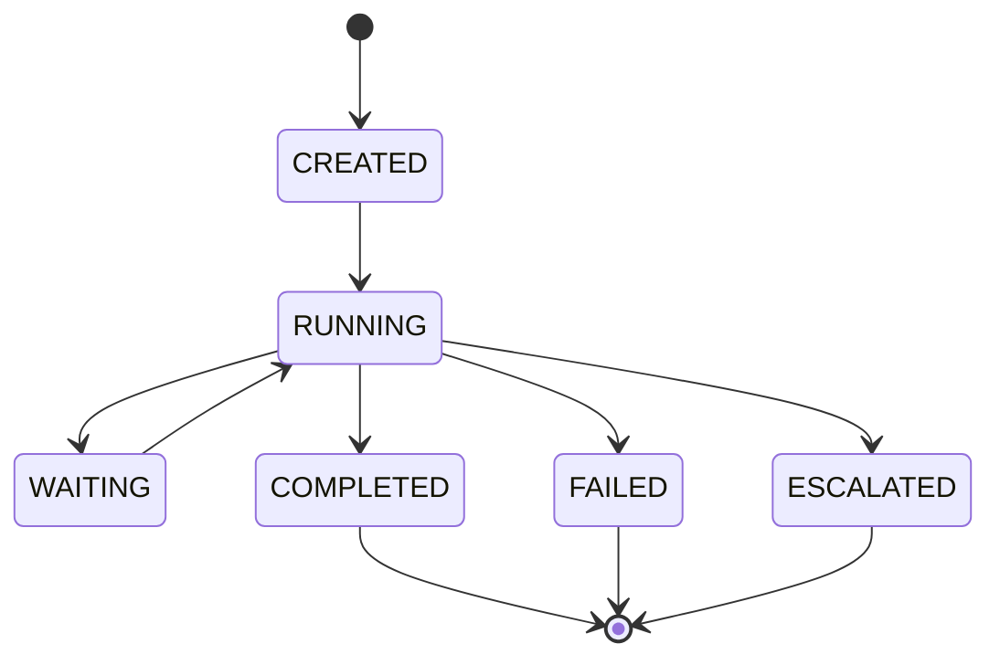

# State machines

Execution uses **two** related mechanisms in `src/domain/execution/services/state_machine.py`:

1. **`ExecutionStateMachine`** — legacy string statuses (`RunStatus`) and `ALLOWED_TRANSITIONS`.
2. **`RunLifecycleStateMachine`** — Planning-10 style **enumerations** for flow, node, agent, and tool runs with separate `validate_*` methods.

## `RunStatus` and `ExecutionStateMachine`

`RunStatus` is a `StrEnum`: `CREATED`, `QUEUED`, `RUNNING`, `WAITING_INPUT`, `COMPLETED`, `FAILED`, `CANCELLED`.

`ExecutionStateMachine.validate_transition(current, target)` raises `InvalidTransitionException` if `target` is not in `ALLOWED_TRANSITIONS[current]`.

Use this when code still reasons about **string** statuses on older paths.

## `RunLifecycleStateMachine`

Canonical types:

| Enum | Values (summary) |
|------|------------------|
| `FlowRunStatus` | `CREATED`, `RUNNING`, `WAITING`, `COMPLETED`, `FAILED`, `ESCALATED` |
| `NodeRunStatus` | `PENDING`, `RUNNING`, `SKIPPED`, `COMPLETED`, `FAILED` |
| `AgentRunStatus` | `CREATED`, `RUNNING`, `COMPLETED`, `FAILED`, `CANCELLED` |
| `ToolRunStatus` | `CREATED`, `EXECUTING`, `SUCCESS`, `ERROR`, `TIMEOUT` |

Methods: `validate_flow`, `validate_node`, `validate_agent`, `validate_tool` — each enforces a **closed** transition table (`*_transitions` dicts on the class) under a traced span.

`FlowRun` responses in the API often expose both `status` (legacy) and `canonical_status` (`FlowRunStatus`) — see `create_flow_run` response building in `execution_service.py`.

## Diagram (canonical flow run)

## Related

- [Flow lifecycle](flow-lifecycle.md) — product-oriented lifecycle diagram
- [Execution service](execution-service.md)
