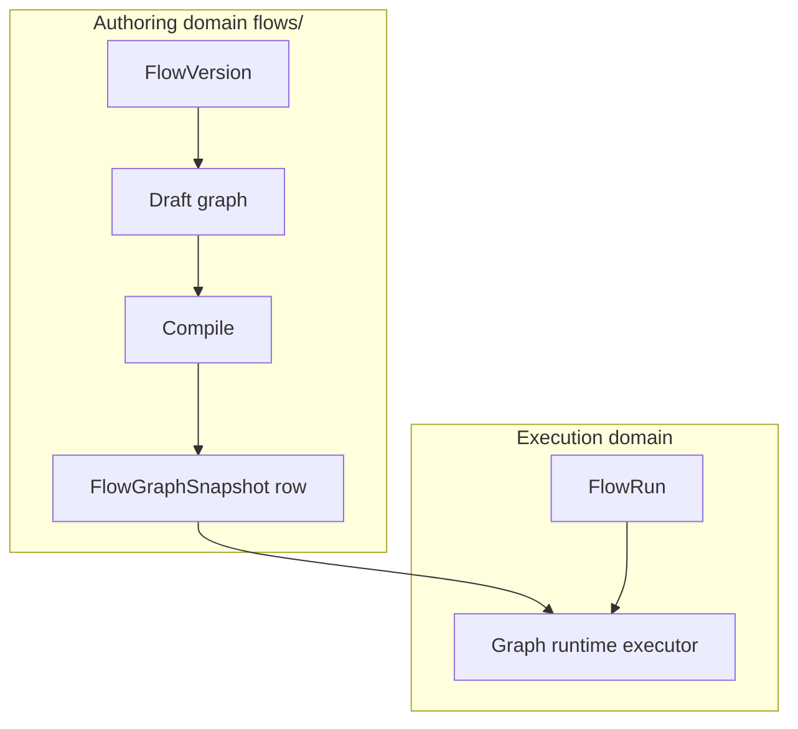

# Flows — authoring and persistence

## Core tables (indicative)

Authoring-time entities map to tables such as:

- `flow`, `flow_version`
- `flow_graph`, `flow_graph_draft`, `flow_graph_snapshot`
- `flow_deployment`, `flow_snapshot` (bundles for environments)

See the authoritative list in [Persistence tables](../Glossary/persistence-tables.md) and cross-check with Alembic migrations under `src/infra/database/migrations/versions/`.

## Row-level lifecycle

Table-level mapping for the flows authoring domain (without duplicating this page) lives in **[Persistence and data](persistence-and-data.md)**. Use that page as the **index** into glossary sections; this document remains the **narrative** for draft → compile → snapshot and authoring vs runtime.

## Authoring vs runtime

Runtime tables such as `flow_run` belong to **execution**; this page focuses on **design-time** rows created via [HTTP API overview](http-api-overview.md).

## Related

- [Runtime vs authoring](../Architecture/runtime-vs-authoring.md)
- [Flow graph snapshot term](../Glossary/terms/flow-graph-snapshot.md)
- [Flows overview](index.md)
