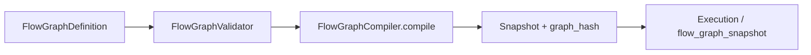

# Flows — graph and compiler

## Validator — `FlowGraphValidator`

`src/domain/flows/services/flow_graph_validator.py`

- Ensures **`start_node`** exists, edges reference known nodes, and structural rules hold (e.g. terminal node types include `ResponseBuilder`, `HumanFallback`).
- Rejects deprecated node types such as **`UserContextEnrichmentNode`** with `deprecated_node_type_user_context_enrichment`.

Draft-specific checks may live in `flow_graph_draft_validator.py`.

## Compiler — `FlowGraphCompiler`

`src/domain/flows/services/flow_graph_compiler.py`

- Input: **`FlowGraphDefinition`** (`domain/flows/schemas/graph.py`).
- **`ConditionCompiler`** delegates to `EdgeEvaluator.compile_condition` for each edge condition string.
- Output: a **snapshot dict** (nodes, compiled edges, `schema_version`) plus a deterministic **`graph_hash`** (SHA-256 over canonical JSON).

## Related

- [Edge evaluator](../Execution/graph-runtime/edge-evaluator.md)
- [Graph compiler runtime](../Execution/graph-runtime/graph-compiler.md) — execution-side consumption
- [Flows HTTP API](http-api-overview.md) — `:validate` and `:compile` routes
