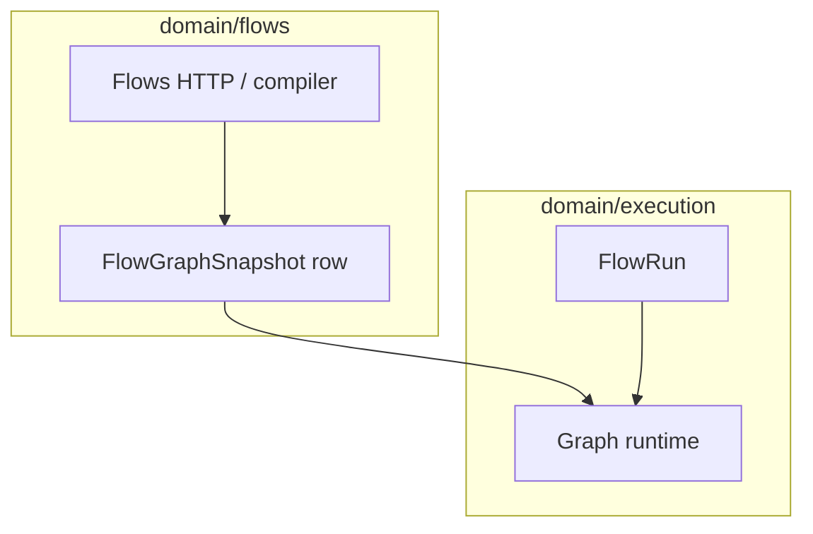

# Flows — integration and runtime

**Flows** is the **authoring** surface: versions, graphs, deployments. **Execution** consumes **compiled snapshots** to run `flow_run` / graph state.

## Authoring to runtime

- [Runtime vs authoring](../Architecture/runtime-vs-authoring.md)
- [Graph runtime](../Execution/graph-runtime/index.md)
- [Governance](../Governance/index.md) participates in snapshot policy resolution (`snapshot_effective_policy`, etc.; see glossary).

## Related

- [Graph and compiler](graph-and-compiler.md)
