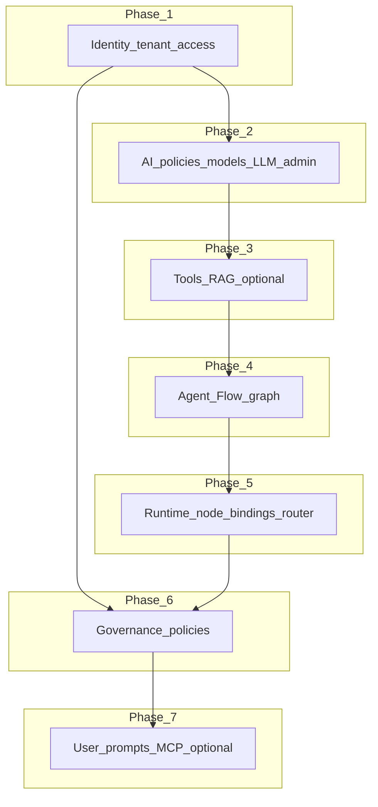
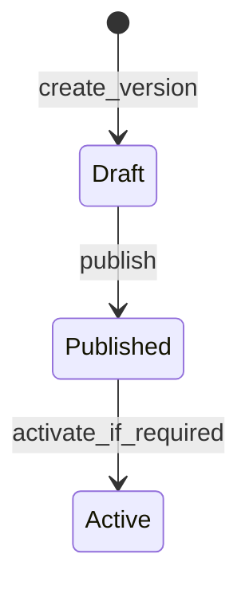

# Full tenant configuration

This guide describes how to configure a **tenant end-to-end** so it is **usable for execution** (conversations, flow runs) with **governance** applied. It is a **process guideline**: it points to domain HTTP and integration docs rather than replacing them.

**Audience:** operators and integrators provisioning a new tenant or hardening an existing one.

**Not covered here:** deep domain internals (see [Architecture overview](../Architecture/ARCHITECTURE.md)), OpenAPI field-by-field specs (use the served OpenAPI / [MkDocs OpenAPI plugin](../Contributing/README.md)), or repository automation scripts (see [Appendix: repository reference examples](#appendix-repository-reference-examples)).

## Definition of done

A tenant is **ready for use** when all of the following hold for your chosen profile (minimal vs extended):

| Criterion | Minimal profile | Extended profile (add when needed) |
|-----------|-----------------|-------------------------------------|
| **Identity** | Tenant record exists; callers can obtain a **tenant-scoped** credential for `/core/v1` (see [Tenants](../Tenants/index.md), [Auth](../Auth/index.md)). | Inbound service keys or org-specific auth patterns per your deployment. |
| **AI execution** | At least one **AI execution policy** with a **published** version; LLM **models** registered where required ([AI policy HTTP API](../AI-Policy/http-api-and-lifecycle.md)). | Extra policy versions for staged rollout. |
| **Tools** | Tool definitions and configs your flows need ([Tools](../Tools/index.md)). | — |
| **RAG** | Skip if unused. | Vector store, RAG config, **validated** then **published** config; ingest complete ([RAG](../RAG/index.md)). |
| **Agent** | **Agent** with **published** and **active** agent version ([Agents](../Agents/index.md)). | Version churn per release process. |
| **Flow** | **Flow** with **published** and **active** flow version; **graph** validated and **compiled** ([Flows HTTP API overview](../Flows/http-api-overview.md), [Graph and compiler](../Flows/graph-and-compiler.md)). | Deployments/artifacts if your pipeline uses them. |
| **Runtime policy** | A **runtime policy** exists and is **activated** so the executor resolves an effective bundle ([Runtime policy resolver](../Execution/runtime-policy-resolver.md), [Governance HTTP API](../Governance/http-api-and-scopes.md#runtime-policies)). | — |
| **Node ↔ AI policy** | Bindings from graph nodes to **AI execution policy versions** for LLM-backed nodes ([Node ↔ policy bindings](../AI-Policy/http-api-and-lifecycle.md#node-policy-version-bindings)). | — |
| **Router / rules** (if used) | Routers, routing rules, condition expressions consistent with the graph ([Flows HTTP API](../Flows/http-api-overview.md#routers-and-rules)). | — |
| **Governance policies** | **Access** and **rate limit** policies: versions **published** ([Enforcement and limits](../Governance/enforcement-and-limits.md)). **Execution limits** satisfied via published policies as required by your environment. | **Billing**, **memory**, **RAG** policy roots and versions **published** / **activated** per product rules ([Governance](../Governance/index.md)). |
| **User prompts / MCP** | Skip if unused. | [User prompts](../User-Prompts/index.md); [MCP registry and runtime](../MCP/index.md). |
| **Proof** | At least one successful **conversation or flow run** path ([Conversation](../Conversation/index.md)). | — |

Glossary shortcuts: [Tenant](../Glossary/terms/tenant.md), [Flow](../Glossary/terms/flow.md), [Flow version](../Glossary/terms/flow-version.md), [Governance policy versioning](../Glossary/terms/governance-policy-versioning.md).

## Prerequisites

- Running **agent-orchestration-core** (or your hosted equivalent) and credentials for admin/tenant operations.
- Read [Installation](installation.md) and, if new to the model, [Domain model overview](../Models/domain-overview.md) and [Governance overview](../Governance/index.md).
- JWTs (or your auth mechanism) must include **scopes** where `/core/v1` governance routes require them ([HTTP API and scopes](../Governance/http-api-and-scopes.md)).

## Configuration phases (recommended order)

Dependencies matter: later phases assume earlier resources exist or are published. The diagram below summarizes phase ordering; details and exceptions are in each subsection.



### Phase 1 — Identity, tenant, and API access

**Goal:** A tenant exists and integrators can call tenant-scoped APIs securely.

**Configure**

- Create or update the tenant ([Tenants HTTP API](../Tenants/http-api.md)).
- Establish how **tokens** or **keys** are issued for this tenant ([Auth HTTP API](../Auth/http-api.md), [Tenants integration](../Tenants/integration-and-runtime.md)).

**Verify**

- Authenticated calls to a simple read endpoint (e.g. tenant metadata) succeed with the intended credential.

**Depends on:** deployment-specific identity provider or platform keys.

---

### Phase 2 — AI execution policies, models, and LLM admin

**Goal:** Published **AI execution policy** versions and **models** exist so LLM nodes can resolve provider, model alias, and guardrails ([AI policy](../AI-Policy/index.md), [LLM](../LLM/index.md)).

**Configure**

- Create **AI execution policy** root and **versions**; **validate** and **publish** a version ([HTTP API and lifecycle](../AI-Policy/http-api-and-lifecycle.md)).
- Register **models** if your tenant needs catalog entries beyond defaults (`POST /core/v1/models` with appropriate scope).
- Optionally configure **LLM provider**, **model mapping**, and **pricing** via **`/admin/llm`** ([LLM admin](../Governance/http-api-and-scopes.md#llm-admin-prefix-adminllm)) — secure this surface at the gateway; see the **Scope gap** admonition on that page.

**Verify**

- Published AI execution policy version is in a state the runtime accepts; model list covers aliases used in policies and nodes.

**Depends on:** Phase 1 (auth to call APIs).

---

### Phase 3 — Tools and RAG (conditional)

**Goal:** Executable **tools** and, if required, **retrieval** backed by a published RAG configuration.

**Tools**

- Import or create tool configs your flows reference ([Tools HTTP API](../Tools/http-api.md), [runtime execution](../Tools/runtime-execution.md)).

**RAG (only if the product uses retrieval)**

- Vector store, chunking rules, RAG config, **validate** configuration, **ingest** documents, then **publish** RAG config when valid ([RAG runtime and integration](../RAG/runtime-and-integration.md), [RAG index](../RAG/index.md)).
- Do **not** rely on unpublished or invalid RAG config in production paths.

**Verify**

- Tool invocations succeed in isolation if you have integration tests; RAG retrieval returns data after publish where applicable.

**Depends on:** Phase 2 for model/embeddings usage in RAG pipelines.

---

### Phase 4 — Agent, flow, graph, and publication

**Goal:** A **flow** with a **published** and **active** version whose **graph** is valid and **compiled**.

**Configure**

- Create **agent** and **agent versions**; validate, publish, activate as per [Agents HTTP API](../Agents/http-api.md).
- Create **flow** and **flow versions** ([Flows HTTP API overview](../Flows/http-api-overview.md)).
- Author the **graph** (draft upsert, **validate** draft, **validate** flow version) before **publish** and **activate** ([Graph and compiler](../Flows/graph-and-compiler.md)).
- Use **node templates** or **custom nodes** as needed ([Node templates](../Execution/node-templates.md)); attach **prompts** where required ([Prompts](../Prompts/index.md)).
- **Compile** the graph when the API requires a compiled artifact for execution.

**Verify**

- `:validate` on graph draft and flow version returns success; `:publish` and `:activate` complete; `:compile` succeeds if used.

**Depends on:** Phases 1–3 for referenced tools, RAG, and AI policies.

!!! warning "Validation order"

    Graph draft validation must succeed before flow version validation can succeed in typical setups. Fix draft errors (schema, node refs) before re-running version-level validation.

---

### Phase 5 — Runtime policy, node bindings, router

**Goal:** The **runtime policy** is **active**; LLM nodes are **bound** to AI execution policy versions; optional **router** and **condition** nodes are wired.

**Configure**

- Create and **activate** a **runtime policy** ([Runtime policies](../Governance/http-api-and-scopes.md#runtime-policies)).
- Create **node ↔ AI execution policy** bindings ([bindings](../AI-Policy/http-api-and-lifecycle.md#node-policy-version-bindings)).
- If the graph uses routing: **routers**, **routing rules**, **condition expressions** ([Routers and rules](../Flows/http-api-overview.md#routers-and-rules)).

**Verify**

- Runtime policy activation accepted; bindings list covers all LLM nodes that need them.

**Depends on:** Published AI execution policy versions (Phase 2) and graph node ids (Phase 4).

---

### Phase 6 — Governance policies (access, rate, billing, memory, RAG policy)

**Goal:** Tenant-level **governance** policies exist in the correct **published** / **activated** states so **enforcement** and **resolution** succeed at runtime ([Governance index](../Governance/index.md), [Enforcement and limits](../Governance/enforcement-and-limits.md)).

**Configure (typical minimum)**

- **Access policy**: create root, create version, **publish** version.
- **Rate limit policy**: create root, create version, **publish** version.
- **Execution limit** expectations: ensure your deployment’s execution cap policy is satisfied (see enforcement docs — may tie to published governance data).

**Configure (when product requires)**

- **Billing** policy versions: publish and **activate** where billing enforcement applies ([Billing policies](../Governance/http-api-and-scopes.md#billing-policies)).
- **Memory** policy: publish and **activate** for layered memory behaviour ([Memory policies](../Governance/http-api-and-scopes.md#memory-policies)).
- **RAG policy** (tenant-level): publish and **activate** to align retrieval with governance ([RAG policies](../Governance/http-api-and-scopes.md#rag-policies)).

**Verify**

- Listed policies appear in expected states; conversation and flow entry points do not fail solely for missing published access/rate policies when those checks are enabled.

**Depends on:** Phase 1 (tenant); memory/RAG governance may depend on Phase 3 resources.

---

### Phase 7 — User prompts and MCP (optional)

**Goal:** Extra **user-level prompts** and **MCP servers** registered when your architecture uses them.

**Configure**

- [User prompts HTTP API](../User-Prompts/http-api.md) for titles/content your runtime consumes.
- [MCP registry and API](../MCP/registry-and-api.md), [Gateway and runtime](../MCP/gateway-and-runtime.md) for MCP exposure.

**Verify**

- End-to-end path that references a user prompt or MCP tool behaves as expected in a test conversation.

**Depends on:** Prior phases; user prompts may need to exist before MCP or tool chains that reference them.

## Governance (consolidated)

Governance is both **data** (policy roots and versions) and **enforcement** at API boundaries ([Enforcement and limits](../Governance/enforcement-and-limits.md)).

| Policy family | Typical lifecycle | Notes |
|---------------|-------------------|-------|
| **Runtime** | Create → **activate** | Drives effective runtime bundle resolution ([Runtime resolution](../Governance/runtime-resolution.md)). |
| **Access / rate limit** | Create → version → **publish** | Consumed for allow/deny and throttling ([Policy model](../Governance/policy-model-and-versioning.md)). |
| **Billing / memory / RAG (tenant)** | Create → version → **publish** → **activate** where applicable | See tables in [HTTP API and scopes](../Governance/http-api-and-scopes.md). |
| **AI execution** | Version **validate** → **publish** | Under [AI policy](../AI-Policy/index.md), not the generic governance policy CRUD for access/rate. |

Authoring changes may emit **authoring events** ([Authoring events](../Governance/authoring-events.md)). Scope strings for governance routes are listed in [Scope enum source](../Governance/http-api-and-scopes.md#scope-enum-source).



Exact transitions vary by policy type; see [Policy model and versioning](../Governance/policy-model-and-versioning.md).

## Completeness checklist

Use this before declaring go-live.

### Minimal execution profile

- [ ] Tenant created; tenant-scoped auth works ([Tenants](../Tenants/index.md), [Auth](../Auth/index.md)).
- [ ] At least one **AI execution policy** version **published** ([AI policy](../AI-Policy/index.md)).
- [ ] **Models** and **`/admin/llm`** mappings sufficient for aliases in policies/nodes ([LLM](../LLM/index.md), [Governance HTTP API](../Governance/http-api-and-scopes.md#llm-admin-prefix-adminllm)).
- [ ] **Tools** required by the graph exist ([Tools](../Tools/index.md)).
- [ ] **Agent** version **published** and **active** ([Agents](../Agents/http-api.md)).
- [ ] **Flow** version **published** and **active**; graph **validated** and **compiled** ([Flows](../Flows/http-api-overview.md)).
- [ ] **Runtime policy** **activated** ([Governance](../Governance/index.md)).
- [ ] **Node ↔ AI execution policy** bindings for LLM nodes ([AI policy](../AI-Policy/http-api-and-lifecycle.md)).
- [ ] **Access** and **rate limit** policy versions **published** ([Enforcement and limits](../Governance/enforcement-and-limits.md)).
- [ ] Smoke **conversation** or **flow run** ([Conversation](../Conversation/index.md)).

### Extended profile (add items that apply)

- [ ] **RAG** config validated and published; ingest done ([RAG](../RAG/index.md)).
- [ ] **Billing** / **memory** / **RAG policy** (tenant) published and activated as required ([Governance HTTP API](../Governance/http-api-and-scopes.md)).
- [ ] **Routers** and **conditions** if used ([Flows HTTP API](../Flows/http-api-overview.md)).
- [ ] **User prompts** ([User-Prompts](../User-Prompts/index.md)).
- [ ] **MCP** servers registered ([MCP](../MCP/index.md)).

## Validation loop and troubleshooting

**Exit criterion:** every checklist item required for your profile is satisfied; a smoke run completes without policy or validation errors.

**If something fails:**

1. **401/403** — credential or **scope** missing ([HTTP API and scopes](../Governance/http-api-and-scopes.md)); fix JWT or gateway.
2. **422 on graph or flow validate** — fix **draft graph** first, then re-run **flow version** validation ([Flows](../Flows/index.md)).
3. **Execution blocked by limits** — check **published** access/rate policies and **execution limit** resolution ([Enforcement and limits](../Governance/enforcement-and-limits.md)).
4. **LLM or moderation failures** — verify **AI execution policy** publish state and **node bindings** ([AI policy](../AI-Policy/index.md)).
5. **RAG empty or errors** — confirm RAG config **published** after **validate**, and **ingest** completed ([RAG runtime](../RAG/runtime-and-integration.md)).

```mermaid
flowchart TD
  fail[Failure]
  auth[Check_Auth_scopes]
  graph[Fix_graph_draft_then_flow_version]
  pol[Check_published_policies]
  rag[Check_RAG_publish_ingest]
  fail --> auth
  fail --> graph
  fail --> pol
  fail --> rag
```

## Related reading

- [Architecture overview](../Architecture/ARCHITECTURE.md) — bounded contexts.
- [Runtime vs authoring](../Architecture/runtime-vs-authoring.md).
- [Execution index](../Execution/index.md) — execution service and graph runtime.
- [Flow lifecycle](../Execution/flow-lifecycle.md).
- [Onboarding](../Onboarding/index.md) — if your product uses onboarding flows.

## Appendix: repository reference examples

The repository may ship **demo seeds** under `resources/scripts/seeds/demo/` and **example API sequences** in `resources/collections/aoc.postman_collection.json` (e.g. folders under `demo/`). These are **optional aids** for local development: they illustrate one possible ordering of API calls and may **drift** from your deployment or OpenAPI version.

They **do not** replace this guideline or the canonical domain documentation. Prefer the links throughout this page for stable behaviour and scope requirements.

For the structure of the demo execution graph (if you run seeds), see [Demo seed graph](../Execution/demo-seed-graph.md).
