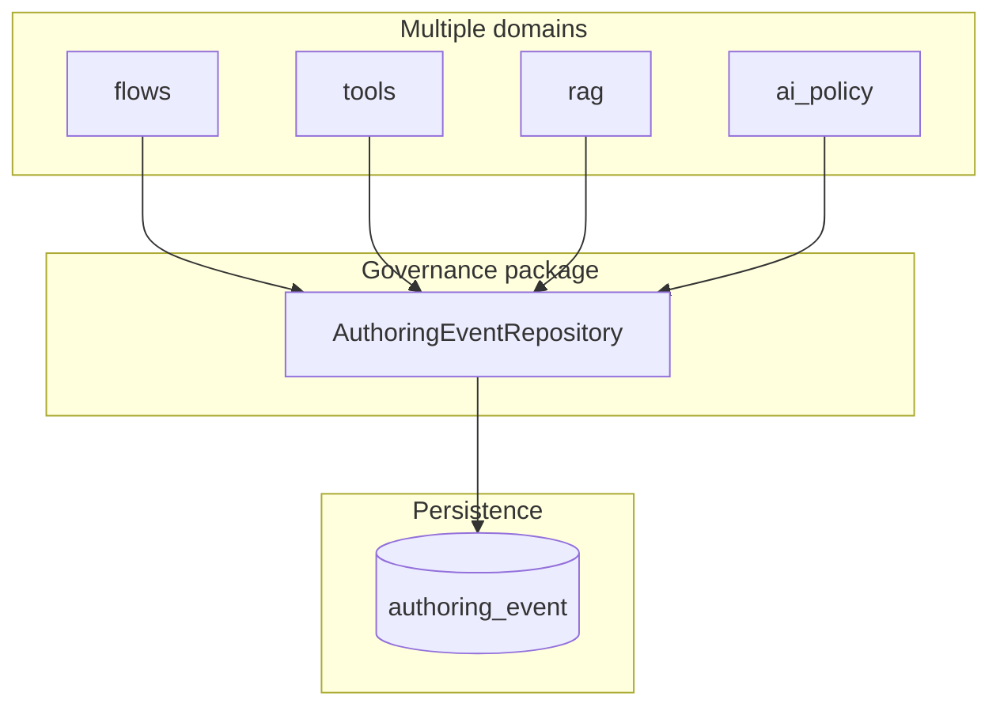

# Authoring events

The **`AuthoringEventRepository`** lives under **`src/domain/governance/repositories/authoring_event_repository.py`**, but it is **cross-cutting**: many domains append audit rows when mutating authoring-time resources (flows, tools, RAG, tenants, AI policies, agents, onboarding, etc.).

## Responsibility

- **`append_event`** — insert one row into **`authoring_event`** with tenant, resource identity, version link, event metadata, **`principal_id`**, **`justification`**, and **`change_type`** / **`event_type`** strings.
- **`list_events_for_resource`** — ordered history for `(tenant_id, resource_type, resource_id)` (used for audit UIs or support).

Signature (abridged):

`append_event(tenant_id, resource_type, resource_id, version_id, event_type, change_type, principal_id, justification, schema_version=1) -> UUID`

Tracing spans: `domain.governance.authoring_event_repository.append_event` and `list_events_for_resource`.

## Why it sits in `governance/`

The table is a **governance and audit** concern: immutable **append-only** history with justification fields aligned to regulated change management. Physically colocating the repository in `governance` avoids every domain reimplementing the same insert.

## Callers (non-exhaustive)

Repositories and services across the codebase receive **`AuthoringEventRepository`** via dependency injection, for example:

- `ToolsService` — tool import, config, bindings
- `FlowsService`, `AgentsService` — graph and agent mutations
- `RagService` — RAG config lifecycle
- `AIService` (`ai_policy`) — AI execution policy changes
- `AuthService`, `TenantsService`, `OnboardingService`

For the **event catalogue** and SSE shapes, see [System events reference](../Develop/system-events-reference.md). For the glossary term, see [Authoring event](../Glossary/terms/authoring-event.md).

## Related

- [Policy model and versioning](policy-model-and-versioning.md)
- [Governance index](index.md)
