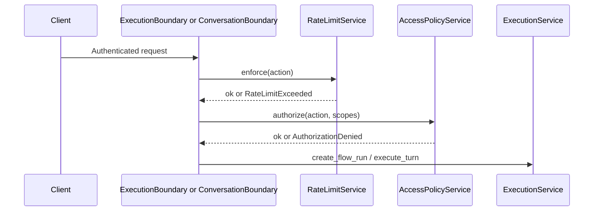

# Enforcement and limits

This page describes **runtime enforcement** services under `src/domain/governance/services/` that run **before** or **during** execution: **access** (allow-list + OAuth-style scopes), **rate limits** (Redis sliding window), and **execution limits** (counts per flow run).

## Access policy — `AccessPolicyService`

`src/domain/governance/services/access_policy_service.py`

### Preconditions

1. **`get_default_policy_for_tenant`** returns a row, or → **`AuthorizationDeniedException`** `access_policy_not_configured`.
2. **`get_published_policy_version`** returns a **PUBLISHED** version, or → `access_policy_version_not_published`.

### Authorization rule

From the published version’s **`rules`** JSON:

- Build **`allowed`** from `rules["allow"]` (list of strings).
- The requested **`action`** must be in **`allowed`** or → `action_not_allowed`.
- The same **`action`** string must appear in the caller’s **`scopes`** set (`auth.scopes`) or → `missing_required_scope`.

So access policy is both an **allow list of action strings** and a **bridge to JWT scopes**: the action must be permitted by policy **and** present on the token.

Tracing: guardrail span `governance.access_policy.authorize`.

## Rate limit — `RateLimitService`

`src/domain/governance/services/rate_limit_service.py`

### Preconditions

1. Default **rate limit policy** for tenant exists, or → `rate_limit_policy_not_configured`.
2. A **published** version exists for the tuple **`(action, principal_type)`**, or → `rate_limit_policy_not_published`.

### Algorithm

- Redis key: **`rate:{tenant_id}:{principal_type}:{principal_id}:{action}`**
- **`incr_with_ttl(key, window_seconds)`** — counter expires after the policy window.
- If counter **>** `version.limit` → **`RateLimitExceededException`** `rate_limit_exceeded`.

Tracing: `governance.rate_limit.enforce` (guardrail) and `governance.rate_limit.increment` (tool/redis).

## Execution limits — `ExecutionLimitService`

`src/domain/governance/services/execution_limit_service.py`

Uses **`ExecutionLimitPolicyRepository`** + **`ExecutionRepository`** counts.

| Method | Check |
|--------|--------|
| `assert_can_create_agent_run` | `count_agent_runs_for_flow_run(flow_run_id)` &lt; `max_agent_runs_per_interaction` (from published version) |
| `assert_can_create_tool_run` | `count_tool_runs_for_flow_run(flow_run_id)` &lt; `max_tool_runs_per_flow_run` |

On missing policy or unpublished version → **`AuthorizationDeniedException`** `execution_limit_policy_not_configured` or `execution_limit_policy_not_published`.

On breach → **`LimitExceededException`** `max_agent_runs_exceeded` or `max_tool_runs_exceeded`.

**Callers:** `ExecutionService` invokes these when creating agent runs and tool runs (see `execution_service.py`).

There is **no** public CRUD route under `GovernancePoliciesController` for execution-limit policies — configure rows via your data pipeline (see [Policy model and versioning](policy-model-and-versioning.md)).

## Boundary integration

| Module | Role |
|--------|------|
| `src/services/execution_boundary.py` | Execution HTTP facade — rate limit + access before `ExecutionService` methods (e.g. `ingest_interaction_and_create_flow_run`). |
| `src/services/conversation_boundary.py` | Conversation/SSE path — same pattern for `send_message` with `Scope.ExecutionFlowRunCreate`. |

`ExecutionBoundary` passes **`str(Scope.ExecutionFlowRunCreate)`** (and similar) as **`action`** so it lines up with **access policy allow list** and **rate limit version** rows for that action.

## Related

- [HTTP API and scopes](http-api-and-scopes.md) — how allow-listed actions get into policies
- [Runtime resolution](runtime-resolution.md) — separate from enforcement
