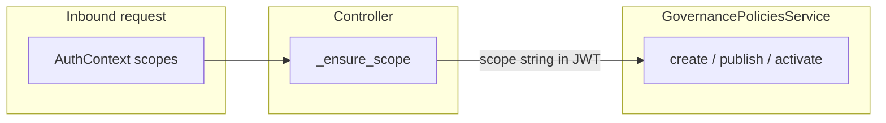

# HTTP API and scopes

This page documents the **Governance HTTP surface**: tenant-scoped policy administration under **`/core/v1`** and **LLM admin** under **`/admin/llm`**.

Implementation: `src/domain/governance/controllers/governance_policies_controller.py`, `src/domain/governance/controllers/llm_admin_controller.py`.

## Authentication

All routes use **`get_auth_context`** (`utils.auth`). The governance policy routes additionally call **`_ensure_scope(auth, Scope.*)`** so the JWT (or equivalent) must include the **named scope** for that operation.

`LLMAdminController` only depends on **`get_auth_context`** — there is **no** `Scope` check in that controller in the current code; treat it as **authenticated admin** surface and lock down at the gateway or extend with scopes in a future change.

## `ChangeRequest`

Endpoints that **activate** a policy version accept a **`ChangeRequest`** body (justification / audit fields). See `src/domain/common/schemas/change.py` and service methods in `GovernancePoliciesService`.

## Governance policies — prefix `/core/v1`

Router prefix in code: **`APIRouter(prefix="/core/v1")`**. Full paths below include that prefix.

### Runtime policies

| Method | Path | Scope |
|--------|------|-------|
| POST | `/core/v1/runtime-policies` | `Scope.RuntimePoliciesCreate` |
| GET | `/core/v1/runtime-policies` | `Scope.RuntimePoliciesList` |
| GET | `/core/v1/runtime-policies/{runtime_policy_id}` | `Scope.RuntimePoliciesRead` |
| PATCH | `/core/v1/runtime-policies/{runtime_policy_id}` | `Scope.RuntimePoliciesUpdate` |
| POST | `/core/v1/runtime-policies/{runtime_policy_id}:activate` | `Scope.RuntimePoliciesActivate` |

Activation takes **`ChangeRequest`** in addition to path id.

### Access policies

| Method | Path | Scope |
|--------|------|-------|
| POST | `/core/v1/access-policies` | `Scope.AccessPoliciesCreate` |
| GET | `/core/v1/access-policies` | `Scope.AccessPoliciesList` |
| GET | `/core/v1/access-policies/{access_policy_id}` | `Scope.AccessPoliciesRead` |
| POST | `/core/v1/access-policies/{access_policy_id}/versions` | `Scope.AccessPolicyVersionsCreate` |
| POST | `/core/v1/access-policies/versions/{access_policy_version_id}:publish` | `Scope.AccessPolicyVersionsPublish` |

### Rate limit policies

| Method | Path | Scope |
|--------|------|-------|
| POST | `/core/v1/rate-limit-policies` | `Scope.RateLimitPoliciesCreate` |
| GET | `/core/v1/rate-limit-policies` | `Scope.RateLimitPoliciesList` |
| GET | `/core/v1/rate-limit-policies/{rate_limit_policy_id}` | `Scope.RateLimitPoliciesRead` |
| POST | `/core/v1/rate-limit-policies/{rate_limit_policy_id}/versions` | `Scope.RateLimitPolicyVersionsCreate` |
| POST | `/core/v1/rate-limit-policies/versions/{rate_limit_policy_version_id}:publish` | `Scope.RateLimitPolicyVersionsPublish` |

### Billing policies

| Method | Path | Scope |
|--------|------|-------|
| POST | `/core/v1/billing-policies` | `Scope.BillingPoliciesCreate` |
| GET | `/core/v1/billing-policies` | `Scope.BillingPoliciesList` |
| GET | `/core/v1/billing-policies/{billing_policy_id}` | `Scope.BillingPoliciesRead` |
| POST | `/core/v1/billing-policies/{billing_policy_id}/versions` | `Scope.BillingPolicyVersionsCreate` |
| POST | `/core/v1/billing-policies/versions/{billing_policy_version_id}:publish` | `Scope.BillingPolicyVersionsPublish` |
| POST | `/core/v1/billing-policies/versions/{billing_policy_version_id}:activate` | `Scope.BillingPolicyVersionsActivate` |

Activate endpoints use **`ChangeRequest`**.

### Memory policies

| Method | Path | Scope |
|--------|------|-------|
| POST | `/core/v1/memory-policies` | `Scope.MemoryPoliciesCreate` |
| GET | `/core/v1/memory-policies` | `Scope.MemoryPoliciesList` |
| GET | `/core/v1/memory-policies/{memory_policy_id}` | `Scope.MemoryPoliciesRead` |
| POST | `/core/v1/memory-policies/{memory_policy_id}/versions` | `Scope.MemoryPolicyVersionsCreate` |
| POST | `/core/v1/memory-policies/versions/{memory_policy_version_id}:publish` | `Scope.MemoryPolicyVersionsPublish` |
| POST | `/core/v1/memory-policies/versions/{memory_policy_version_id}:activate` | `Scope.MemoryPolicyVersionsActivate` |

### RAG policies

| Method | Path | Scope |
|--------|------|-------|
| POST | `/core/v1/rag-policies` | `Scope.RagPoliciesCreate` |
| GET | `/core/v1/rag-policies` | `Scope.RagPoliciesList` |
| GET | `/core/v1/rag-policies/{rag_policy_id}` | `Scope.RagPoliciesRead` |
| POST | `/core/v1/rag-policies/{rag_policy_id}/versions` | `Scope.RagPolicyVersionsCreate` |
| POST | `/core/v1/rag-policies/versions/{rag_policy_version_id}:publish` | `Scope.RagPolicyVersionsPublish` |
| POST | `/core/v1/rag-policies/versions/{rag_policy_version_id}:activate` | `Scope.RagPolicyVersionsActivate` |

## Scope enum source

All `Scope.*` strings live in `src/domain/governance/schemas/scopes.py`. Governance-related entries include:

- `runtime_policies:create|list|read|update|activate`
- `access_policies:create|list|read`, `access_policy_versions:create|publish`
- `rate_limit_policies:create|list|read`, `rate_limit_policy_versions:create|publish`
- `billing_policies:create|list|read`, `billing_policy_versions:create|publish|activate`
- `memory_policies:create|list|read`, `memory_policy_versions:create|publish|activate`
- `rag_policies:create|list|read`, `rag_policy_versions:create|publish|activate`

## LLM admin — prefix `/admin/llm`

Router: **`APIRouter(prefix="/admin/llm", dependencies=[Depends(get_admin_auth)])`**.

This is a **platform-operator** surface, not a tenant one. Every route requires the **`X-Admin-Key`**
header matching `ADMIN_API_KEY`; a tenant JWT is not accepted. `tenant_id` is a **request body**
field, so operator credentials and targets never appear in URLs, access logs, or traces.

| Method | Path | Body |
|--------|------|------|
| POST | `/admin/llm/provider` | `ProviderUpsertRequest` — `tenant_id`, `provider`, `status`, optional `base_url`, `credential_secret_ref` |
| POST | `/admin/llm/model-mapping` | `ModelMappingUpsertRequest` — `tenant_id`, `provider`, `model_alias`, `provider_model`, `status` |
| POST | `/admin/llm/pricing` | `PricingUpsertRequest` — `provider`, `provider_model`, `unit`, costs, `currency`, `status` (**global** rows, no tenant) |

Implementation delegates to **`LLMAdminService`**, which uses `llm_provider_repository`, `llm_model_mapping_repository`, `llm_pricing_repository`, and **`AIRepository`** from `domain/ai_policy` for related consistency.

!!! warning "Pricing is global"

    `/admin/llm/pricing` writes rows that every tenant's cost engine reads. That is why the whole
    router sits behind the admin key rather than tenant scopes — previously any authenticated
    tenant JWT could rewrite platform-wide pricing (gap register §1).

## Related

- [Policy model and versioning](policy-model-and-versioning.md)
- [Enforcement and limits](enforcement-and-limits.md) — how published access/rate policies are consumed at runtime
