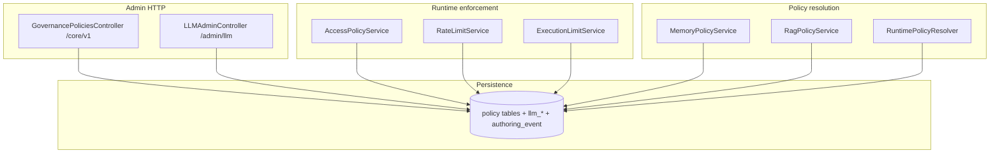

# Governance — guide

The **`governance`** bounded context centralizes **tenant policy administration**, **runtime enforcement** (who may do what, how often, and how many executions), **resolution** of effective memory and RAG policy for a run, **LLM provider and pricing administration**, and the **`AuthoringEventRepository`** used for audit across domains.

## What this module is for

| Concern | Mechanism |
|---------|-----------|
| Define limits and behaviour as data | Versioned **policy roots** + **`*_policy_version`** rows (see [Policy model and versioning](policy-model-and-versioning.md)). |
| Protect execution and conversation APIs | **`AccessPolicyService`** and **`RateLimitService`** invoked from **boundary** facades before domain work (see [Enforcement and limits](enforcement-and-limits.md)). |
| Cap graph workload | **`ExecutionLimitService`** against **execution limit policy** (no dedicated HTTP surface in `GovernancePoliciesController`). |
| Resolve effective bundles at runtime | **`RuntimePolicyResolver`** (execution domain) for the **runtime policy** document; **`MemoryPolicyService`** / **`RagPolicyService`** for tenant memory/RAG (see [Runtime resolution](runtime-resolution.md)). |
| Audit changes | **`AuthoringEventRepository.append_event`** — repository lives here, callers span flows, RAG, tools, auth, etc. (see [Authoring events](authoring-events.md)). |

## Conceptual architecture

## Package map

| Area | Role | Path |
|------|------|------|
| **Governance policies service** | CRUD + publish/activate for runtime, access, rate limit, billing, memory, RAG policies | `src/domain/governance/services/governance_policies_service.py` |
| **Governance policies controller** | REST under `/core/v1` | `src/domain/governance/controllers/governance_policies_controller.py` |
| **Access / rate / execution limits** | Enforcement services | `src/domain/governance/services/access_policy_service.py`, `rate_limit_service.py`, `execution_limit_service.py` |
| **Memory / RAG resolution** | Resolve active definitions via execution repository | `src/domain/governance/services/memory_policy_service.py`, `rag_policy_service.py` |
| **LLM admin** | Provider, mapping, pricing upserts | `src/domain/governance/services/llm_admin_service.py`, `controllers/llm_admin_controller.py` |
| **Repositories** | Per-policy repositories + `authoring_event_repository` | `src/domain/governance/repositories/` |
| **Schemas** | `policy_admin`, `runtime_policy`, `memory_policy`, `rag_policy`, `scopes` | `src/domain/governance/schemas/` |
| **Ports** | `AccessPolicyServicePort`, `ExecutionLimitServicePort` | `src/domain/governance/ports/` |

## Related domains (outside this folder)

- **`RuntimePolicyResolver`** — implemented under `src/domain/execution/services/runtime_policy_resolver.py`; documented in [Runtime policy resolver](../Execution/runtime-policy-resolver.md). It consumes **`runtime_policy`** rows rather than encapsulating all of `governance/`.
- **`ai_policy`** — AI execution policies (`ai_execution_policy`, node bindings) live under `src/domain/ai_policy/` with their own HTTP surface; conceptually adjacent to governance.

## Reading order

1. [Policy model and versioning](policy-model-and-versioning.md) — tables, lifecycle, policy types.
2. [HTTP API and scopes](http-api-and-scopes.md) — `/core/v1` routes, `Scope`, LLM admin routes.
3. [Enforcement and limits](enforcement-and-limits.md) — access, rate limit, execution limits, boundaries.
4. [Runtime resolution](runtime-resolution.md) — runtime bundle vs memory/RAG resolution.
5. [Authoring events](authoring-events.md) — audit repository and cross-cutting use.

## Cross-links

- [Governance policy versioning](../Glossary/terms/governance-policy-versioning.md) — short glossary definition.
- [Persistence tables](../Glossary/persistence-tables.md) — `*_policy`, `*_policy_version`, `llm_*`, `authoring_event`.
- [Guardrail engine](../Execution/guardrail-engine.md), [Runtime policy resolver](../Execution/runtime-policy-resolver.md), [RAG overview](../RAG/index.md), [LLM overview](../LLM/index.md).
