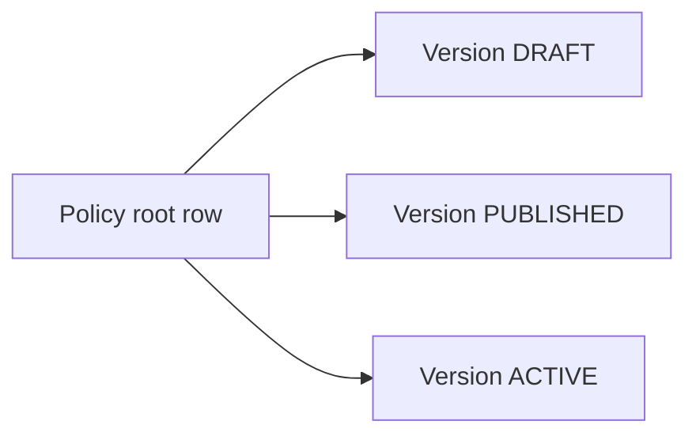
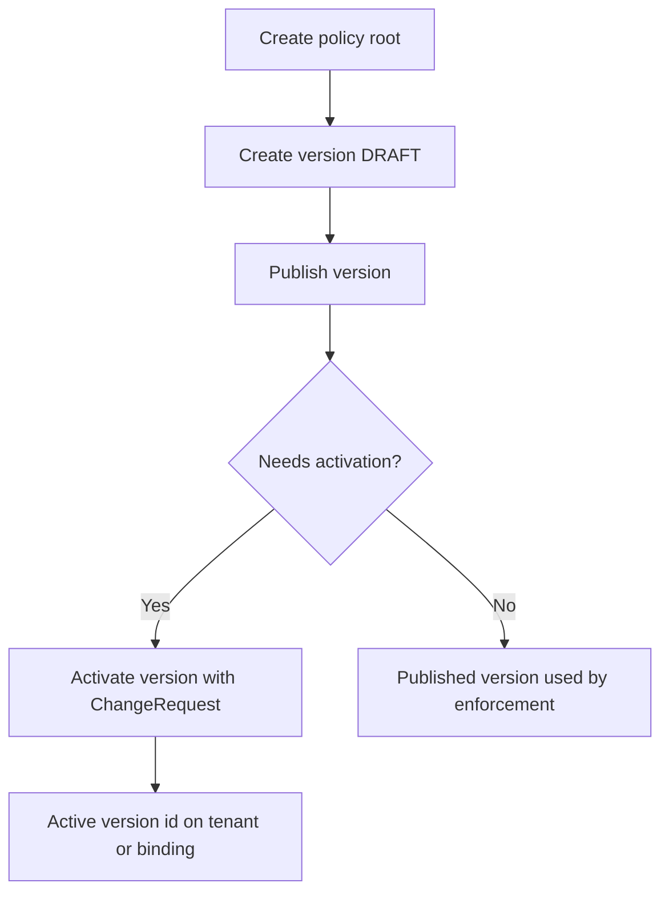

# Policy model and versioning

Governance policies in this service follow a **repeatable pattern**: a **policy root** row (identity and name per tenant) plus one or more **version** rows that hold the immutable snapshot used at runtime or after publish.

See also [Governance policy versioning](../Glossary/terms/governance-policy-versioning.md) and [Persistence tables](../Glossary/persistence-tables.md).

## Root + version pattern

- **Root** — stable id (`*_policy_id`), `tenant_id`, human-readable `name` where applicable.
- **Version** — semantic-ish triple (`version_major`, `version_minor`, `version_patch`), `status` (e.g. `DRAFT`, `PUBLISHED`), payload (`rules`, `policy_definition`, `definition`, … depending on type).

Typical **authoring flow**:

- **Runtime policy** — publish and **activate** via `:activate` with a **`ChangeRequest`** body (`src/domain/common/schemas/change.py`) — see [HTTP API and scopes](http-api-and-scopes.md).
- **Access / rate limit** — enforcement services load **default policy for tenant** + **published** version (no separate “activate” in the same sense as billing/memory/RAG for those two — see repositories).
- **Billing / memory / RAG** — **publish** then **activate** on the version so the tenant points at the active snapshot (service methods in `GovernancePoliciesService`).

Exact semantics live in each `*_repository.py` under `src/domain/governance/repositories/`.

## Policy types managed under `GovernancePoliciesService`

| Type | Root table | Version table | Payload focus |
|------|------------|---------------|----------------|
| **Runtime** | `runtime_policy` only (no separate `runtime_policy_version` table) | `policy_definition` JSON + `version` string + `status` on the same row (`DRAFT` → activate) | `RuntimePolicyDefinition` in `src/domain/governance/schemas/runtime_policy.py` — `limits`, `execution`, `tools`, `llm`, `moderation`, `fallback_sla`, `memory_extraction`, `memory_retrieval`, `user_context_enrichment` |
| **Access** | `access_policy` | `access_policy_version` | `rules`: `allow` list (and optional `deny` in schema; enforcement uses **allow list** + token **scopes** — see [Enforcement and limits](enforcement-and-limits.md)) |
| **Rate limit** | `rate_limit_policy` | `rate_limit_policy_version` | `action`, `principal_type`, `limit`, `window_seconds` |
| **Billing** | `billing_policy` | `billing_policy_version` | `rules` — flexible schema (`BillingPolicyRulesSchema` with `extra="allow"`) |
| **Memory** | `memory_policy` | `memory_policy_version` | `MemoryPolicyDefinition` in `src/domain/governance/schemas/memory_policy.py` |
| **RAG** | `rag_policy` | `rag_policy_version` | `RagPolicyDefinition` in `src/domain/governance/schemas/rag_policy.py` |

Schemas for admin DTOs: `src/domain/governance/schemas/policy_admin.py`.

## Execution limit policy (enforcement only)

| Table | Role |
|-------|------|
| `execution_limit_policy` | Root |
| `execution_limit_policy_version` | Published limits, e.g. `max_agent_runs_per_interaction`, `max_tool_runs_per_flow_run` |

**`ExecutionLimitService`** (`src/domain/governance/services/execution_limit_service.py`) reads the tenant’s **default** policy and **published** version, then asserts counts via `ExecutionRepository`.

There is **no** route on `GovernancePoliciesController` for execution-limit CRUD in the current codebase: configuration is assumed to be **data + repository** (migrations, seeds, or future admin API). Document this honestly — operators configure rows through whatever channel your deployment uses.

## Runtime policy definition (bundle)

`RuntimePolicyDefinition` groups operational knobs used by the execution and LLM layers when a resolved policy is applied (see [Runtime policy resolver](../Execution/runtime-policy-resolver.md)):

- **limits** — graph size, duration, loop iterations, tool fan-out, …
- **execution** — edge evaluation strictness, parallel nodes, …
- **tools** — retries, circuit breaker
- **llm** — retries, streaming, history tasks, **inference_layers** (cache, SLM, …)
- **moderation** / **fallback_sla** — provider hooks for guardrails and human fallback LLM
- **memory_extraction** / **memory_retrieval** / **user_context_enrichment** — memory pipeline defaults

## AI execution policy (adjacent domain)

**`ai_execution_policy`** / **`ai_execution_policy_version`** and node bindings are owned by **`src/domain/ai_policy/`**, not `governance/`. They complement runtime governance with **per-node** AI execution rules. See that package and [Persistence tables](../Glossary/persistence-tables.md).

## Related

- [HTTP API and scopes](http-api-and-scopes.md)
- [Enforcement and limits](enforcement-and-limits.md)
- [Runtime resolution](runtime-resolution.md)
