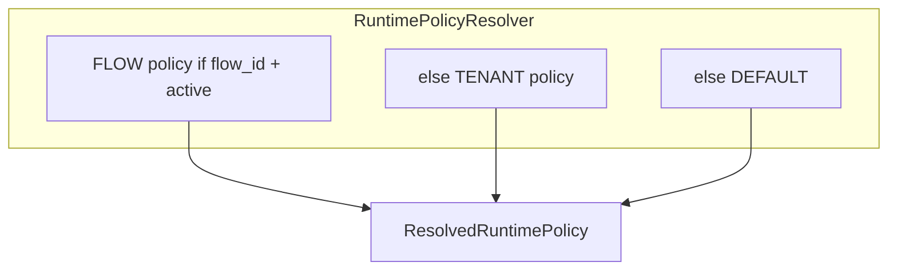
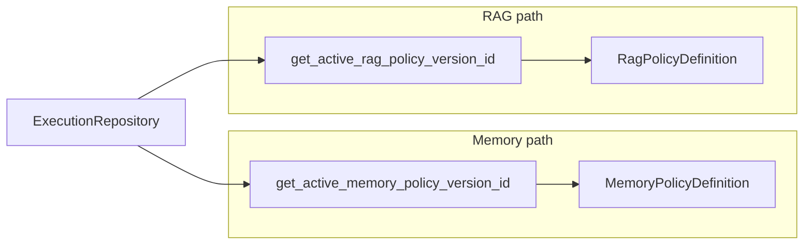

# Runtime resolution

“Resolution” means **choosing which policy document applies** at execution time. This service has **two distinct mechanisms**:

1. **`RuntimePolicyResolver`** (execution domain) — resolves the **`RuntimePolicyDefinition`** bundle for graph execution (FLOW → TENANT → DEFAULT).
2. **`MemoryPolicyService` / `RagPolicyService`** (governance package) — resolve **tenant memory** and **RAG** policy definitions from **active version ids** stored on tenant state via **`ExecutionRepository`**.

## 1. Runtime policy bundle (`RuntimePolicyResolver`)

Documented in [Runtime policy resolver](../Execution/runtime-policy-resolver.md).

- **Input:** `tenant_id`, optional `flow_id`, constructor **default** definition.
- **Output:** `ResolvedRuntimePolicy` with `definition: RuntimePolicyDefinition`, `scope`, `source` (`FLOW` | `TENANT` | `DEFAULT`).
- **Consumer:** `ExecutionService` passes the result into `RuntimeExecutor` and **`ExecutionContext.metadata["runtime_policy"]`** so nodes and LLM code read limits, LLM defaults, moderation, memory extraction defaults, etc.

Code: `src/domain/execution/services/runtime_policy_resolver.py` — uses `RuntimePolicyRepository` from governance persistence.

## 2. Memory policy — `MemoryPolicyService.resolve`

`src/domain/governance/services/memory_policy_service.py`

- Calls **`ExecutionRepository.get_active_memory_policy_version_id(tenant_id)`**.
- If present, loads **`get_memory_policy_version`** and builds **`MemoryPolicyDefinition`** (retention, consent, allowed sources/schemas).
- If missing, returns **`ResolvedMemoryPolicy`** with **`DEFAULT_NONE`** source and empty definition.

Used when persisting or retrieving user memory under governance (see call sites in the same module and execution flows).

## 3. RAG policy — `RagPolicyService`

`src/domain/governance/services/rag_policy_service.py`

- **`resolve(tenant_id)`** — loads active RAG policy version id via **`get_active_rag_policy_version_id`**, then **`get_rag_policy_version`**, wraps **`RagPolicyDefinition`**.
- **`scope_policy(tenant_id, task_type, scope)`** — combines resolved definition with per-task defaults (`RagTaskDefaults`, `RagScopePolicy`) for activation gating.

Links to LLM task types: `src/domain/llm/schemas/llm.py` (`LLMTaskType`).

## How this differs from the runtime bundle

| Aspect | Runtime bundle | Memory / RAG services |
|--------|----------------|------------------------|
| **Primary data** | `runtime_policy` + activation per flow/tenant | `memory_policy_version` / `rag_policy_version` **ids** wired to tenant |
| **Resolver class** | `RuntimePolicyResolver` | Service methods on `MemoryPolicyService` / `RagPolicyService` |
| **Typical use** | Graph limits, LLM defaults, tool circuit breaker | Retention/consent, RAG activation matrix |

Both can coexist: a flow run may carry **`metadata["runtime_policy"]`** while memory writes consult **`MemoryPolicyService`**.

## Related

- [Policy model and versioning](policy-model-and-versioning.md)
- [RAG overview](../RAG/index.md), [RAG runtime and integration](../RAG/runtime-and-integration.md)
- [LLM overview](../LLM/index.md)
