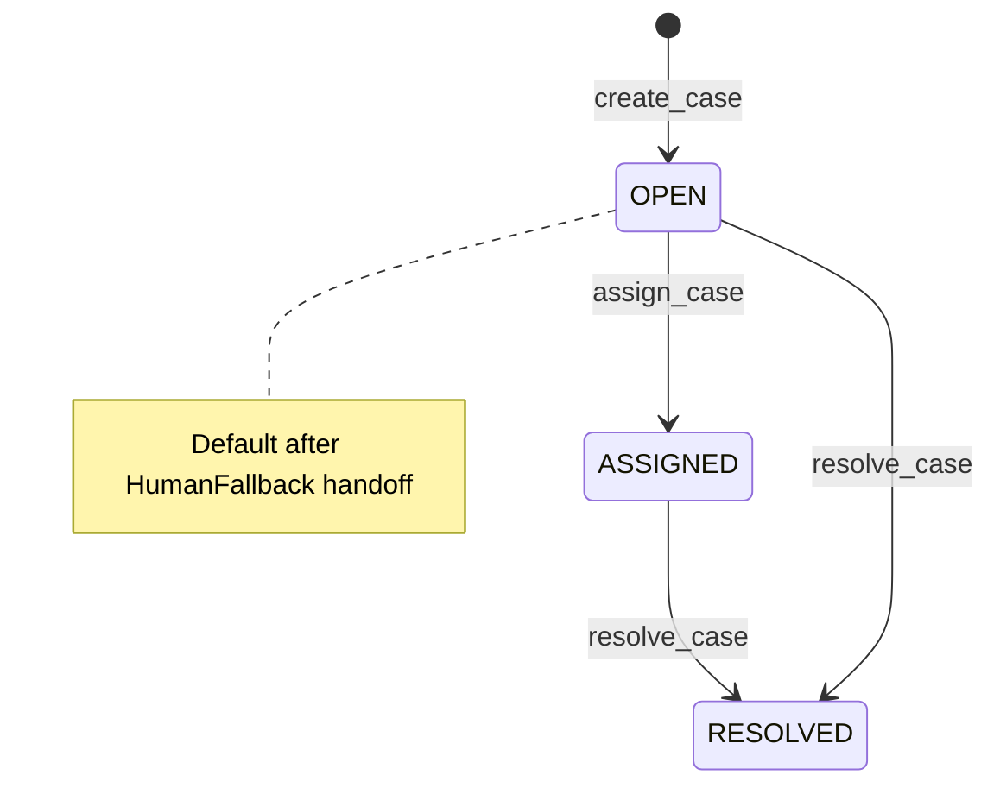
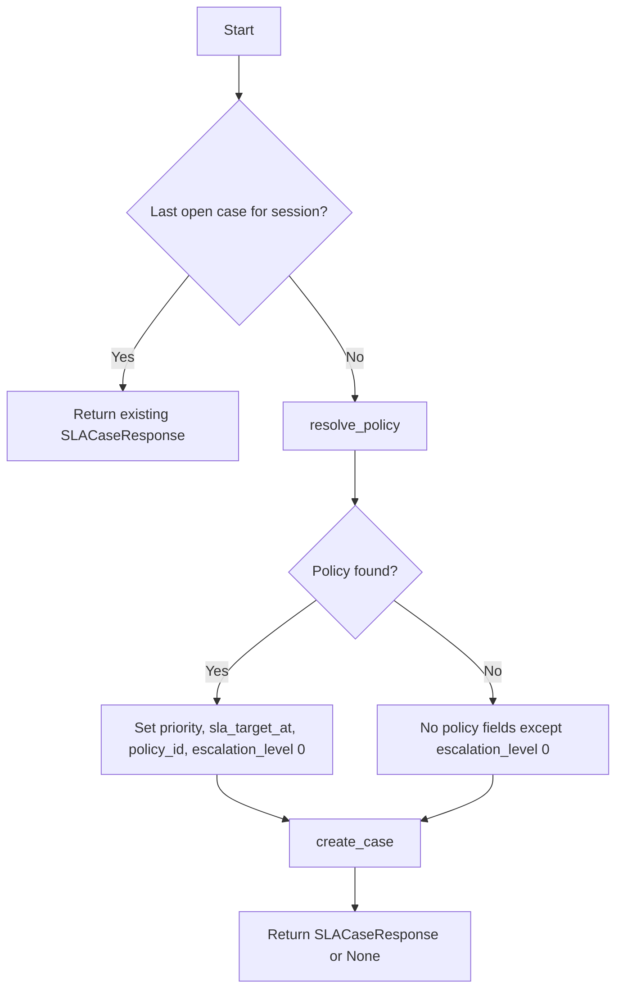
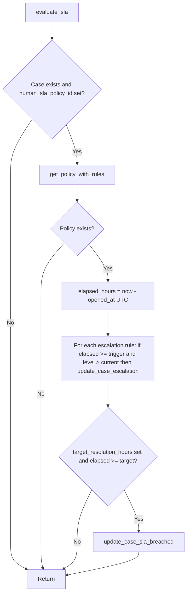
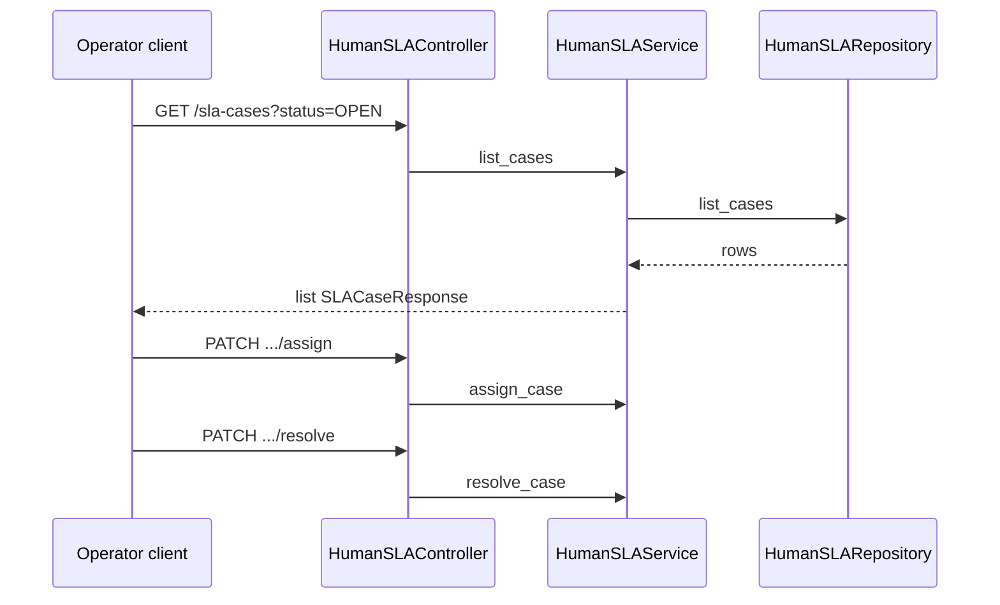

# Cases and service

This page covers **case** fields, **`HumanSLAService`** behaviour (including **`evaluate_sla`**), and the **operator-facing HTTP API**.

## Enums and payloads

`src/domain/human_sla/schemas/sla_case.py`

| Enum | Values / notes |
|------|----------------|
| **`SLAStatus`** | `OPEN`, `ASSIGNED`, `RESOLVED`, `ABANDONED` |
| **`SLAFallbackReason`** | e.g. `LOW_CONFIDENCE`, `TOOL_FAILURE`, `TIMEOUT`, `POLICY_BLOCK`, `USER_REQUESTED_HUMAN`, … |
| **`SLAResolutionStatus`** | `RESOLVED`, `UNRESOLVED`, `TRANSFERRED`, `USER_ABANDONED` |

DTOs **`SLACaseCreate`** / **`SLACaseResponse`** include: tenant, session, `flow_run_id`, `node_run_id`, optional `interaction_id`, `user_id`, `priority`, `fallback_reason`, `opened_at`, `sla_target_at`, optional `human_sla_policy_id`, `current_escalation_level`, resolution fields, `sla_breached`, timestamps.

## Case state (conceptual)

Use the API paths below for real transitions; repository methods enforce tenant scoping.

## `HumanSLAService`

`src/domain/human_sla/services/human_sla_service.py`

### `get_or_create_open_case_for_fallback`

Used by **HumanFallback** when `human_sla_service` is configured and `current_node_run_id` is set.

Behaviour summary:

1. **`get_last_open_case_for_session`** — if a row exists, return it (**one open case per session** policy at the application layer).
2. Else **`resolve_policy`** by tenant, `node` string, and **`fallback_reason.value`**.
3. If policy exists: **`priority`** = `initial_priority`; **`sla_target_at`** = `opened_at` (normalized UTC) + `target_response_hours` when that field is set; **`human_sla_policy_id`**; **`current_escalation_level`** = 0.
4. If no policy: those policy-derived fields are null except **`current_escalation_level`** = 0.
5. **`create_case`**; return validated **`SLACaseResponse`** or `None`.

### `create_case_for_fallback`

Creates a case **without** the “existing open case” short-circuit — for callers that need an explicit insert path.

### `evaluate_sla(case_id, tenant_id)`

**Programmatic** SLA check (not exposed on `HumanSLAController` today). Intended for schedulers, workers, or internal hooks.

Important:

- Escalation loops **reload the case** after updates so subsequent rules see fresh `current_escalation_level`.
- **Breach** (`sla_breached`) is driven by **`target_resolution_hours`**, not by escalation rules alone.

!!! note "Integration gap"

    There is **no** dedicated HTTP route for `evaluate_sla` in `human_sla_controller.py`. If you need periodic evaluation, call the service from a **job** or **wire a route** in a future change.

### Other methods

- **`list_open_cases`**, **`list_cases`**, **`get_case_detail`**
- **`assign_case`** — sets human agent id (moves toward **`ASSIGNED`** per repository semantics)
- **`resolve_case`** — resolution status, summary, agent id

## HTTP API

`HumanSLAController` — `src/domain/human_sla/controllers/human_sla_controller.py`

**Prefix:** `/core/v1/sla-cases`  
**Auth:** `get_auth_context` — tenant-scoped (`auth.tenant_id`).

| Method | Path | Action |
|--------|------|--------|
| GET | `` | List cases; optional query `status` (`SLAStatus`); `limit` 1–200, `offset` |
| GET | `/{sla_case_id}` | Detail |
| PATCH | `/{sla_case_id}/assign` | Body: `SLACaseAssign` — assign to human agent |
| PATCH | `/{sla_case_id}/resolve` | Body: `SLACaseResolve` — resolve with status + summary |

### Sequence: operator resolves a case

## Related

- [Policies and matching](policies-and-matching.md)
- [HumanFallback node](../Execution/graph-runtime/nodes/llm-nodes.md#humanfallback)
