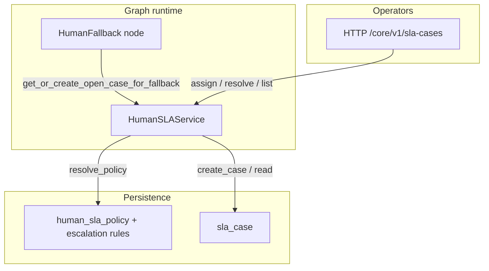
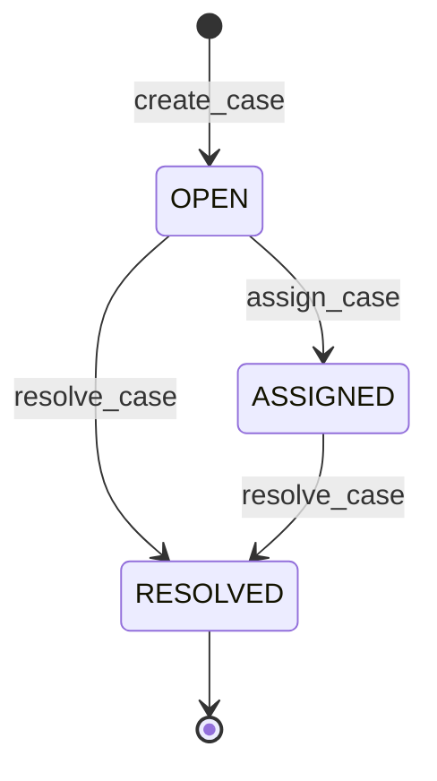

# Human SLA — guide

This section explains how the **human SLA** bounded context works end to end: why cases exist, how **policies** attach targets and escalation rules, how **cases** are created from the graph runtime, and how operators work cases through the HTTP API.

## What this module is for

| Goal | Mechanism |
|------|-----------|
| Record that a conversation needs a human | A **case** (`sla_case`) ties tenant, session, flow run, node run, and fallback reason. |
| Apply per-tenant rules (response time, escalation) | **Policies** (`human_sla_policy` + `human_sla_escalation_rule`) matched by graph node id and fallback reason. |
| Let staff triage work | REST API under `/core/v1/sla-cases` (list, detail, assign, resolve). |

Automation does **not** replace your ticketing system by itself: it gives a **first-class persistence layer** inside this service so flows, sessions, and SLA metadata stay aligned with execution.

## Conceptual architecture

## Lifecycle at a glance

Implemented transitions in `HumanSLARepository` today:

`SLAStatus` also defines **`ABANDONED`**, but there is no `assign`/`resolve`-style helper shown in the same repository module for that value — treat it as reserved unless you add a code path.

## Who triggers case creation?

Only the **HumanFallback** graph node calls `HumanSLAService.get_or_create_open_case_for_fallback` when `HumanSLAService` is injected into the executor. The node passes:

- **`node`** — from execution metadata: `fallback_source_node`, or else `current_node_type`, or `""` (see `human_fallback.py`).
- **`fallback_reason`** — from metadata if it is a valid `SLAFallbackReason`; otherwise **`LOW_CONFIDENCE`**.

Details: [LLM-backed nodes — HumanFallback](../Execution/graph-runtime/nodes/llm-nodes.md#humanfallback).

## Reading order

| Audience | Path |
|----------|------|
| Configure policies and understand matching | [Policies and matching](policies-and-matching.md) |
| Case fields, service methods, API, SLA evaluation | [Cases and service](cases-and-service.md) |

## Package map

| Area | Role | Path |
|------|------|------|
| **Service** | Case CRUD, policy resolution, SLA evaluation | `src/domain/human_sla/services/human_sla_service.py` |
| **Repositories** | `HumanSLARepository`, `HumanSLAPolicyRepository` | `src/domain/human_sla/repositories/` |
| **Schemas** | Policy, case, enums | `src/domain/human_sla/schemas/` |
| **Controller** | REST under `/core/v1/sla-cases` | `src/domain/human_sla/controllers/human_sla_controller.py` |

## Persistence

Tables: `human_sla_policy`, `human_sla_escalation_rule`, `sla_case` — [Persistence tables](../Glossary/persistence-tables.md) (Human SLA section).
