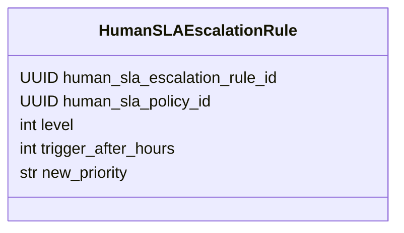
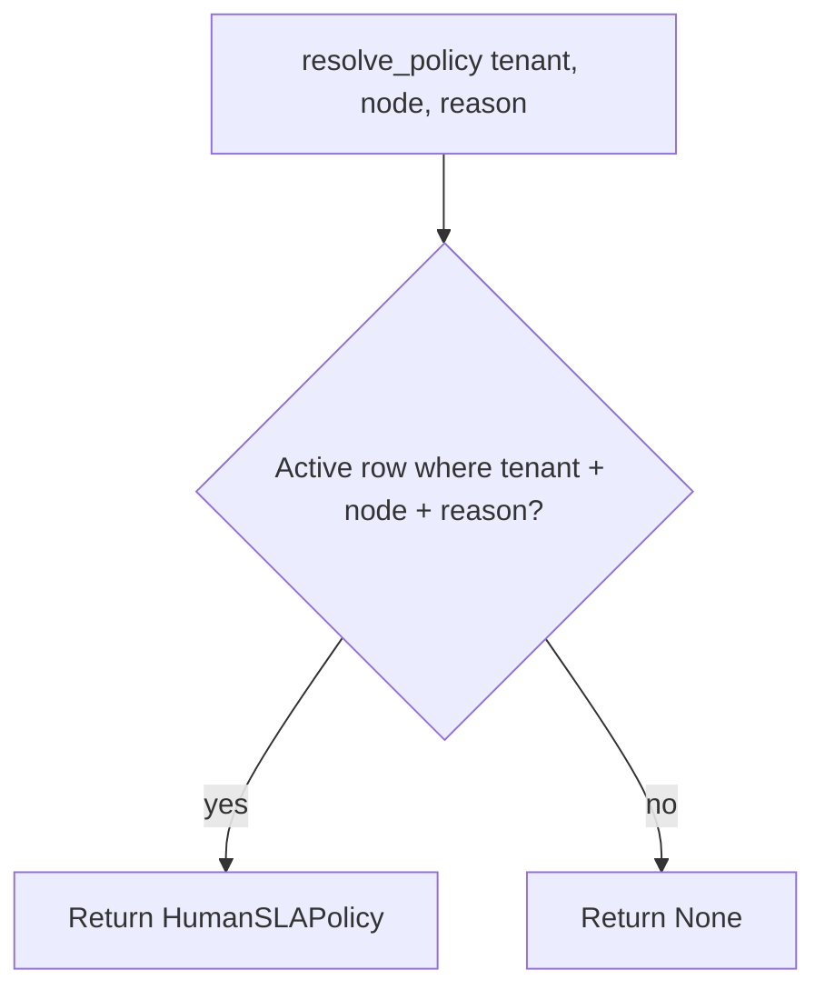
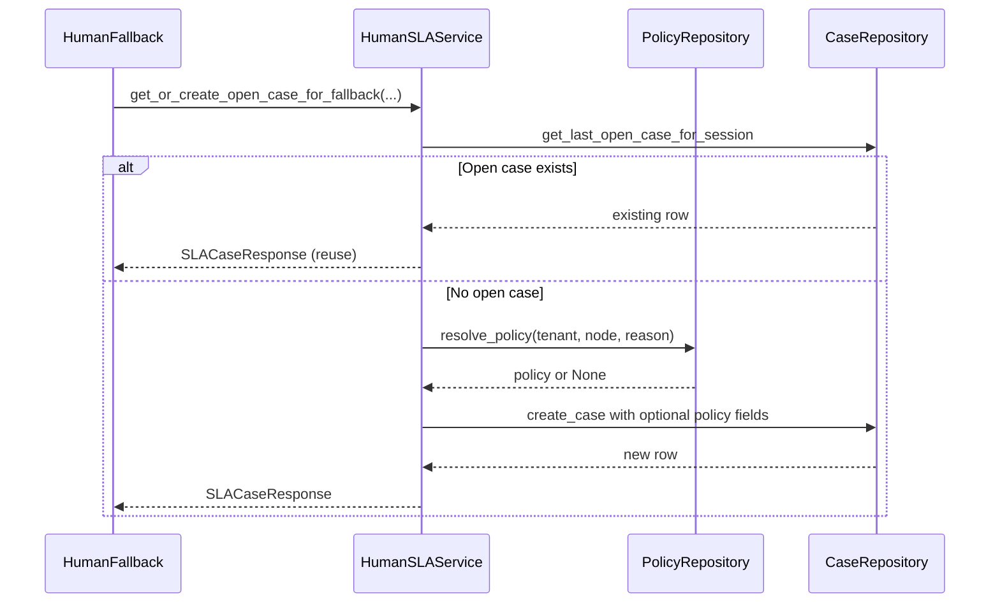

# Policies and matching

Policies let you define **different SLA behaviour** depending on **which graph node** escalated and **why** (fallback reason). This page describes the schema, how a row is selected at runtime, and what you must align in data vs graph metadata.

## Why matching uses `node` and `fallback_reason`

At human handoff, the service receives:

- **`tenant_id`** — from the running execution context.
- **`node`** — a **string** (see HumanFallback: `fallback_source_node` or `current_node_type`).
- **`fallback_reason`** — enum value serialized to string for the SQL lookup (`SLAFallbackReason.value`).

The database stores **`node`** and **`fallback_reason`** as plain strings. They must match **exactly** (with the repository’s equality semantics) what the graph passes in, or **no policy** is found and the case is still created **without** `human_sla_policy_id` (see service).

## Schema: `HumanSLAPolicy`

`src/domain/human_sla/schemas/human_sla_policy.py`

| Field | Role |
|-------|------|
| `human_sla_policy_id`, `tenant_id`, `name` | Identity and labeling |
| `node` | Matched against the string from HumanFallback (e.g. upstream node type or explicit metadata). |
| `fallback_reason` | Matched against the string form of `SLAFallbackReason` (e.g. `LOW_CONFIDENCE`). |
| `initial_priority` | Written onto the new case when this policy applies. |
| `target_response_hours` | If set, **`sla_target_at`** = `opened_at` + this many hours (UTC). |
| `target_resolution_hours` | Used in **`evaluate_sla`** to set **`sla_breached`** when elapsed time exceeds this target. |
| `active` | Only **active** rows participate in **`resolve_policy`**. |
| `escalation_rules` | Ordered **`HumanSLAEscalationRule`** rows: `level`, `trigger_after_hours`, `new_priority`. |

### Escalation rule shape

Rules are applied in repository order inside **`evaluate_sla`** (see [Cases and service](cases-and-service.md)): when elapsed hours cross `trigger_after_hours` and the rule’s `level` is greater than the case’s `current_escalation_level`, priority and level update.

## Resolution algorithm

`HumanSLAPolicyRepository.resolve_policy` (`src/domain/human_sla/repositories/human_sla_policy_repository.py`) returns **at most one** active policy such that:

- `tenant_id` equals the request
- `node` equals the given node string
- `fallback_reason` equals the given reason string
- `active` is true

If nothing matches, the return is **`None`**.

## Sequence: policy attach at case creation

This is the logical order inside **`get_or_create_open_case_for_fallback`** when no open case exists for the session:

## `get_policy_with_rules`

`get_policy_with_rules(policy_id)` loads one policy and attaches **escalation rules** for **`evaluate_sla`**. It is **not** used at case-creation time for the initial resolve; it backs SLA evaluation when the case already stores `human_sla_policy_id`.

## Operational checklist

1. **Decide the `node` string** your graph will emit (or set `fallback_source_node` in execution metadata to a stable id).
2. **Insert policies** so `node` and `fallback_reason` match those strings exactly (including enum value spelling).
3. **Mark inactive** policies you retire (`active = false`) so they no longer match.
4. **Order escalation rules** by increasing `level` / `trigger_after_hours` as intended — the service iterates rules and may update the case multiple times in one `evaluate_sla` call.

## Related

- [Cases and service](cases-and-service.md)
- [HumanFallback node](../Execution/graph-runtime/nodes/llm-nodes.md#humanfallback)
