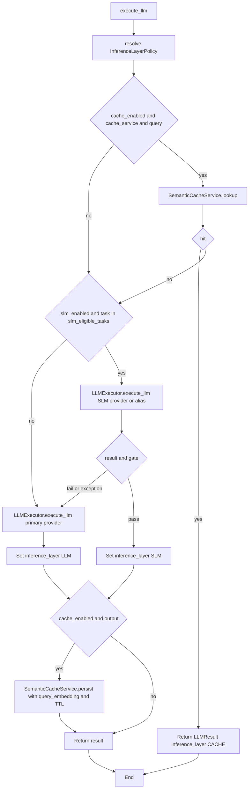

# Layered inference

`LayeredInferenceOrchestrator` (`src/domain/llm/services/layered_inference_orchestrator.py`) implements `LLMExecutorPort` (`src/domain/llm/ports/llm_executor.py`). It wraps the core [LLM executor](llm-executor.md) and orders work as **semantic cache → SLM → primary LLM**, with optional **escalation** when the SLM path does not satisfy structured output expectations, and **write-back** to the semantic cache on success.

## Policy: `InferenceLayerPolicy`

Runtime knobs are defined in `InferenceLayerPolicy` (`src/domain/llm/schemas/inference_cache.py`). Callers can pass `policy_llm["inference_layers"]` as a dict; the orchestrator validates it with `InferenceLayerPolicy.model_validate` and falls back to the orchestrator’s default policy on validation failure.

| Field | Purpose |
|-------|---------|
| `cache_enabled`, `cache_similarity_threshold`, `cache_ttl_seconds` | Enable semantic lookup and TTL for persist |
| `slm_enabled`, `slm_eligible_tasks`, `slm_provider`, `slm_model_alias` | When the task type is eligible, the request is copied with `model_alias` set to `slm_model_alias` and `provider` to `slm_provider` for the first attempt |
| `escalation_on_schema_mismatch` | If true, SLM results that fail `_passes_confidence_gate` are discarded so the primary LLM runs |

Default `slm_eligible_tasks` includes `intent_selection` and `tool_selection`.

## Execution flow

### Cache hit

If caching is enabled, `user_message` or `prompt` is used as `user_query`, and `task_type` is present, `SemanticCacheService.lookup` runs. On hit, the orchestrator returns immediately with `InferenceLayer.CACHE`, `cost_usd=0.0`, and empty `token_usage` as implemented.

The lookup also returns `query_embedding`, reused on persist to avoid a second embedding when possible.

### SLM branch

When the task is SLM-eligible, the orchestrator builds `slm_request = request.model_copy(update={"model_alias": layer_policy.slm_model_alias})` and calls `LLMExecutor.execute_llm` with `provider=layer_policy.slm_provider`. Exceptions are swallowed (`result = None`) so execution can fall back.

If `escalation_on_schema_mismatch` is true and `_passes_confidence_gate` returns false, the SLM result is cleared so the primary path runs.

### Confidence / schema gate

`_passes_confidence_gate` compares `LLMResult.output` to `request.output_schema`:

- If there is no `output_schema`, any non-empty output passes.
- If `output_schema` has a `required` list, every listed key must exist in `result.output`.
- Otherwise, every key in `properties` must exist in `result.output`.

This is a **structural** check, not a JSON Schema `validate()` call (that happens inside `LLMExecutor`).

### Primary LLM

The primary call uses the original `request` and the `provider` argument passed into `execute_llm` (default `"OPENAI"`).

### Persist

If cache is enabled, `user_query` and `task_type` are set, and `result.output` is truthy, `SemanticCacheService.persist` stores the answer with `query_embedding` (from lookup or computed inside persist if missing), `inference_layer` as the layer’s string value, and `ttl_seconds` from policy.

## See also

- [Semantic cache](semantic-cache.md)
- [LLM executor](llm-executor.md)
- [Token cost and context strategy](../Develop/token-cost-and-context-strategy.md) — duplicate mermaid and product-level narrative
