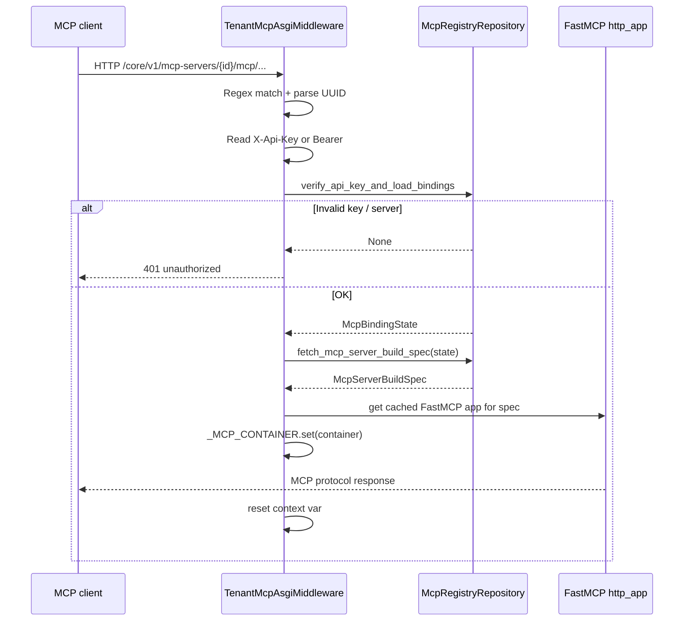
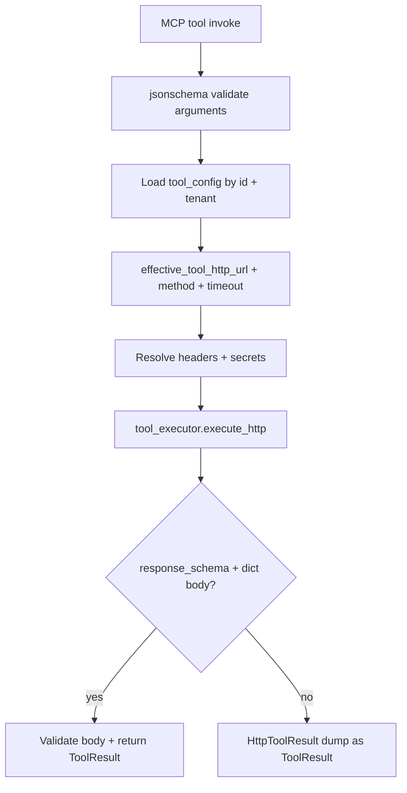
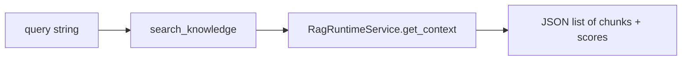

# Gateway and runtime

MCP **session handling** and **tool execution** are implemented in **`src/adapters/mcp/tenant_mcp_gateway.py`**. The domain registry decides **which** tools and resources belong to a server; this module builds a **FastMCP** ASGI application per **`McpServerBuildSpec`** and executes HTTP-backed tools through the same **`tool_executor`** stack as graph execution.

## Request routing and auth

### URL pattern

Requests must match:

`^/core/v1/mcp-servers/([uuid])/mcp(.*)$`

The middleware extracts **`mcp_server_id`**, then rewrites the inner path to **`/mcp` + suffix** for the FastMCP app (`inner_path`).

### API key

The gateway accepts:

- Header **`X-Api-Key`**, or
- **`Authorization: Bearer <token>`**

If missing or invalid → **401** JSON `{"detail": "unauthorized"}`.

### Application container context

`_McpHttpProxyTool.run` and **`search_knowledge`** read **`ApplicationContainer`** from the context var **`_MCP_CONTAINER`**. If it is not set (middleware bug or direct invocation), tools return structured errors such as **`mcp_context_missing`**.

## Building the FastMCP app: `_build_http_app_from_spec`

For each **`McpServerToolBinding`**, the gateway registers **`_McpHttpProxyTool`**:

- **Tool name** = `binding.mcp_name`
- **`parameters`** = `request_schema` (JSON Schema for MCP arguments)
- Optional **`output_schema`** for response body validation

### Tool call path: `_McpHttpProxyTool.run`

On **`run(arguments)`**:

1. **Validate** `arguments` with **jsonschema** against `parameters` → on failure, return `arguments_validation_failed`.
2. Resolve container; load **`tool_config`** by `exec_tool_config_id`; enforce **`tenant_id`** matches `exec_tenant_id`.
3. Resolve HTTP **`url`** via `effective_tool_http_url(config)`, **method** (default `POST`), **`timeout_seconds`** (default `10`).
4. Resolve **headers**: plain strings, or **`secret_ref`** objects via **`SecretResolverPort`** (with tracing).
5. Call **`tool_executor.execute_http`** with JSON body = MCP arguments (dict).
6. Validate **`HttpToolResult`**; if `response_schema` is set and body is a dict, **jsonschema**-validate body; otherwise return a structured dump of the HTTP result.

So: **MCP clients see named tools**; the adapter **maps** each name to a persisted **HTTP tool config** and performs the outbound request.

### Error surfaces (non-exhaustive)

| Condition | Typical structured error |
|-----------|---------------------------|
| Invalid arguments | `arguments_validation_failed` |
| Missing container | `mcp_context_missing` |
| Wrong tenant / missing config | `tool_config_not_found` |
| No URL in config | `tool_config_missing_url` |
| Bad header shape | `invalid_tool_headers_config` |
| HTTP/validation failure | `tool_response_validation_failed` or exception type name |
| Body vs schema | `response_body_schema_mismatch` |

## Optional tool: `search_knowledge`

If **`spec.vector_store_ids`** is non-empty, the gateway registers **`search_knowledge`**:

- For each bound vector store, resolves a **published RAG config** id.
- Calls **`RagRuntimeService.get_context`** per store, aggregates scored chunks.
- If vector ids were given but **no** published config existed → JSON `{"error": "no_published_rag_config"}`.

See [RAG runtime and integration](../RAG/runtime-and-integration.md).

## Prompts

For each bound user prompt, **`mcp.prompt(name=slug, ...)`** registers a template that returns **`title` + `content`** as plain text (implementation concatenates with a newline).

## Caching and lifespan

- **`_spec_cache_key`** — hashes tool bindings (ids, `mcp_name`, request/response schema fingerprints), vector ids, prompt content hashes, and flow ids.
- **`_MCP_APP_CACHE`** — LRU of built ASGI apps (limit **64**).
- **`_ensure_mcp_asgi_lifespan`** — holds the FastMCP app’s lifespan context in a background task so the app stays initialized under load.

Use **`clear_tenant_mcp_app_cache()`** / **`shutdown_tenant_mcp_lifespans()`** in tests or controlled shutdown (see module docstrings and call sites).

## Related

- [Registry and API](registry-and-api.md)
- [RAG runtime and integration](../RAG/runtime-and-integration.md)
