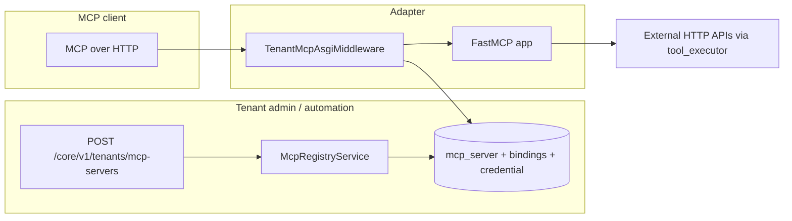

# MCP registry — guide

This section explains how **tenant-scoped MCP servers** are registered in the **domain** layer and how **MCP clients** call tools over HTTP through the **gateway** adapter. Use it when integrating external MCP-aware clients (IDEs, agents) with flows and tools already modeled in this service.

## What you get

| Layer | Responsibility |
|-------|----------------|
| **MCP registry (domain)** | Persist `mcp_server`, bind tool configs / vector stores / user prompts / optional flow ids; issue **API keys**; build an **`McpServerBuildSpec`** for the gateway. |
| **Tenant MCP gateway (adapter)** | Match `/core/v1/mcp-servers/{id}/mcp`, verify API key, load spec, serve a **FastMCP** HTTP app: HTTP-proxy tools, optional **`search_knowledge`**, **prompts**. |

The **MCP wire protocol** (Streamable HTTP / FastMCP) is **not** implemented inside `domain/mcp_registry/` — it lives in `src/adapters/mcp/tenant_mcp_gateway.py`.

## End-to-end picture

Typical flow:

1. **Register** a server with tool config ids (and optional vector stores, prompts, flow snapshot/deployment).
2. Store the returned **`endpoint`** URL and **`api_key`** in the client.
3. The client sends MCP requests to that URL with **`X-Api-Key`** or **`Authorization: Bearer`**.
4. Each bound tool becomes an MCP tool name that **proxies** to the tenant’s HTTP tool configuration.

## Reading order

| Step | Document |
|------|----------|
| 1 | [Registry and API](registry-and-api.md) — create/list/get servers, validations, credential handling, how **`McpServerBuildSpec`** is built. |
| 2 | [Gateway and runtime](gateway-and-runtime.md) — URL pattern, auth, `_McpHttpProxyTool`, `search_knowledge`, caching. |

## Package map

| Area | Role | Path |
|------|------|------|
| **Service** | Create/list/get MCP servers, build public endpoint URL + API key | `src/domain/mcp_registry/services/mcp_registry_service.py` |
| **Repository** | SQL bindings, credential hash, load `McpServerBuildSpec` | `src/domain/mcp_registry/repositories/mcp_registry_repository.py` |
| **Schemas** | Request/response DTOs, `McpServerBuildSpec`, `McpServerToolBinding` | `src/domain/mcp_registry/schemas/mcp_registry.py` |
| **Controller** | HTTP API under `/core/v1/tenants/...` | `src/domain/mcp_registry/controllers/mcp_registry_controller.py` |
| **Gateway** | FastMCP ASGI app, tool proxy, RAG search, prompts | `src/adapters/mcp/tenant_mcp_gateway.py` |

## Persistence

Tables: `mcp_server`, `mcp_server_tool`, `mcp_server_vector_store`, `mcp_server_user_prompt`, `mcp_server_credential` — see [Persistence tables](../Glossary/persistence-tables.md) (MCP section).

## Related

- Tool configs live under `src/domain/tools/` (referenced by MCP bindings).
- [RAG overview](../RAG/index.md) — vector stores bound to MCP and `search_knowledge`.
