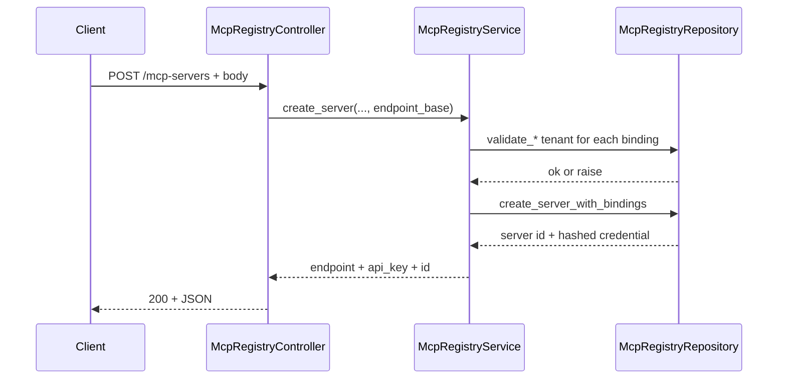
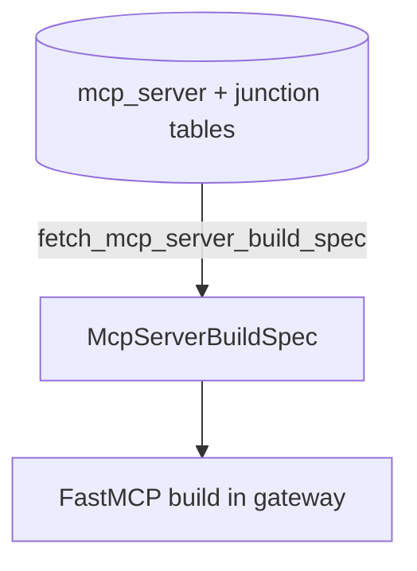

# Registry and API

This page is the **operator guide** for creating MCP servers via HTTP: request shape, validation errors, what gets persisted, and how the repository prepares the **`McpServerBuildSpec`** consumed by the [gateway](gateway-and-runtime.md).

## `McpRegistryService`

`src/domain/mcp_registry/services/mcp_registry_service.py`

### `create_server`

Accepts **`McpServerCreateRequest`** with optional lists:

- `tool_config_ids`
- `vector_store_ids`
- `user_prompt_ids`
- Optional `name`, `flow_snapshot_id`, `flow_deployment_id`

#### Validation (tenant ownership)

Before insert, each referenced id is checked to belong to the **same tenant**. On mismatch the service raises **`DomainValidationException`** with a **distinct code**:

| Check | Code |
|-------|------|
| Tool configs | `mcp_tool_config_tenant_mismatch` |
| Vector stores | `mcp_vector_store_tenant_mismatch` |
| User prompts | `mcp_user_prompt_tenant_mismatch` |
| Flow snapshot | `mcp_flow_snapshot_tenant_mismatch` |
| Flow deployment | `mcp_flow_deployment_tenant_mismatch` |

#### Persistence and response

`create_server_with_bindings` (repository):

- Inserts **`mcp_server`** (status `ACTIVE`).
- Junction rows: `mcp_server_tool`, `mcp_server_vector_store`, `mcp_server_user_prompt`.
- Revokes prior credentials for that server (if any), inserts **`mcp_server_credential`** with **SHA-256** hash of the new API key (`hash_api_key`).
- Returns **`api_key` plaintext once** in the API response (not retrievable later from list/get).

Response fields:

- **`endpoint`** — `{endpoint_base}/core/v1/mcp-servers/{mcp_server_id}/mcp`  
  (`endpoint_base` from the controller: `PUBLIC_BASE_URL` or request base URL.)
- **`api_key`**
- **`mcp_server_id`**

### `list_servers` / `get_server`

Return summaries or detail including the **public MCP path** pattern and binding id lists. **`get_server`** loads tool / vector store / user-prompt ids via `list_server_binding_ids`.

!!! note "Secrets"

    Responses do **not** include the raw API key after creation — only the fact that credentials exist. Rotate by creating a new server or extending the product if you add a rotation API later.

## `McpRegistryController`

`src/domain/mcp_registry/controllers/mcp_registry_controller.py`

Router prefix: **`/core/v1/tenants`** — the **tenant** comes from **auth** (`auth.tenant_id`), not from a path segment.

| Method | Path | Permission scope |
|--------|------|------------------|
| POST | `/mcp-servers` | `McpServersCreate` |
| GET | `/mcp-servers` | `McpServersList` |
| GET | `/mcp-servers/{mcp_server_id}` | `McpServersGet` |

`create_mcp_server` passes `PUBLIC_BASE_URL` or `request.base_url` as **`endpoint_base`** so the returned **`endpoint`** is usable by off-host clients.

## `McpRegistryRepository` (selected behaviour)

`src/domain/mcp_registry/repositories/mcp_registry_repository.py`

### `verify_api_key_and_load_bindings`

Called on **every MCP HTTP request** in the gateway:

- Compares **hashed** API key to stored credential.
- Loads active server → **`McpBindingState`** (frozen sets of tool / vector / prompt ids + optional flow ids).

### `fetch_mcp_server_build_spec`

Joins `tool_config` + `tool` to produce **`McpServerToolBinding`** rows:

- **`mcp_name`** — derived from tool name, with a suffix when duplicates exist.
- **`request_schema`** — from `config.request_schema`, normalized to a JSON Schema object; fallback **`additionalProperties: true`**.
- **`response_schema`** — from `config.response_schema` when typed as object.
- User prompts become **`(user_prompt_id, slug, title, content)`** with slug from `_mcp_prompt_slug`.

The resulting **`McpServerBuildSpec`** is what **`tenant_mcp_gateway`** uses to register FastMCP tools (see [Gateway and runtime](gateway-and-runtime.md)).

## Related

- [Gateway and runtime](gateway-and-runtime.md)
