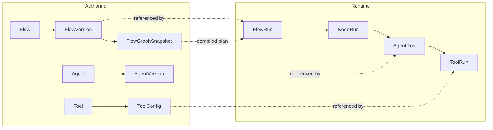
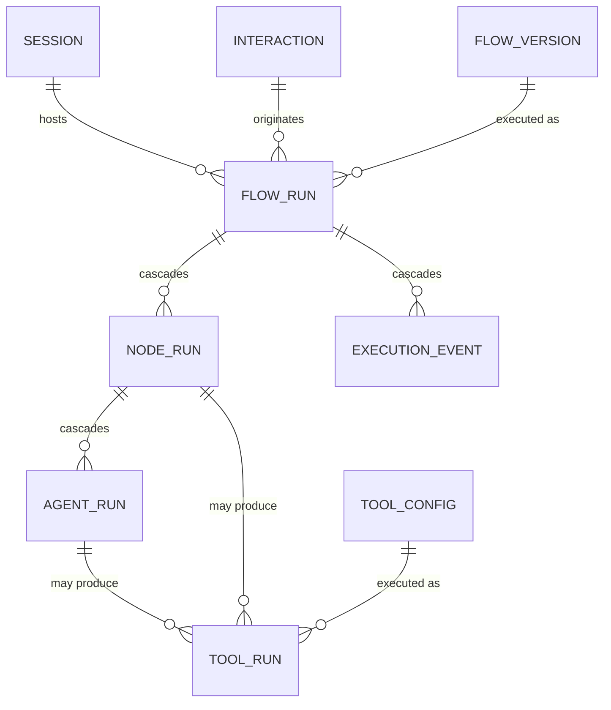

# Domain model overview

Entities and relationships across bounded contexts. This page is the **conceptual** view — for the
SQL table index see [Persistence tables](../Glossary/persistence-tables.md), and for individual
term definitions see the [Glossary](../Glossary/index.md).

## Bounded contexts

Each context lives at `src/domain/<context>/` with the same internal layout
(`controllers/`, `services/`, `repositories/`, `schemas/`).

| Group | Contexts | Owns |
|-------|----------|------|
| **Authoring** | `flows`, `agents`, `prompts`, `user_prompts`, `tools`, `ai_policy` | The definitions a tenant edits and publishes. |
| **Runtime** | `execution`, `conversation`, `user_input`, `llm`, `context`, `rag` | What happens when a request arrives. |
| **Control** | `governance`, `auth`, `tenants`, `human_sla`, `mcp_registry`, `onboarding` | Who may do what, at what cost, and what happens when a human is needed. |

`common/` holds shared schemas (error, versioning, change log). Cross-context orchestration lives
in `src/services/` (`ExecutionBoundary`, `ConversationBoundary`), not inside any single context.

## The two halves: authoring and runtime

The central split in this model is that **definitions are versioned and immutable**, while
**execution is append-only and references them**. Nothing in the runtime mutates a definition.



See [Runtime vs authoring](../Architecture/runtime-vs-authoring.md) for the full treatment.

## Versioned artefacts

Flows, agents, AI execution policies and every governance policy share one lifecycle:

```
DRAFT ──publish──▶ PUBLISHED ──activate──▶ ACTIVE ──▶ DEPRECATED / DISABLED
```

Once a version reaches `PUBLISHED` its payload is **immutable** — a change means a new version, not
an edit. Every lifecycle transition is recorded as an `AuthoringEvent` with a `justification`
(see [Authoring events](../Governance/authoring-events.md)).

| Artefact | Version entity | Notes |
|----------|----------------|-------|
| `Flow` | `FlowVersion` | Compiles to a `FlowGraphSnapshot`; a `FlowDeployment` points at the active one. |
| `Agent` | `AgentVersion` | Carries tool bindings via `AgentVersionToolBinding`. |
| `AIExecutionPolicy` | `AIExecutionPolicyVersion` | Bound per node. |
| Governance policies | `*PolicyVersion` | Access, billing, execution limit, memory, RAG, rate limit. |

> **Known deviation.** Tool bindings currently mutate already-published agent versions, which
> violates the immutability rule above.

## Execution records

One turn produces a chain of append-only records. `tenant_id` is present at every level and always
originates from the JWT security context.



| Record | Grain | Key references |
|--------|-------|----------------|
| `FlowRun` | One turn of one flow | `flow_version`, `flow_graph_snapshot`, `session`, `interaction`, and a self-reference for the previous run in the conversation |
| `NodeRun` | One node execution | `flow_run` (cascade), `node` |
| `AgentRun` | One agent invocation | `node_run` (cascade), `agent_version`, `billing_policy_version` |
| `ToolRun` | One tool invocation | `agent_run` / `node_run` (both nullable), `tool_config`, `billing_policy_version` |
| `ExecutionEvent` | One observable step | `tenant`, `session`, `flow_run` (cascade) |
| `RunFailure` | A terminal failure | `flow_run` |

`ToolRun` also carries the scheduling fields used by `ToolExecutionMode.SCHEDULED` — see
[Durable execution](../Execution/durable-execution.md).

`AgentRun` rows come from three places: the direct agent-run endpoint, A2A delegation, and the graph
runtime — `NodeStepRunner._record_usage` creates one whenever an agent version governs the node it
just ran, which is also what makes the `assert_can_create_agent_run` governance gate reachable. The
per-run token and cost columns are populated on that path. See
[Tracing and cost](../Develop/tracing-and-cost.md#spend-ledger-llm_usage_ledger).

## Conversation and memory

| Entity | Role |
|--------|------|
| `EndUser` | The tenant's end user; distinct from the API principal. |
| `Session` | Groups interactions and flow runs for one conversation. |
| `Interaction` | One inbound request. |
| `ResponseArtifact` | Generated output attached to an interaction. |
| `UserMemoryProfile` | Durable structured memory written by `MemoryCommitNode`. |

Session memory (carried in `NodeResult.memory`) and durable memory (`user_memory_profile`) are
**different things** — a node can advance session memory without persisting anything. See
[MemoryCommitNode](../Execution/graph-runtime/nodes/non-llm-nodes.md#memorycommitnode).

Conversation *history* is not modelled here at all: with the OpenAI provider it lives in the
provider's Conversations API. See [Token cost and context strategy](../Develop/token-cost-and-context-strategy.md).

## Escalation

When a graph routes into `HumanFallback`, an `SLACase` is opened and matched against an
`HumanSLAPolicy` on the composite key `(tenant_id, node, fallback_reason)`, which carries ordered
`HumanSLAEscalationRule` rows. See [Policies and matching](../Human-SLA/policies-and-matching.md).

## Retrieval

| Entity | Role |
|--------|------|
| `RAGConfig` | Retrieval contract for a tenant/use case. |
| `VectorStore` | Backing store binding. |
| `RAGDocument` → `RAGChunk` | Ingested source and its chunks. |
| `RAGChunkingRule` | Chunk sizing and overlap. |
| `RAGQueryCache`, `SemanticAnswerCache` | Retrieval-level and answer-level caches — not interchangeable. |
| `RAGUsageCounter` | Per-tenant usage accounting. |

## Core invariants

1. `tenant_id` always comes from the JWT security context, never from a request body.
2. Domain code does not import from `infra/` or `adapters/`; dependencies point inward.
3. Published versions are immutable.
4. Execution never mutates definitions — run records are append-only.
5. LLM calls stay inside node implementations; side effects are deterministic node logic.
6. `Idempotency-Key` is required on POST execution endpoints.

## Related

- [Architecture overview](../Architecture/ARCHITECTURE.md)
- [Runtime vs authoring](../Architecture/runtime-vs-authoring.md)
- [Persistence tables](../Glossary/persistence-tables.md)
- [Glossary](../Glossary/index.md)
- [Flow lifecycle](../Execution/flow-lifecycle.md)
