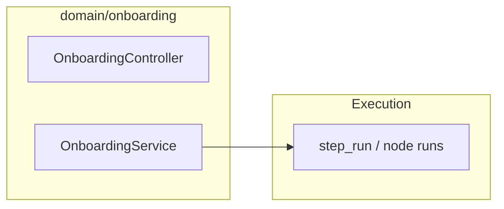

# Onboarding — integration and runtime

**Onboarding** tracks program definitions and runs **alongside** the main flow execution product; it uses its own service and HTTP surface under `domain/onboarding/`.

## Placement

- Step-level execution details align with tables in [Persistence tables](../Glossary/persistence-tables.md) (`step_run` under **Runtime execution**).

## Related

- [HTTP API](http-api.md)
- [Execution](../Execution/index.md)
