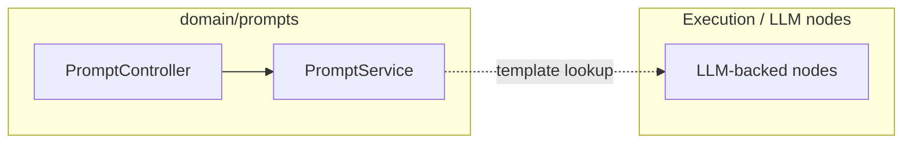

# Prompts — integration and runtime

**Node prompts** are resolved when graph nodes need default template text for a **`node_type`**, complementary to inline prompts stored on nodes in **Flows**.

## Placement

## Related

- [LLM-backed nodes](../Execution/graph-runtime/nodes/llm-nodes.md)
- [User prompts](../User-Prompts/index.md)
