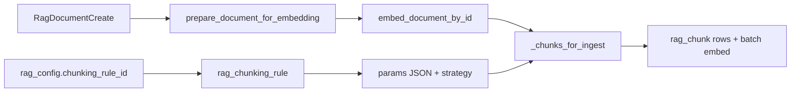

# RAG chunking strategies

This page is the **canonical reference** for how documents are split into **`rag_chunk`** rows before embedding. Chunking is **not** inferred from `rag_config.options` alone: every published `rag_config` **must** reference a tenant-scoped **`rag_chunking_rule`** (`chunking_rule_id`). At ingest time, `RagRuntimeService` loads that rule, parses `params` with **`parse_rag_chunking_rule_params`**, and dispatches on **`RagChunkingStrategy`**.

**Source of truth (code):**

- Strategy enum and param models: `src/domain/rag/schemas/rag.py` (`RagChunkingStrategy`, `TokenWindowChunkingParams`, `RecursiveCharacterChunkingParams`, `SemanticChunkingParams`, `PerPageChunkingParams`, `parse_rag_chunking_rule_params`).
- Ingest chunking: `src/domain/rag/services/rag_runtime_service.py` (`_resolve_rag_ingest_bundle`, `_chunks_for_ingest`, `_chunk_text`, `_recursive_character_chunks`).
- Authoring validation (create/update rule): `src/domain/rag/services/rag_service.py` (calls `parse_rag_chunking_rule_params` before persist).
- HTTP: `RagChunkingRuleCreate` / `PATCH .../rag-chunking-rules/{id}` — see [Runtime and integration](runtime-and-integration.md#http-api-as-implemented).

## How a rule attaches to ingestion

1. **`rag_config`** points to exactly one **`rag_chunking_rule`** row.
2. **`prepare_document_for_embedding`** enforces **`len(document.content) <= rule_params.max_document_chars`** for every strategy (reject with `rag_document_too_large` if exceeded).
3. **`embed_document_by_id`** reads stored document content + optional **`ingest_pages`** from document metadata (see below), then calls **`_chunks_for_ingest`**.

## Strategies at a glance

| Strategy | Splitting basis | Same as token window? | Pages / ingest payload |
|----------|-----------------|------------------------|-------------------------|
| **`TOKEN_WINDOW`** | Tiktoken **`cl100k_base`** token windows | — | No; uses `document.content` only |
| **`SEMANTIC`** | Tiktoken **`cl100k_base`** token windows | **Yes** — today identical to `TOKEN_WINDOW` | No |
| **`RECURSIVE_CHARACTER`** | Character-length windows with ordered **separators** | No | No; uses `document.content` only |
| **`PER_PAGE`** | One chunk per **pre-split page string** | No | **Yes** — requires `RagDocumentCreate.pages` on ingest |

!!! note "Naming: `SEMANTIC`"

    The value **`SEMANTIC`** is a reserved strategy for future semantic splits. **Current production behaviour** is the same as **`TOKEN_WINDOW`**: both call **`_chunk_text`** with `target_tokens` / `overlap_tokens` / `max_chunks_per_document`. Do not assume embeddings or NLP segmentation beyond fixed-size token sliding.

## Parameter models (defaults)

Defaults below match the Pydantic models in **`src/domain/rag/schemas/rag.py`**. API payloads must include **`strategy`** and fields required by the discriminated union for that strategy.

### `TOKEN_WINDOW`

| Field | Type | Default | Role |
|-------|------|---------|------|
| `strategy` | literal `"TOKEN_WINDOW"` | — | Discriminator |
| `target_tokens` | int | `500` | Max tokens per chunk (encoder: `cl100k_base`) |
| `overlap_tokens` | int | `50` | Token overlap between consecutive chunks |
| `max_chunks_per_document` | int | `100` | Hard cap on chunk count; excess document tail is not embedded |
| `max_document_chars` | int | `100_000` | Max length of **`document.content`** at prepare time |

**Algorithm (summary):** encode full text → slide a window of `target_tokens` → decode each window with the same encoding → advance start by `target_tokens - overlap_tokens`. If the cap is hit before the text ends, chunking stops and metadata flags truncation (see [Truncation metadata](#truncation-metadata)).

### `SEMANTIC`

Uses **`SemanticChunkingParams`**: same fields and defaults as **`TOKEN_WINDOW`** (`target_tokens`, `overlap_tokens`, `max_chunks_per_document`, `max_document_chars`). Runtime path: **`_chunk_text`** — same implementation as **`TOKEN_WINDOW`**.

### `RECURSIVE_CHARACTER`

| Field | Type | Default | Role |
|-------|------|---------|------|
| `strategy` | literal `"RECURSIVE_CHARACTER"` | — | Discriminator |
| `chunk_size` | int | `2000` | Maximum characters per window |
| `chunk_overlap` | int | `200` | Characters subtracted from the next window start when advancing |
| `max_chunks_per_document` | int | `100` | Hard cap on chunk count |
| `max_document_chars` | int | `100_000` | Max length of **`document.content`** at prepare time |
| `separators` | list[str] | `["\n\n", "\n", " ", ""]` | Tried in order; within each window, split after the **last** occurrence of a separator if it falls in the **second half** of the window (`pos >= chunk_size // 2`) |

**Algorithm (summary):** scan `document.content` with a sliding character window of length `chunk_size`. For each window, choose the cut position: prefer breaking after the best separator found in the second half of the window; otherwise cut at end of window. Advance by `cut - chunk_overlap` (with a guard so progress always moves forward). Empty strips are skipped.

### `PER_PAGE`

| Field | Type | Default | Role |
|-------|------|---------|------|
| `strategy` | literal `"PER_PAGE"` | — | Discriminator |
| `max_document_chars` | int | `100_000` | Per **page** string: characters beyond this are truncated before becoming a chunk |
| `max_chunks_per_document` | int | `500` | Max number of page strings consumed from the ingest payload |
| `pages` | list[str] | `[]` | Validated on the **rule** model for authoring; **ingest runtime does not read `params.pages`** for splitting |

**Ingest contract:** chunk text comes from **`RagDocumentCreate.pages`**, not from splitting `document.content`. When `pages` is present on the create payload, **`prepare_document_for_embedding`** copies it into document metadata as **`ingest_pages`**. **`_chunks_for_ingest`** then:

- Requires **`ingest_pages`** non-empty; otherwise raises **`rag_per_page_pages_required`** (`422`).
- Takes up to **`max_chunks_per_document`** pages in order.
- Truncates each page to **`max_document_chars`** characters.

**`document.content` is still required:** it is used for deduplication hash, length check against the rule’s `max_document_chars` at prepare time, and must remain non-empty for embedding pipeline validation. Align `content` with your canonical document body (e.g. concatenation of pages or a summary) so operators understand **`content_hash`** semantics.

### Media ingest vs PER_PAGE

`POST .../documents:ingestFromMedia` builds a **`RagDocumentCreate`** with **`content`** filled by the document-to-text extract (e.g. Docling markdown for PDF) and does **not** set **`pages`**. Chunking then follows the active **`rag_chunking_rule`** on that single body (e.g. `TOKEN_WINDOW`, `RECURSIVE_CHARACTER`).

To use **`PER_PAGE`** (one chunk per pre-split page string), callers must supply **`RagDocumentCreate.pages`** on the **batch text** ingest (`documents:ingest`) or another pipeline that populates `pages` explicitly. **`ingestFromMedia` does not** map PDF pages to `pages` automatically; if you need page-aligned chunks, pre-split elsewhere and ingest with `pages`, or accept non–`PER_PAGE` chunking over the unified `content` string.

!!! note "PER_PAGE and PDF via media"

    **`PER_PAGE`** is not “native PDF pages” from the media endpoint: it requires **`pages`** on the document create payload. PDFs ingested only through **`ingestFromMedia`** are chunked like any other single-string document unless you add a separate step that supplies **`pages`**.

## Truncation metadata

When chunking stops early because of **`max_chunks_per_document`** or (for **`PER_PAGE`**) page/page-length limits, **`embed_document_by_id`** sets on the document metadata:

- **`truncated`**: `true`
- **`truncated_chunks`**: number of chunks actually written

Downstream retrieval is unchanged; this is an **operator signal** that the corpus did not fully fit the rule.

!!! warning "`truncated` means chunks were dropped"
    The tail of the document was **never embedded** and can never be retrieved. Treat it as a
    data-loss signal rather than a warning: either raise `max_chunks_per_document`, lower
    `target_tokens`, or split the source before ingest.

## Overlap must stay below the target

`overlap_tokens` is **not** validated against `target_tokens`, and `chunk_overlap` is not validated against `chunk_size`. The window advances by `max(1, target_tokens - overlap_tokens)`, so an overlap greater than or equal to the target degrades to a **one-token step** and burns straight through `max_chunks_per_document` — producing a near-useless corpus of almost-identical chunks, plus `truncated: true`.

Keep the overlap at roughly **10–20%** of the target. `examples/rag/chunking_strategies.py` prints the effect side by side.

!!! note "Fixed in this repository"
    `_chunk_text` previously advanced by `end - overlap_tokens`, which stalled once the final window was reached and re-emitted that last chunk until the cap. A 202-token document produced **100 chunks, 4 distinct**, with a false `truncated: true`. The loop now terminates on the final window and advances by a fixed step, matching the algorithm described above. See `tests/unit/rag/test_rag_chunking.py`.

## Choosing a strategy (operator)

| Goal | Suggested strategy | Notes |
|------|-------------------|--------|
| Stable, tokenizer-aligned chunks for English-heavy text | **`TOKEN_WINDOW`** | Predictable size in tokens; uses OpenAI-style `cl100k_base` |
| Same as above but product/catalog says “semantic” | **`SEMANTIC`** | Behaviour matches **`TOKEN_WINDOW`** until a true semantic splitter exists |
| Preserve paragraphs / markdown-ish structure | **`RECURSIVE_CHARACTER`** | Tune `separators` (e.g. `\n\n` first); watch `chunk_size` vs embedding model context |
| PDF or OCR pipeline already produced one string per page | **`PER_PAGE`** | Supply **`pages`** on each **`RagDocumentCreate`**; keep **`content`** within `max_document_chars` |
| PDF only via **`documents:ingestFromMedia`** | **`TOKEN_WINDOW`**, **`RECURSIVE_CHARACTER`**, etc. (not page splits from the endpoint) | Single **`content`** from extract; for **`PER_PAGE`** supply **`pages`** on **`documents:ingest`** or pre-split — [Media ingest vs PER_PAGE](#media-ingest-vs-per_page) |

## Related

- `examples/rag/chunking_strategies.py` — every strategy applied to one document, with bounds and failure modes (runnable, no infrastructure required)
- [RAG overview](index.md)
- [Runtime and integration](runtime-and-integration.md) — ingest HTTP ([batch vs media](runtime-and-integration.md#batch-text-ingest)), retrievers, policies
- [Data model reference](data-model-reference.md) — `rag_chunking_rule`, `rag_chunk`
- [Embedding orchestration](embedding-orchestration.md) — embedding contract after chunks exist
