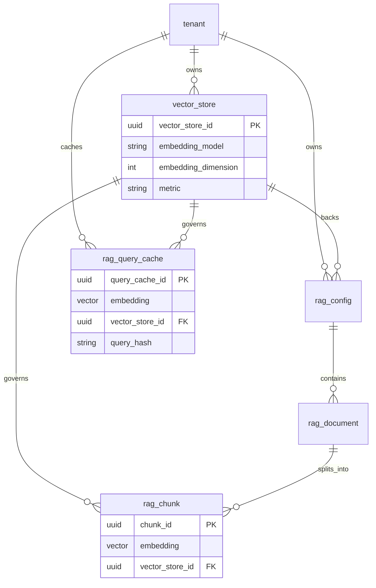

# RAG data model reference

This page summarizes **relational and vector columns** for RAG, where to read them in code, and how they relate. **Source of truth:** SQLAlchemy models under `src/infra/database/models/rag/` and Alembic migrations under `src/infra/database/migrations/versions/`.

## How it works in this repository

- **`vector_store`** defines the **embedding contract** for an index: operational `embedding_model` string, `embedding_dimension`, `metric`, `version`, `active`.
- **`rag_config`** points to exactly one **`vector_store_id`** and carries JSON **`options`** (parsed in domain as `RagConfigOptions`). It references **`chunking_rule_id`** → **`rag_chunking_rule`** (strategy + params JSON validated as a discriminated union). See [Chunking strategies](chunking-strategies.md) for behaviour per **`RagChunkingStrategy`**.
- **`rag_document`** belongs to a **`rag_config_id`** and tracks ingest/embedding pipeline status (`embedding_status`, attempts, errors, timestamps).
- **`rag_chunk`** stores **one embedding column** per row plus **`vector_store_id`** so chunks always align with the index used for similarity search.
- **`rag_query_cache`** stores query embeddings keyed by **`tenant_id`**, **`vector_store_id`**, and **`query_hash`** (see `RagRepository` query-cache helpers).
- **`SemanticAnswerCache`** (`src/infra/database/models/llm/semantic_answer_cache.py`) is **not** part of the chunk retrieval pipeline; it supports LLM semantic caching with `model_alias` and is documented alongside LLM cost docs.

## Code map

| Area | Path |
|------|------|
| Vector store ORM | `src/infra/database/models/rag/vector_store.py` |
| Rag config / chunking rule ORM | `src/infra/database/models/rag/rag_config.py` (and related modules in the same package) |
| Rag document / chunk ORM | `src/infra/database/models/rag/rag_document.py`, `rag_chunk.py` |
| Rag query cache ORM | `src/infra/database/models/rag/rag_query_cache.py` |
| Semantic answer cache ORM | `src/infra/database/models/llm/semantic_answer_cache.py` |
| Model registry (AI policy) | `src/infra/database/models/ai_policy/model.py` |
| Runtime orchestration | `src/domain/rag/services/rag_runtime_service.py` |
| Repository (search, caches) | `src/domain/rag/repositories/rag_repository.py` |
| Embedding port | `src/domain/rag/ports/embedding.py` |
| OpenAI adapter | `src/domain/rag/adapters/openai_embedding_adapter.py` |

**Repository caching:** `RagRepository.get_rag_config` may use Redis (when configured) with a short TTL for published configs; vector store loads are typically uncached—see implementation for current keys and TTL.

## Entity relationship (consolidated)

## Design decisions (implemented)

- **Single embedding column on `rag_chunk`:** Model name and dimension are **not** duplicated on each chunk row; they come from **`vector_store`** and are validated at runtime before embed/search.
- **`RagDocument` → `vector_store` is indirect** via `rag_config.vector_store_id` (documents do not carry `vector_store_id` directly).
- **`SemanticAnswerCache`** is separate from RAG chunk search: it stores vectors for answer-level caching under LLM governance, not tenant document corpora.

## Related

- [Runtime and integration](runtime-and-integration.md) (broader ER including `rag_policy`, `agent_version`)
- [Embedding orchestration](embedding-orchestration.md)
- [Persistence tables](../Glossary/persistence-tables.md)
