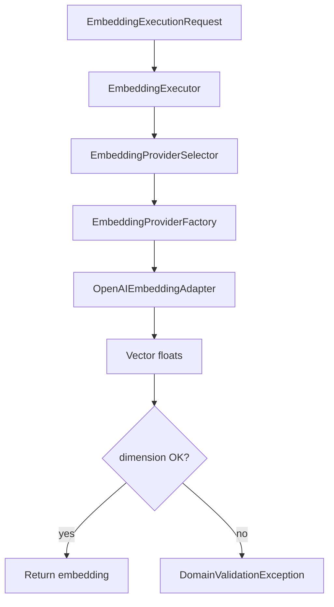

# Embedding orchestration

This page describes how **query and document embeddings** are produced in the RAG stack: protocol, executor, provider selection, and the **vector store contract** (operational model name + dimension + metric). It complements [Runtime and integration](runtime-and-integration.md), which covers ingest, retrieval, and HTTP.

## How it works in this repository

1. **`EmbeddingPort`** (`src/domain/rag/ports/embedding.py`) is a small protocol: `generate_embedding` and `generate_embeddings_batch`, each accepting optional `model` and `dimension` overrides.
2. **`OpenAIEmbeddingAdapter`** (`src/domain/rag/adapters/openai_embedding_adapter.py`) implements that protocol (Redis and tracing hooks live with the adapter implementation).
3. **`EmbeddingExecutor`** (`src/domain/rag/services/embedding_executor.py`) is the domain entry point: it receives an **`EmbeddingExecutionRequest`** or **`EmbeddingBatchExecutionRequest`** (`src/domain/rag/schemas/embedding.py`) with:
   - `contract`: **`EmbeddingContract`** — `provider`, `model`, `dimension`, `metric`, `version`
   - `use_case`: `"indexing"` or `"retrieval"`
4. **`EmbeddingProviderSelector`** (`src/domain/rag/services/embedding_provider_selector.py`) does **not** pick a different model than the contract: it returns an **`EmbeddingProviderSelection`** that mirrors the contract’s provider and model. Business rules for *which* contract applies belong in **`RagRuntimeService`** (and related resolution from `vector_store` + `rag_config.options`).
5. **`EmbeddingProviderFactory`** (`src/domain/rag/services/embedding_adapter_factory.py`) builds the concrete provider implementation from the selection.
6. **Wiring for DI:** `src/adapters/rag/embedding_adapter.py` re-exports `OpenAIEmbeddingAdapter` for containers and jobs.

The executor validates that each returned vector length equals **`contract.dimension`**; otherwise it raises **`DomainValidationException`** (`rag_embedding_dimension_mismatch`).

## Conceptual flow

## Vector store as the index contract

- Each **`vector_store`** row stores **`embedding_model`** (string), **`embedding_dimension`**, **`metric`**, **`version`**, **`active`**.
- **`RagRuntimeService`** resolves the operational model (including optional **`model_id`** from AI policy / aliases), ensures **compatibility** with the linked vector store before ingest and similarity search, and builds **`EmbeddingContract`**-compatible calls for the executor path used by ingest and `get_context`.
- **`RagDocument`** does not own the embedding model: it holds content and pipeline state; chunks carry **`vector_store_id`** and the **embedding** column aligned to that store.

## Design notes

- Prefer **batch** embedding APIs where the adapter supports them (`execute_batch`) for ingest throughput.
- **Indexing vs retrieval** both use the same executor types; the **`use_case`** field is available for tracing and future policy (e.g. different latency budgets). The **contract** must remain consistent with the vector index used for search.
- Do not duplicate embedding configuration on **`RagChunk`** beyond what ORM requires: model semantics live on **`vector_store`** (see [Data model reference](data-model-reference.md)).

## Related

- [Chunking strategies](chunking-strategies.md) — how text becomes chunks before the embedding contract applies
- [Runtime and integration](runtime-and-integration.md)
- [Data model reference](data-model-reference.md)
- [RAG overview](index.md)
